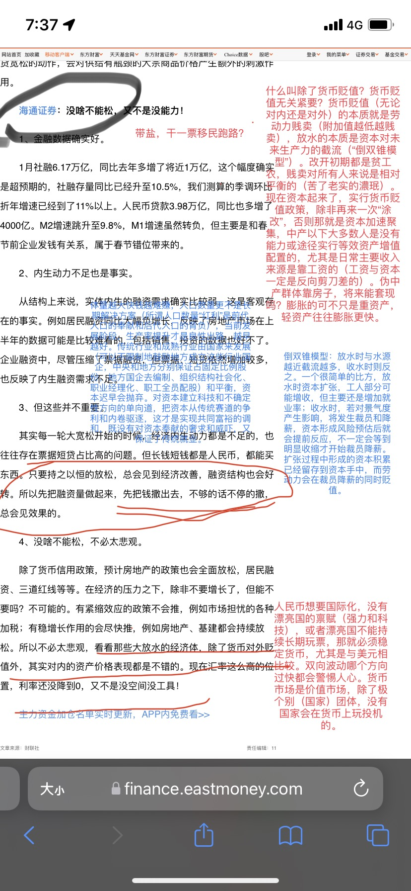
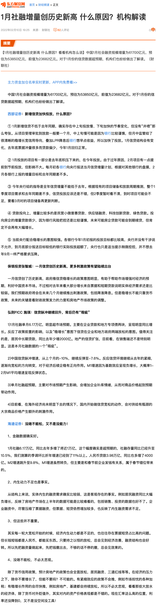

# 20220210234100

[1月社融增量创历史新高 什么原因？机构解读 _ 东方财富网](https://finance.eastmoney.com/a/202202102272837565.html)

# 评论

什么叫除了货币贬值？货币贬值无关紧要？货币贬值（无论对内还是对外）的本质就是劳动力贱卖（附加值越低越贱卖），放水的本质是资本对未来生产力的截流（“倒双锥模型”）。改开初期都是贫工农，贱卖对所有人来说是相对平衡的（苦了老实的濃珉）。现在资本起来了，实行货币贬值政策，除非再来一次“涂改”，否则那就是资本加速聚集，中产以下大多数人是没有能力或途径实行等效资产增值配置的，尤其是日常主要收入来源是靠工资的（工资与资本一定是反向剪刀差的）。伪中产群体靠房子，将来能套现吗？膨胀的可不只是重资产，轻资产往往膨胀更快。

人民币想要国际化，没有漂亮国的禀赋（强力和科技），或者漂亮国不能持续长期玩票，那就必须稳定货币，尤其是与美元相比较。双向波动哪个方向过快都会警惕人心。货币市场是价值市场，除了极个别（国家）团体，没有国家会在货币上玩投机的。

倒双锥模型：放水时与水源越近截流越多，收水时则反之。一个很简单的比方，放水时资本扩张，工人部分可能增收，但主要还是增加就业率；收水时，若对景气度产生影响，将发生裁员和降薪，资本形成风险预估后就会提前反应，不一定会等到明显收缩才开始裁员降薪。扩张过程中形成的资本积累已经留存到资本手中，而劳动力会在裁员降薪的同时贬值。

体量越大快钱越难赚，人口数量更不是长期解决方案（所谓人口数量“红利”是前代人口的奉献和后代人口的背负），当前发展阶段，生产率提升才是良性出路，越早越好。传统行业和成熟行业由国家来发展和平衡，资本迟早会抛弃。对资本建立科技和不确定性方向的单向道，把资本从传统赛道的争利和内卷驱逐，这才是实现共同富裕的调和，既没有对资本奉献的奢求和威吓，又保证了传统就业。

# 引申

## 地方国企

对于传统行业和成熟行业，中央鼓励各级地方成立这类国企集团（数量不唯一），限定地方政府占股最低比例。实行创新机制：

1. 宗旨
	1. 保障地方经济
	2. 服务民生
	3. 资产增值
2. 业务
	1. 托底传统行业
	2. 主营成熟行业
	3. 探索未来行业
3. 治理
	1. 完全去编制
	2. 组织结构完全社会化
	3. 完全职业经理人化
	4. 不往体制内晋升
4. 股权建设
	1. 地方财政（政府，下同）保持不低于31%股份
	3. 保留地方社保10%入股权份额，由地方财政预购
	4. 保留地方建设基金10%入股权份额（建立地方建设基金），由地方财政预购
	5. 保留员工10%入股权份额，由地方财政预购
		1. 在岗员工每满一年拥有一定数量时价配股权（具体数量由公司章程确定）
		2. 离职可以保留
	6. 保留29%股份给予本地户籍居民以时价入股权（每人上限数量由公司章程确定），由地方财政预购
	7. 剩余10%股份由其他资本参与（包括各级政府、社会资本等）
5. 董事会
	1. 董事会由占股10%以上（包含）股东构成
	2. 董事会除了地方政府、地方社保、地方建设基金外，不另允许一致行动人
	3. 董事会不参与日常管理
	4. 若地方政府、地方社保、地方建设基金三方投票与其他所有股东相反，则需要向省级政府（若省级政府由董事会成员，则向中央政府）复议
	5. 独立董事
6. 监督
	1. 派驻党委，为独立监督机构，成员不在公司任职，党委由地方派遣和上级地方派遣组成
	2. 派驻纪委，为独立监督机构，成员不在公司任职，纪委由全国轮调（建立纪委轮调制度）和上级地方派遣组成
	3. 监事会，由员工代表、地方政府派遣、地方群众公开自举、上级政府派遣组成

# 引文

