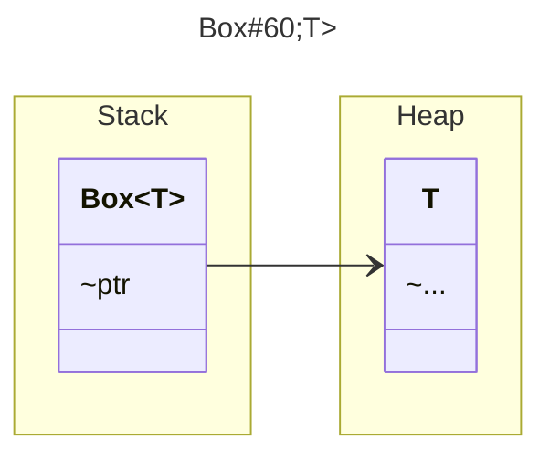
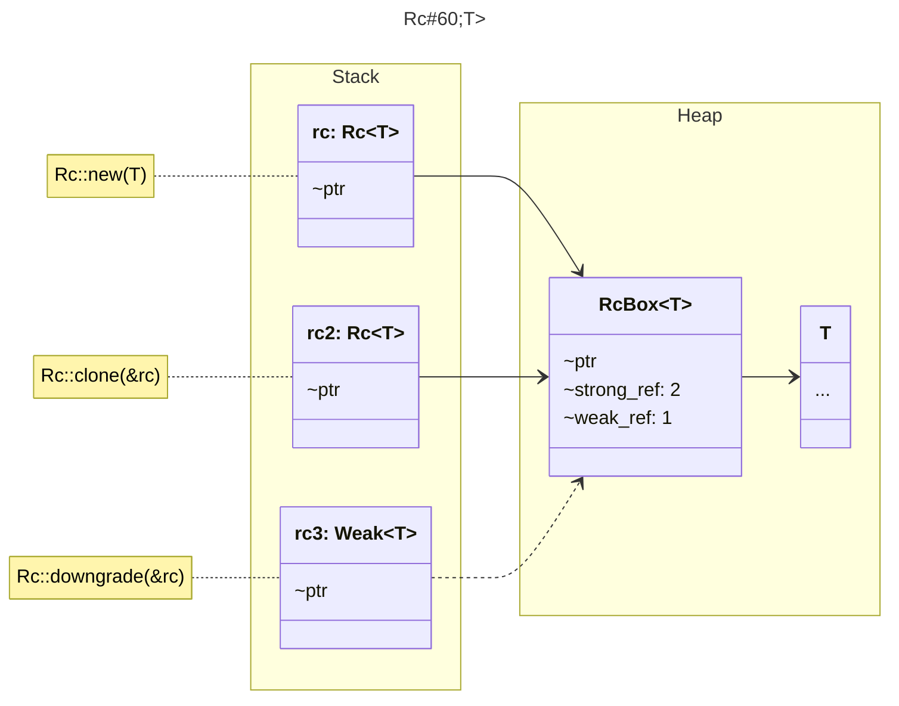

# 语言

## 语言生命力

- [开源](https://github.com/rust-lang)
- [社区驱动](https://www.rust-lang.org/governance)
- [定期更新](#工具链版本)
- [集中库注册源-crates.io](https://crates.io)
- [集中库文档-docs.rs](https://docs.rs)
- [语言服务器协议](https://github.com/rust-analyzer/rust-analyzer)（[*LSP*](https://microsoft.github.io/language-server-protocol/)）
- 优秀的[官方文档](#查阅reference)
- 丰富的[标准库](https://doc.rust-lang.org/std/)
- 活跃的[开源社区](https://www.rust-lang.org/community)
- 强大的[原生工具链](#工具链管理-Rustup)
  - 编译
  - 测试
  - 文档
  - 包管理
  - 代码质量
  - 离线文档
  - 交叉编译
  - 工具链升级
  - 命令行补全
  - 语言服务器
  - ...
- 无GC[智能内存管理](#内存管理)
- 完善的[模块化能力](#模块系统module-system)
  - 文件内模块化能力
  - 模块内部对外默认不可见
  - 统一规范的模块组织结构
  - 命名空间式（区别于文件路径引用）的模块引用

## 语言特性

- 严格可变性（*Mutability*）
- 变量遮蔽（*Variable Shadowing*）
- 类型推断（*Type Inference*）
- 强大的模式匹配（*Pattern Matching*）
- 表达式编程（*Expressions Everywhere*）
  - 封闭域（*Block*）自动返回尾部表达式
- 闭包（*Closure*）
- 运算符重载（*Overload*）
- 没有类(~~*Class*~~)
- 没有反射（~~*Reflection*~~）
- 文件内模块化能力（*Inline Modules*）
- 描述和组合取代实现和继承（`trait`和`struct`）
- 元编程（*Meta Programing*）
  - 宏（*Macros*）：Rust的宏不是简单的字符串替换，而是和函数一样具有丰富的高阶编程能力和自定义返回值。
    - 声明式宏（*Declarative Macros*），匹配Rust提供的特定语法结构以执行相应代码，如`vec!`
    - 过程式宏（*Procedural Macros*），解析属性备注的字符流（`TokenStream`）并执行代码
      - 派生宏（*Derive*），如`#[derive(Clone)]`
      - 类属性宏（*Attribute-Like*），如`#[route(GET, "/")]`
      - 类函数宏（*Function-Like*），如`html! { <h1>{ "Hello World" }</h1> }`
- 内存安全和智能内存管理（*Memory Safety*）
  - 所有权（*Ownership*）
  - 借用（*Borrowing*）
  - 切片（*Slice*）
  - 生命周期（*Lifetime*）
- 原生工具链
  - 原生测试：依托宏强大的表达能力，测试代码可以直接写在源文件中
  - 原生文档：专属备注直接生成文档，发布包时自动集成在[社区文档网站](https://docs.rs)中，风格统一。

# 准备

## 工具

- [Rust Search Extension](https://rust.extension.sh/)：在浏览器中搜索*Rust*文档、库等的终极解决方案，强烈建议安装。

## 查阅（Reference）

### 官方文档

- Rust 语言术语：[Glossary](https://doc.rust-lang.org/reference/glossary.html)
- Rust 征求意见：[Rust RFCs](https://rust-lang.github.io/rfcs/)
- Rust 学习之路：[Learn Rust](https://www.rust-lang.org/learn)
- Rust 入门教程（The Book）：[The Rust Programming Language](https://doc.rust-lang.org/book/)，[中文翻译1](https://rustwiki.org/zh-CN/book)，[中文翻译2](https://kaisery.github.io/trpl-zh-cn/)
- Rust 实例教程：[Rust by Example (RBE)](https://doc.rust-lang.org/rust-by-example/)，[中文翻译](https://rustwiki.org/zh-CN/rust-by-example)
- Rust 练习教程（Rustlings）：[🦀 Small exercises on the command line!](https://github.com/rust-lang/rustlings/)，[中文翻译](https://github.com/rust-lang-cn/rustlings-cn)
- Rust 语言参考：[The Rust Reference](https://doc.rust-lang.org/reference)，[中文翻译](https://rustwiki.org/zh-CN/reference)
- Rust 标准库文档：[The Rust Standard Library](https://doc.rust-lang.org/std/)，[中文翻译](https://rustwiki.org/zh-CN/std)
- Rust 异步编程：[Asynchronous Programming in Rust](https://rust-lang.github.io/async-book)
- Rust `unsafe`深入：[Rustonomicon: the dark arts of unsafe Rust](https://doc.rust-lang.org/nomicon/)
- Rust 命令行开发：[Command line apps in Rust](https://rust-cli.github.io/book/)
- Rust [WebAssembly](https://webassembly.org/)开发：[Rust 🦀 and WebAssembly 🕸](https://rustwasm.github.io/docs/)
- Rust 嵌入式开发：[Embedded Rust](https://doc.rust-lang.org/embedded-book)
- Rust 编译器教程：[rustc: Compiler for the Rust](https://doc.rust-lang.org/rustc/)，[中文翻译](https://rustwiki.org/zh-CN/rustc)
- Rust 预览版功能：[The Rust Unstable Book](https://doc.rust-lang.org/stable/unstable-book/)
- Rust 语言版本：[What are Editions?](https://doc.rust-lang.org/edition-guide/editions/index.html#what-are-editions)，[中文翻译](https://rustwiki.org/zh-CN/edition-guide)
- Rust 开发风格指引：[Rust Style Guidelines](https://doc.rust-lang.org/1.6.0/style/README.html)
- Rust API风格指引：[Rust API Guidelines](https://rust-lang.github.io/api-guidelines)
- Rust 错误代码查询：[Rust error codes index](https://doc.rust-lang.org/error_codes/error-index.html)，阅读该文档对深入理解编程语言和Rust都非常有用。[中文翻译](https://rustwiki.org/zh-CN/error-index)
- Rust 文档生成工具Rustdoc：[The Rustdoc Book](https://doc.rust-lang.org/rustdoc/)，[中文翻译](https://rustwiki.org/zh-CN/rustdoc)
- Rust 项目管理工具Cargo：[The Cargo Book](http://localhost/rust/cargo/index.html#the-cargo-book)，[中文翻译](https://rustwiki.org/zh-CN/cargo)
- Rust 工具链管理工具Rustup：[The Rustup Book](https://rust-lang.github.io/rustup/index.html#introduction)s
- Rust 官方仓库文档库：[documentation host for crates](https://docs.rs/)

### 其他文档

- Rust 宏详解：[The Little Book of Rust Macros](https://danielkeep.github.io/tlborm/book/index.html)，[中文翻译](https://www.bookstack.cn/read/DaseinPhaos-tlborm-chinese/README.md)
- Rust 设计模式：[Rust Design Pattern](https://rust-unofficial.github.io/patterns/)
- Rust 新手开发：[Rust Cookbook](https://rust-lang-nursery.github.io/rust-cookbook)，[中文翻译](https://rustwiki.org/zh-CN/rust-cookbook)
- Rust 性能手册：[The Rust Performance Book](https://nnethercote.github.io/perf-book/title-page.html)
- Rust 编写模糊测试：[Rust Fuzz Book](https://rust-fuzz.github.io/book/)
- Rust 非官方中文教程：[Rust语言圣经（Rust Course）](https://course.rs)

### 其他资源

- Rust 官方社区仓库 crates.io：[The Rust community’s crate registry](https://crates.io/)
- Rust 受控的第三方仓库 lib.rs：[Catalog of programs and libraries written in the Rust](https://lib.rs/)
- Rust 中文翻译合集 rustwiki：[Rust 中文翻译项目组翻译合集](https://rustwiki.org/)

### 常用指南

- Rust 语言速查表：[Rust Language Cheat Sheet](https://cheats.rs/)
- Rust 术语中英文对照：[Rust 语言术语中英文对照表](https://rustwiki.org/wiki/translate/english-chinese-glossary-of-rust)
- Rust Awesome：[awesome-rust learning resources](https://github.com/rust-unofficial/awesome-rust#resources)
- Rust 操作符和符号：[Operators and Symbols](https://doc.rust-lang.org/book/appendix-02-operators.html)
- Rust 关键词：[Keywords](https://doc.rust-lang.org/book/appendix-01-keywords.html)
- Rust 派生特征：[Derivable Traits](https://doc.rust-lang.org/book/appendix-03-derivable-traits.html)
- Rust 交叉编译：[Cross-compilation](https://rust-lang.github.io/rustup/cross-compilation.html)
- Rust 命令参数：[Rustc command-line arguments](http://localhost/rust/rustc/command-line-arguments.html)
- Rust 引入依赖：[Specifying Dependencies](https://doc.rust-lang.org/cargo/reference/specifying-dependencies.html)
- Rust 工作空间：[Workspaces](https://doc.rust-lang.org/stable/cargo/reference/workspaces.html)
- Rust 链接库：[Linkage](https://doc.rust-lang.org/reference/linkage.html)
- Rust 开发工具：[Useful Development Tools](https://doc.rust-lang.org/book/appendix-04-useful-development-tools.html)
- Rust 自动升级项目语言版本：[Transitioning an existing project to a new edition](https://doc.rust-lang.org/edition-guide/editions/transitioning-an-existing-project-to-a-new-edition.html#transitioning-an-existing-project-to-a-new-edition)，[Advanced migration strategies](https://doc.rust-lang.org/edition-guide/editions/advanced-migrations.html)
- Rust 替换crate源：[Crates Source Replacement](https://doc.rust-lang.org/cargo/reference/source-replacement.html)

## 语言习惯（Convention）

- 类型名用 *PascalCase* ；
- 常量用 *UPPER_SNAKE_CASE* ；
- 变量名、函数名、属性名等一般标识符使用 *lower_snake_case* ；

## 语言周边（）

| [社区吉祥物 Ferris](https://www.rustacean.net/) |
| ----------------------------------------------- |
|                       |

### Rustacean

> [*Rustacean*](https://www.rustaceans.org/)：Rust 用户。
> *Rustaceans are people who use Rust, contribute to Rust, or are interested in the development of Rust.*

### Rustonomicon

> *Rustonomicon*：Rust 高级技巧。
> *The Dark Arts of Advanced and Unsafe Rust Programming.*

## 工具链管理-Rustup

> [Rustup](https://rust-lang.github.io/rustup/)是Rust官方的工具链的版本安装和管理器。对于开发者来说应当作为Rust语言安装和版本管理的首选工具。

Rustup的本地[配置文件](https://rust-lang.github.io/rustup/configuration.html#configuration) 位于：`${RUSTUP_HOME}/settings.toml`

### 工具链

通过`rustup toolchain`命令可以查看、安装和删除[不同版本工具链](#工具链版本)。

Rustup提供了交叉编译能力，你可以在本地安装不同平台的工具链进行代码生产，也可以同时安装同一平台工具链的不同版本，具体可见[构建-工具链版本](#工具链版本)。

通过`rustup target`可以查看、添加和删除目标平台标准库，以支持[交叉编译](#目标平台和交叉编译)。

### 工具链组件

通过 `rustup component`命令可以查看、安装和删除当前工具链的所有组件。Rustup提供的核心[组件包括](https://rust-lang.github.io/rustup-components-history/)：

- Rust编译器[Rustc](https://doc.rust-lang.org/rustc/)
- Rust包管理器[Cargo](https://github.com/rust-lang/cargo/)
- Rust语言服务器[RLS](https://github.com/rust-lang/rls)
- Rust离线文档[Rust-docs](https://rust-lang.github.io/rust-docs/)
- Rust代码格式化工具[Rustfmt](https://github.com/rust-lang/rustfmt)
- Rust代码质量和风格检查工具（*linter*）[Clippy](https://github.com/rust-lang/rust-clippy)
- Rust中间码解释器[Miri](https://github.com/rust-lang/miri/)
- ......

### 升级

通过`rustup check/update`检查/升级Rustup和工具链的更新。

通过`rustup self update/uninstall`可以升级和移除*Rustup*。

### 其他

通过`rustup doc`命令可以查看[Rust-docs](https://rust-lang.github.io/rust-docs/)提供的离线文档。如：
  - `rustup doc --book`：查看语言教程（*the book*）
  - `rustup doc --reference`：语言参考
  - `rustup doc --std [paths|keyword]`：标准库文档
  - `rustup doc --core [topic]`：核心库文档

通过`rustup completions`给当前终端添加命令补全。

## 项目管理-Cargo

> [Cargo](https://doc.rust-lang.org/cargo)是Rust项目（或包，Crate）管理和构建工具。

### 配置

[Configuration](https://doc.rust-lang.org/cargo/reference/config.html#configuration)

配置清单保存在`.cargo/config`（或`.cargo/config.toml`，若同时存在则用*config*）文件中：
- 全局配置目录位于`$CARGO_HOME`（即`$HOME/.cargo/config`）。
- 项目本地配置位于所有项目源文件目录（即`<repo>/**/.cargo/config`）。

多个配置文件（本地、全局）会进行**深度合并**，其中数组会进行连接。

[所有配置概览](https://doc.rust-lang.org/cargo/reference/config.html#configuration-format)：
```toml
[alias] # 命令别名
b = "build"
space_example = ["run", "--release", "--", "\"command list\""]

[build]
jobs = 1                      # number of parallel jobs, defaults to # of CPUs
rustc = "rustc"               # the rust compiler tool
rustc-wrapper = "…"           # run this wrapper instead of `rustc`
rustc-workspace-wrapper = "…" # run this wrapper instead of `rustc` for workspace members
rustdoc = "rustdoc"           # the doc generator tool
target = "triple"             # 目标三元组（编译的目标运行环境架构，如x86_64-pc-windows-msvc）
target-dir = "target"         # 生成文件的存放目录
rustflags = ["…", "…"]        # custom flags to pass to all compiler invocations
rustdocflags = ["…", "…"]     # custom flags to pass to rustdoc
incremental = true            # 增量编译
dep-info-basedir = "…"        # path for the base directory for targets in depfiles
pipelining = true             # rustc pipelining

[doc]
browser = "chromium"          # browser to use with `cargo doc --open`,
                              # overrides the `BROWSER` environment variable

[env]
# Set ENV_VAR_NAME=value for any process run by Cargo
ENV_VAR_NAME = "value"
# Set even if already present in environment
ENV_VAR_NAME_2 = { value = "value", force = true }
# Value is relative to .cargo directory containing `config.toml`, make absolute
ENV_VAR_NAME_3 = { value = "relative/path", relative = true }

[cargo-new]
vcs = "none"              # VCS to use ('git', 'hg', 'pijul', 'fossil', 'none')

[http]
debug = false               # HTTP debugging
proxy = "host:port"         # HTTP proxy in libcurl format
ssl-version = "tlsv1.3"     # TLS version to use
ssl-version.max = "tlsv1.3" # maximum TLS version
ssl-version.min = "tlsv1.1" # minimum TLS version
timeout = 30                # timeout for each HTTP request, in seconds
low-speed-limit = 10        # network timeout threshold (bytes/sec)
cainfo = "cert.pem"         # path to Certificate Authority (CA) bundle
check-revoke = true         # check for SSL certificate revocation
multiplexing = true         # HTTP/2 multiplexing
user-agent = "…"            # the user-agent header

[install]
root = "/some/path"         # `cargo install` destination directory

[net]
retry = 2                   # network retries
git-fetch-with-cli = true   # use the `git` executable for git operations
offline = true              # do not access the network

[patch.<registry>]
# Same keys as for [patch] in Cargo.toml

[profile.<name>]         # Modify profile settings via config.
opt-level = 0            # Optimization level.
debug = true             # Include debug info.
split-debuginfo = '...'  # Debug info splitting behavior.
debug-assertions = true  # Enables debug assertions.
overflow-checks = true   # Enables runtime integer overflow checks.
lto = false              # Sets link-time optimization.
panic = 'unwind'         # The panic strategy.
incremental = true       # Incremental compilation.
codegen-units = 16       # Number of code generation units.
rpath = false            # Sets the rpath linking option.
[profile.<name>.build-override]  # Overrides build-script settings.
# Same keys for a normal profile.
[profile.<name>.package.<name>]  # Override profile for a package.
# Same keys for a normal profile (minus `panic`, `lto`, and `rpath`).

[registries.<name>]  # registries other than crates.io
index = "…"          # URL of the registry index
token = "…"          # authentication token for the registry

[registry]
default = "…"        # name of the default registry
token = "…"          # authentication token for crates.io

[source.<name>]      # source definition and replacement
replace-with = "…"   # replace this source with the given named source
directory = "…"      # path to a directory source
registry = "…"       # URL to a registry source
local-registry = "…" # path to a local registry source
git = "…"            # URL of a git repository source
branch = "…"         # branch name for the git repository
tag = "…"            # tag name for the git repository
rev = "…"            # revision for the git repository

[target.<triple>]
linker = "…"            # linker to use
runner = "…"            # wrapper to run executables
rustflags = ["…", "…"]  # custom flags for `rustc`

[target.<cfg>]
runner = "…"            # wrapper to run executables
rustflags = ["…", "…"]  # custom flags for `rustc`

[target.<triple>.<links>] # `links` build script override
rustc-link-lib = ["foo"]
rustc-link-search = ["/path/to/foo"]
rustc-flags = ["-L", "/some/path"]
rustc-cfg = ['key="value"']
rustc-env = {key = "value"}
rustc-cdylib-link-arg = ["…"]
metadata_key1 = "value"
metadata_key2 = "value"

[term]
verbose = false        # whether cargo provides verbose output
color = 'auto'         # whether cargo colorizes output
progress.when = 'auto' # whether cargo shows progress bar
progress.width = 80    # width of progress bar

```

### 包来源

详见 [Source Replacement - The Cargo Book](https://doc.rust-lang.org/cargo/reference/source-replacement.html)

包主要有三个来源：注册源（*registry*）、*git*仓库、本地文件夹（*vendor*）。

[*registry*](https://doc.rust-lang.org/cargo/reference/source-replacement.html#registry-sources)：注册源，一个集中管理*crate*的数据库。该数据库存储*crate*包装文件（`.crates`）并通过维护索引（*index*）来分发包。

[*vendor*](https://doc.rust-lang.org/cargo/reference/source-replacement.html#directory-sources)：供给文件夹，一个直接存储*crate*源文件夹（*unpacked*）的文件夹（*/path/to/vendor/package...*）。

可通过*cargo-local-registry*（`cargo install local-registry`）维护[本地注册源](https://doc.rust-lang.org/cargo/reference/source-replacement.html#local-registry-sources)。

*Rust crates*的默认注册源为 [crates.io](https://crates.io)，可通过以下方式可以[修改注册源](https://doc.rust-lang.org/cargo/reference/source-replacement.html#configuration)：

1. 修改配置文件

```toml
[source.crates-io]
# 替换成`[source.my-vendor-source]`的配置
replace-with = "my-vendor-source"

[source.my-vendor-source]
# 远程注册源
registry = "https://example.com/path/to/index"
# 本地注册源（通过`cargo-local-registry`管理）
local-registry = "path/to/registry"
# 本地文件夹
directory = "path/to/vendor"
# git源
git = "https://example.com/path/to/repo"
# branch = "master"
# tag = "v1.0.1"
# rev = "313f44e8"
```

### 开发流

#### 工具

- `cargo install/uninstall`：安装可执行文件（命令）
- `cargo vendor`：（下载）创建本地注册源目录

#### 创建

```toml
[package]
name = "demo"
version = "0.1.0"
edition = "2021" # 设置rustc大版本
```

- `cargo new`：创建（新目录）项目
- `cargo init`：初始化（当前目录）项目；

#### 依赖

[Specifying Dependencies](http://localhost/rust/cargo/reference/specifying-dependencies.html#specifying-dependencies)

```toml
[dependencies]
# 1. 默认注册源
foo = "0.1.12"
bar = { version = "0.1.12" }
# 2. 指定注册源
baz = { registry = "other-registry", version = "1.0.0" }
# 3. git仓库
regex = { git = "https://github.com/rust-lang/regex", branch = "next" }
regex = { git = "...", tag = "1.0.0" }
regex = { git = "...", rev = "4c59b707" } # 其他任意头
# 4. 本地路径，仅本地可用
hello_utils = { path = "hello_utils" }

# * 多来源，同时提供version字段来定义发布后使用注册源
hello_utils = { path = "hello_utils", version = "1.0.0" }
smallvec = { git = "https://github.com/servo/rust-smallvec", version = "1.0" }

[dev-dependencies]

[build-dependencies]
```

平台特定依赖：

```toml
[target.'cfg(windows)'.dependencies]
winhttp = "0.4.0"
[target.'cfg(target_arch = "x86")'.dependencies]
native = { path = "native/i686" }
[target.'cfg(target_arch = "x86_64")'.dependencies]
native = { path = "native/x86_64" }
```

- `cargo search`
- `cargo fetch`：从网络下载项目依赖包到本地（用于离线编译）
- `cargo update`

#### 开发

- `cargo run`：直接运行代码（编译+运行可执行文件）；（如果没有提前下载）会自动下载依赖。
- `cargo clean`：清理Cargo生成的工件；

#### 测试

- `cargo test`：执行测试代码；
- `cargo bench`： 性能测试；

#### 质量

- `cargo check/fix`：检查项目及其依赖的错误（通过编译）；

```rust
// 代码中调整检查策略
#[allow(clippy::needless_lifetimes)]
#[deny(clippy::needless_lifetimes)]
#[warn(clippy::needless_lifetimes)]
#[forbid(clippy::needless_lifetimes)]
```

- `cargo clippy`：检查代码质量和风格（类似 *eslint*）；由 [*rust-clippy*](https://github.com/rust-lang/rust-clippy) （`rustup component add clippy`）组件实现；

```bash
cargo clippy --fix
cargo clippy --no-deps
```

- `cargo fmt`：格式化代码；由[*rustfmt*](https://github.com/rust-lang/rustfmt) （`rustup component add rustfmt`）组件实现；

#### 编译

见[项目构建](#项目构建build)

`cargo build`：默认以开发模式编译代码（输出位于 *target/debug*），包含debug信息、代码未经编译器优化。

1. 修改编译器配置（如优化策略、调试符号等）：

```toml
[profile.dev]
opt-level = 1               # Use slightly better optimizations.
overflow-checks = false     # Disable integer overflow checks.
```
2. 修改*rustc*参数：

```toml
[target.xxx]
rustflags = []
```

#### 发布

[Publishing on crates.io](https://doc.rust-lang.org/cargo/reference/publishing.html#publishing-on-cratesio)

与发布相关的重要[配置字段](https://doc.rust-lang.org/cargo/reference/manifest.html)：

```toml
[package]
# ...
description = "A short description of my package"
keywords = ["gamedev", "graphics"]
categories = ["command-line-utilities", "development-tools::cargo-plugins"]
readme = "README.md"
homepage = "https://serde.rs/"
documentation = "https://docs.rs/bitflags"
repository = "https://github.com/rust-lang/cargo/"
license = "MIT OR Apache-2.0"
license-file = "LICENSE.txt"

version = "1.0.0"
# include会覆盖exclude
include = [
  "**/*.rs",
  "Cargo.toml",
  "LICENSE",
]
exclude = [
  "static/*",
]
```

- `cargo package`：打包项目文件（*.crate*），等同于`cargo publish --dry-run`。
  - [ctates.io](https://crates.io) 限制一个包最大*10MB*，可通过`cargo package --list`命令查看打包后的文件列表，确认是否包含了必要和多余文件。
  - 打包前会自动执行一些检查，比如检测本地代码是否提交、*Cargo.toml*的规范性验证等。
  - 打包完成后还会自动解压到临时目录执行一次编译验证。
- `cargo login/logout`：
- `cargo publish`
- `cargo yank`：撤销已发布版本。
  - 该命令不会删除任何源文件（所以若上传了密码等机密信息只能重置它们）。
  - 如果撤销的版本已经在其他项目的*Cargo.lock*（可以看到*checksum*字段）中存在，这些项目仍将使用撤销的版本。

```bash
cargo yank --vers 1.1.0
cargo yank --vers 1.1.0 --undo # 取消撤回操作
```

- `cargo owner`：管理包的拥有人（可以多个）。
  - Owner可以发布和撤销包版本，必须是Github用户（`cargo owner --add <github_user>`）或团队（`cargo owner --add github:<org>:<team>`）。
  - 只有用户Owner可以添加和删除Owner。

#### 其他

- `cargo doc`： 生成项目文档；通过 [*rustdoc*](https://doc.rust-lang.org/rustdoc/) 实现，Rust 发行版自带。


### Cargo环境变量

完整的环境列表可见[Environment Variables - The Cargo Book](https://doc.rust-lang.org/cargo/reference/environment-variables.html)

- `CARGO_HOME`
- `RUSTC`
- `CARGO_TARGET_DIR`：生成工件的存放目录，对应配置`build.target-dir`，默认为当前项目的*target*目录

### 第三方工具

[Third-party-cargo-subcommands](https://github.com/rust-lang/cargo/wiki/Third-party-cargo-subcommands)

- `cargo-cache`：查看和清理cargo缓存

## 项目构建（Build）

完整构建一个项目可能包括：组织项目结构、声明项目元信息、管理项目依赖、构建开发环境、功能测试、性能测试、编译代码、打包源文件、对外发布......，即使*Rustup*已经为我们提供了各环节的工具链，但无论单独配置每个环节还是整合这些工作依然是繁琐和杂乱的。

不过，通过前面我们已经知道了官方提供了[包管理器-Cargo](#项目管理-Cargo)这一工具，没错，在*Rust*中最简单的项目构建方式就是通过创建*Cargo*来进行。通过编写*Cargo.toml*进行各环节的配置，如配置语言版本、工具链、依赖库、编译条件、环境变量......各种参数，然后执行少许命令就可以自动化地构建项目。

这一章主要针对项目编译这一环节进行描述，其他主要环节可以在[开发流](#开发流)一章节中查阅。

### 语言版本

[What are Editions?](https://doc.rust-lang.org/edition-guide/editions/index.html#what-are-editions)

虽然*Rust*尽可能提供了前向兼容，但经过语言快速发展，也诞生了很多新的语法特性，尤其是关键字（比如`async`, `await`）等，所以仍存在不同的语言版本。

[`--edition`: specify the edition to use](https://doc.rust-lang.org/rustc/command-line-arguments.html#--edition-specify-the-edition-to-use)

查看目前已有的版本：

```bash
rustc --help | grep '\--edition'
```

通过以下方式可以设置版本：

```toml
[package]
edition = 2018
```
```bash
rustc --edition 2018
```

### 工具链版本

[How Rust is Made and “Nightly Rust”](https://doc.rust-lang.org/book/appendix-07-nightly-rust.html#appendix-g---how-rust-is-made-and-nightly-rust)

[Toolchains](https://rust-lang.github.io/rustup/concepts/toolchains.html#toolchains)

Rust官方工具链对外发布有三种[渠道（*channel*）](https://doc.rust-lang.org/book/appendix-07-nightly-rust.html#choo-choo-release-channels-and-riding-the-trains)[版本](https://rust-lang.github.io/rustup/concepts/toolchains.html#toolchain-specification)：

- *nightly*：每天发布一个版本
- *beta*：每六周发布一个版本
- *stable*：当前*beta*版本发布六周后正式发布

查看已安装的版本：

```bash
> rustup toolchain list
stable-x86_64-apple-darwin (default)
```

安装[其他版本工具链](https://rust-lang.github.io/rustup/concepts/toolchains.html#toolchain-specification)：

```bash
# 版本格式：<channel>[-<date>][-<host>]

rustup toolchain install stable
rustup toolchain install nightly-2022-02-22
# 指定编译的目标平台
rustup toolchain install stable-x86_64-pc-windows-msvc
# channel除了可以是stable, beta, nightly，还可以是版本号如1.42.1
rustup toolchain install 1.42.1
```

> x86_64-pc-windows-msvc 为编译目标平台的特征值（*目标三值*），详细可见[目标平台和交叉编译](#目标平台和交叉编译)。

切换全局（默认）工具链：`rustup default`

```bash
rustup default stable
```

也可以在项目中配置特定工具链：`rustup override`

```bash
cd /path/to/project
rustup override set nightly
```

当工具链不是由*Rustup*进行维护时，你也可以将这些以其他方式添加的工具链加入*Rustup*：

```bash
rustup toolchain link my-toolchain path/to/my-toolchain
```

### 条件编译

[Conditional compilation](http://localhost/rust/reference/conditional-compilation.html#conditional-compilation)

> 条件编译源码：编译器通过判断源码中特定声明的条件，选择是否加入相关代码进行编译、或在源码中加入特定声明中提供的[属性](http://localhost/rust/reference/attributes.html)、或返回特定声明中的条件是否满足的真值。

代码中编译条件有三种表达方式：

- 通过[`#[cfg(...)]`](http://localhost/rust/reference/conditional-compilation.html#the-cfg-attribute) 属性，选择是否加入相关代码进行编译
- 通过[`#[cfg_attr(...)]`](http://localhost/rust/reference/conditional-compilation.html#the-cfg_attr-attribute) 属性，选择是否在源码中加入提供的特定属性
- 通过[`cfg!(...)`](http://localhost/rust/reference/conditional-compilation.html#the-cfg-macro)类函数[宏](http://localhost/rust/reference/macros.html) ，获取条件断言

无论哪种表达方式，其[配置条件](#配置条件)的表达式格式都是相同的。

#### 配置条件

条件表达式可以是一个*配置项*（*configuration option*），也可以是一个*配置断言*（*configuration predicate*）。

*配置项*则是一个*配置名称*（*configuration name*）如`unix`，或者*配置键值对*（*configuration key-value pair*）如`target_os="unix"`。

*配置断言*则由多个*配置项*组合而成，组合的方式有三种`all()`、`any()`、`not()`。如`all(target_os="window", target_arch="x86_64")`

#### 显隐代码

`#[cfg(<condition>)]`

例如：

- 配置名称：`#[cfg(unix)]`
- 配置键值对：`#[cfg(target_arch="x86_64")]`
- 配置断言：`#[cfg(any(foo, bar)]`、`#[cfg(all(unix, target_pointer_width = "32"))]`

#### 添加属性

`#[cfg_attr(<condition>, <attributes...>)]`

通过断言判断是否展开后续属性，如果后续属性是`cfg_attr`属性，则继续展开。

比如：

```rust
#[cfg_attr(feature = "magic", sparkles, crackles)]
```

如果`feature="magic"`条件满足，则展开为：

```rust
#[sparkles]
#[crackles]
```

#### 获取断言

`cfg!(<conditio>)`

通过宏获取断言以在函数内判断当前环境。

```rust
#![allow(unused)]
fn main() {
  let machine_kind = if cfg!(unix) {
    "unix"
  } else if cfg!(windows) {
    "windows"
  } else {
    "unknown"
  };
}
```

#### `[features]`

通过在*Cargo.toml*中定义特征可以简化配置条件。比如：

```toml

```

### 目标平台和交叉编译

[Cross-compilation](https://rust-lang.github.io/rustup/cross-compilation.html#cross-compilation)

[Rust支持交叉编译](https://rust-lang.github.io/rustup/cross-compilation.html)（在A平台编译出B平台所用的软件），可以通过*rustup*官网查看[支持的所有编译平台](https://rust-lang.github.io/rustup-components-history/)。

*rustc*默认即支持交叉编译：

```bash
rustc --target=aarch64-apple-ios
```

查看*rustc*支持的目标平台：

```bash
> rustc --print target-list
aarch64-apple-darwin
aarch64-apple-ios
...
```

`rustup target`：**尽管*rustc*本身支持交叉编译，但标准库（*std*, *core*等）仍然需要自行添加**。

查看所有可用平台（标准库）：

```bash
> rustup target list
aarch64-apple-darwin
aarch64-apple-ios
...
x86_64-apple-darwin (installed)
...
```
```bash
> rustup target list --installed
x86_64-apple-darwin (installed)
```

添加目标平台（标准库）：

```bash
# 当前工具链
rustup target add aarch64-apple-ios
# 指定工具链
rustup target add aarch64-apple-ios --toolchain stable
```

在项目中选择编译平台：

```toml
[build]
target = "aarch64-apple-ios"

[target.aarch64-apple-ios]
rustflags = [...]
```

#### 目标三值（target）

> *Target triplets*，一个描述软件运行平台的特征值，一般来说由三个部分组成：**CPU架构（*target_arch*）**、**平台厂商（*target_vendor*）**、**操作系统（*target_os*）**。编译器通过这些特征值可以将软件以合适的方式编译到不同的平台运行。
>
> 随着平台发展的多样化，目标三值更多是概念性表达，而非只有三个值。
>
> 比如，有些平台可能同时存在多种工具链（如*gnu*和*msvc*），它们编译出来的软件和运行方式会存在区别（比如*msvc*提供了更多库函数，使得编译出的软件更小、兼容性更强），所以在这些平台还可能有额外值用来指示**工具链（*target_env*）**。
>
> 再比如，并非所有的编译目标都是直接运行在原始平台上，如*WebAssembly*是运行在虚拟机，所以我们可以看到*Rust*提供的wasm三值如`wasm32-wasi`并没有厂商和操作系统信息。

通过`rustc --print=cfg`命令可以查看当前平台特征信息，比如：
```bash
> rustc --print=cfg
debug_assertions
target_arch="x86_64"
target_endian="little"
target_env=""
target_family="unix"
target_feature="fxsr"
target_feature="sse"
target_feature="sse2"
target_feature="sse3"
target_feature="ssse3"
target_os="macos"
target_pointer_width="64"
target_vendor="apple"
unix
```

各特征常见值如：

- CPU架构：`x86_64`, `aarch64`, `arm` ......
- 平台厂商：`pc`, `apple`, `linux` ......
- 操作系统：`windows`, `darwin`, `ios` ......
- 工具链：`msvc`, `gnu` ......

常见平台如：

- [aarch64-apple-darwin](https://rust-lang.github.io/rustup-components-history/aarch64-apple-darwin.html)：M系列（arm平台）macbook
- [aarch64-apple-ios](https://rust-lang.github.io/rustup-components-history/aarch64-apple-ios.html)：iOS系列产品
- [x86_64-pc-windows-msvc](https://rust-lang.github.io/rustup-components-history/x86_64-pc-windows-msvc.html)
- [x86_64-unknown-linux-gnu](https://rust-lang.github.io/rustup-components-history/x86_64-unknown-linux-gnu.html)
- [aarch64-linux-android](https://rust-lang.github.io/rustup-components-history/aarch64-linux-android.html)：安卓系列产品
- [x86_64-apple-darwin](https://rust-lang.github.io/rustup-components-history/x86_64-apple-darwin.html)：I系列（x64平台）macbook

更多可见[Rust官方支持的目标编译平台](https://rust-lang.github.io/rustup-components-history/)

#### 编译WebAssembly

见[WebAssembly](#WebAssembly)

### 文件类型（正式）

[`--crate-type`: a list of types of crates for the compiler to emit](https://doc.rust-lang.org/rustc/command-line-arguments.html#--crate-type-a-list-of-types-of-crates-for-the-compiler-to-emit)

```bash
rustc --help | grep '\--crate-type'
```

- `bin`：生成可执行文件
- `lib`：生成编译器首选的库文件类型，目前为`rlib`
- `rlib`：*Rust*规范的静态库文件（`rlib`）
- `dylib`：*Rust*规范的动态库文件（`.so`,`.dylib`,`.dll`）
- `cdylib`：*C*语言规范的动态库，适用于跨语言调用（`.so`,`.dylib`,`.dll`）
- `staticlib`：*C*语言规范的静态库，适用于跨语言调用（`.a`,`.lib`）
- `proc-macro`：*Rust*过程式宏库

关于库文件详见：[Linkage - The Rust Reference](https://doc.rust-lang.org/reference/linkage.html)

```bash
rustc --crate-type cdylib
```

```toml
[lib]
crate-type = ["cdylib"]
```

```rust
#[crate_type = "cdylib"]
```

### 文件类型（调试）

[`--emit`: specifies the types of output files to generate](https://doc.rust-lang.org/rustc/command-line-arguments.html#--emit-specifies-the-types-of-output-files-to-generate)

```bash
rustc --help | grep '\--emit'
```

-   `asm` ：汇编代码（`.s`）
-   `dep-info` ：包含生成crate所有源文件依赖关系的*Makefile*文件（`.d`）
-   `link` ：由`--crate-type`选项指定输出文件类型，为选项的默认值。
-   `llvm-bc` — LLVM字节码文件（[LLVM bitcode](https://llvm.org/docs/BitCodeFormat.html)`.bc`）
-   `llvm-ir` — LLVM中间码文件（[LLVM IR](https://llvm.org/docs/LangRef.html)`.ll`）
-   `metadata` — 包含crate元数据的文件（`.rmeta`）
-   `mir` — *rustc*中间码文件（`.mir`），可以通过[Miri](https://github.com/rust-lang/miri/)解释
-   `obj` — 原生对象文件（`.o`）

### 打印编译信息（调试）

[`--print`: print compiler information](https://doc.rust-lang.org/rustc/command-line-arguments.html#--print-print-compiler-information)

这个选项会忽略执行`--emit`这一步

-   `crate-name`
-   `file-names` — The names of the files created by the `link` emit kind.
-   `sysroot` — Path to the sysroot.
-   `target-libdir` - Path to the target libdir.
-   `cfg` — List of cfg values. See [conditional compilation](https://doc.rust-lang.org/reference/conditional-compilation.html) for more information about cfg values.
-   `target-list` — List of known targets. The target may be selected with the `--target` flag.
-   `target-cpus` — List of available CPU values for the current target. The target CPU may be selected with the [`-C target-cpu=val` flag](https://doc.rust-lang.org/rustc/codegen-options/index.html#target-cpu).
-   `target-features` — List of available target features for the current target. Target features may be enabled with the [`-C target-feature=val` flag](https://doc.rust-lang.org/rustc/codegen-options/index.html#target-feature). This flag is unsafe. See [known issues](https://doc.rust-lang.org/rustc/targets/known-issues.html) for more details.
-   `relocation-models` — List of relocation models. Relocation models may be selected with the [`-C relocation-model=val` flag](https://doc.rust-lang.org/rustc/codegen-options/index.html#relocation-model).
-   `code-models` — List of code models. Code models may be selected with the [`-C code-model=val` flag](https://doc.rust-lang.org/rustc/codegen-options/index.html#code-model).
-   `tls-models` — List of Thread Local Storage models supported. The model may be selected with the `-Z tls-model=val` flag.
-   `native-static-libs` — This may be used when creating a `staticlib` crate type. If this is the only flag, it will perform a full compilation and include a diagnostic note that indicates the linker flags to use when linking the resulting static library. The note starts with the text `native-static-libs:` to make it easier to fetch the output.

## 注释

```rust
// （非文档注释）单行注释，注释内容直到行尾。

/* （非文档注释）块注释，注释内容一直到结束分隔符。 */

/// 为接下来的项生成帮助文档，等价于#[doc="..."]。

/** 为接下来的项生成帮助文档，等价于#[doc="..."]。*/

//! 为注释所属于的项（译注：如 crate、模块或函数）生成帮助文档，等价于#![doc="..."]。

/*! 为注释所属于的项（译注：如 crate、模块或函数）生成帮助文档，等价于#![doc="..."]。 */
```

## 格式化输出

> 打印由[std::fmt](https://doc.rust-lang.org/stable/std/fmt/)标准模块所定义的一系列*宏（Macro）* 和*特征（Trait）* 来处理，且这些格式化不会本地化，在所有环境下表示完全一致。

| 宏（Macro）    | 含义                                                   |
| -------------- | ------------------------------------------------------ |
| `format_args!` | 将格式化文本写到字符串                                 |
| `format!`      | 将格式化文本写到字符串                                 |
| `print!`       | 将格式化文本写到控制台（`io::stdout`）                 |
| `println!`     | 同上，输出追加一个换行符                               |
| `eprint!`      | 将格式化文本写到标准错误（`io::stderr`）               |
| `eprintln!`    | 同上，输出追加一个换行符                               |
| `write!`       | 将格式化文本写到指定缓冲区（内存）（`&mut io::Write`） |
| `writeln!`     | 同上，输出追加一个换行符                               |

<!--  -->
```pseudo
#FORMAT
  / `{` 和 `}` 的转义分别为 `{{` 和 `}}` /
  `{`"("[FORMAT_ARGUMENT]")""?"`:`"(""("[FORMAT_FILL]")""?"[FORMAT_ALIGN]")""?""("[FORMAT_SIGN]")""?""("[FORMAT_MIN_WIDTH]")""?""("`.`[FORMAT_PRECISION_OR_MAX_WIDTH]")""?"`}`

  #FORMAT_ARGUMENT
      [INTEGER]             / 位置参数 /
    | [IDENTIFIER]          / 具名参数 /

  #FORMAT_FILL
    [CHAR]

  #FORMAT_ALIGN
      `<`                   / 左对齐 /
    | `^`                   / 中心对齐 /
    | `>`                   / 右对齐 /

  #FORMAT_SIGN
      `+`                   / 针对数字，始终打印正负号 /
    | `-`                   / 保留字符，当前未使用 /
    | `0`                   / 针对数字，填充 `0` /
    | `#?`                  / `Debug`模式打印 /
    | `#x`                  / 添加前缀`0x` /
    | `#X`                  / 添加前缀`0x` /
    | `#b`                  / 添加前缀`0b` /
    | `#o`                  / 添加前缀`0o` /

  #FORMAT_MIN_WIDTH
    / 文本最小长度，或数字的小数部分的最小长度 /
      [INTEGER]             / 具体值 /
    | [FORMAT_ARGUMENT]`$`  / 使用参数 /

  #FORMAT_PRECISION_OR_MAX_WIDTH
    / 文本最大长度，或数字的小数部分的最大长度 /
      [INTEGER]             / 具体值 /
    | [FORMAT_ARGUMENT]`$`  / 使用参数 /
    | `*`                   / 见*https://doc.rust-lang.org/stable/std/fmt/#precision* /
                            / 如`assert_eq!(format!("{:.*}", 3, 1.2345), format!("{name:.*}", 3, name=1.2345))` /

  #FORMAT_TRAIT
    / 任何部署了如下右侧特征的值，都可以通过左侧格式进行格式化，如`println!("{:b}", 0b111)` /
      "nothing"             / `Display` /
    | `?`                   / `Debug`/
    | `x?`                  / `Debug`/
    | `X?`                  / `Debug`/
    | `b`                   / `Binary` /
    | `o`                   / `Octal` /
    | `p`                   / `Pointer` /
    | `x`                   / `LowerHex` /
    | `X`                   / `UpperHex` /
    | `e`                   / `LowerExp` /
    | `E`                   / `UpperExp` /
```
<!--  -->
```rust
// 位置参数:
assert_eq!("hello world", format!("{1} {0}", "world", "hello"));
// 命名参数:
assert_eq!("hello world", format!("{} {name}", "hello", name="world"));
// 本地变量:
let name = "world";
assert_eq!("hello world", format!("hello {name}"));

// 填充字符:
assert_eq!("Hello x----!", format!("Hello {:-<5}!", "x")); // 参数左对齐 `>`

// 对齐方式:
assert_eq!("Hello x    !", format!("Hello {:<5}!", "x")); // 参数左对齐 `<`
assert_eq!("Hello   x  !", format!("Hello {:^5}!", "x")); // 参数居中对齐 `^`
assert_eq!("Hello     x!", format!("Hello {:>5}!", "x")); // 参数右对齐 `>`

// 最小宽度:
assert_eq!("Hello x    !", format!("Hello {:5}!", "x"));
assert_eq!("Hello x    !", format!("Hello {:1$}!", "x", 5));
assert_eq!("Hello x    !", format!("Hello {1:0$}!", 5, "x"));
assert_eq!("Hello x    !", format!("Hello {:width$}!", "x", width = 5));

// 小数精度: `.<precision>`
assert_eq!("1.7", format!("{value:.1}", value=1.679));
// 文本最大宽度: `.<maxWidth>`
assert_eq!("wor", format!("{value:.3}", value="world"));

// 引用参数: `<name|index>$`
assert_eq!("1.68", format!("{value:0.0$}", 2, value=1.679));
assert_eq!("1.68", format!("{value:0.precision$}", precision=2, value=1.679));
```

## 断言

```rust
assert!(1 == 1);
assert_eq!(1, 1);
assert_ne!(1, 2);
// 非优化模式编译
debug_assert!(1 == 1);
debug_assert_eq!(1, 1);
debug_assert_ne!(1, 2);
```

## 调试

- `dbg!`: 将表达式及其执行结果输出到*stderr*
- `file!`: 获取当前文件名
- `line!`: 获取当前文件行号
- `column!`: 获取当前文件列号

# 内存管理

## 值有效性

> 值有效性界定了值是否被销毁、内存是否被回收。

- 值（*右值*）的有效范围就是变量（*左值*, *Owner*）的有效范围；
- 变量有效存在于从该变量在作用域中出现到该变量最后一次被调用之间；
- 同级作用域下，变量遮蔽（*Variable Shadowing*）会导致变量提前销毁；

```rust
let a = 1;
let a = "ha"; // 声明新 a 的时候，Rust 会将旧 a 销毁
```

## 值所有权（Ownership）

> *Rust*没有运行时，所以也没有垃圾回收器，但一般情况下却无需手动释放内存。这是通过编译器检查**所有权机制**实现的，通过对变量（Stack）和值（Heap）进行所有权绑定，来保证值在变量用完即毁，显然，这种实现没有运行时开销。

所有权的基本规则为：

1. 每个值都有一个所有者（Owner）；
2. 每个值同一时刻只有一个所有者；
3. 当所有者的作用范围结束时，值即被自动销毁；

```rust
fn main() {
  {
    let x = 1;
    // drop(x);
  }
}
```

## 值调用（Munipulation）

> 对于**值类型**和**引用类型**有不同的赋值策略。值类型存储的是数据本身，也就是说值类型在赋值的过程中值会进行复制，而引用类型只会复制指针，而不会复制所指向的值则不会。

值调用主要表现为值的传递，如变量间赋值、传入函数、函数返回、值解构...，不同的操作对值的访问深度可能不同，为了保证值调用的性能，Rust提供了多种值传递的处理方式供开发者选择。
包括：

- **Move**：转移值所有权；
- **Copy**：复制值；
- **Borrow**：借用（完成引用）值；

### 值拷贝（Copy）

> 对于直接分配在栈（*Stack*）中的值，即值类型，在传递时执行复制（*Copy*）操作（即推入执行栈）。值类型对应的是标量，包括字面量（数字、字符（串）、布尔值）和*非显式分配*在堆中的布尔值、数字、指针、函数项。


```rust
fn main() {
    let a = 1;
    let b = a;
    assert_ne!(&a as *const _, &b as *const _);
}
```

⚠️ 之所以说*非显式分配*，是因为所有值都可以通过[显式堆分配](#盒子boxt)的方式分配到堆中，被间接引用：

```rust
fn main() {
    let a = Box::new(1);
    let pa = &a as *const _;
    let pav = a.as_ref() /* 返回1的直接引用 */ as *const _;
    let b = a;
    let pb = &b as *const _;
    let pbv = b.as_ref() as *const _;
    assert_eq!(pav, pbv);
    assert_ne!(pa, pb);
    println!("{:?} {:?}", pa, pav);
    println!("{:?} {:?}", pb, pbv);
}
```

### 值所有权转移（Move）

> 对于分配在堆内存（*Heap*）中的值，值复制将涉及到分配空内存、复制值，以及碎片整理等操作，为了保持性能，Rust在进行值传递时默认转移（*Move*）值的所有权（即复制指针），而非（深度）复制（即[克隆](#值克隆clone)）值。

```rust
let s1 = String::from("hello");
let s2 = s1;
println!("{}", s1); // error[E0382]: borrow of moved value: `s1`
```
```rust
fn main() {
    let a = vec![1];
    let pav = a.as_ptr(); /* 获取数据（堆）地址 */
    let pa = &a as *const /* 获取引用（指针）地址 */_;
    let b = a;
    let pbv = b.as_ptr();
    let pb = &b as *const _;
    assert_eq!(pav, pbv);
    assert_ne!(pa, pb);
    println!("{:?} {:?}", pa, pav);
    println!("{:?} {:?}", pb, pbv);
}
```


### 值克隆（Clone）

> 当然在需要的时候，你也可以显式克隆（深度复制）堆中值。

```rust
let s1 = String::from("hello");
let s2 = s1.clone();
assert_eq!(s1, s2);
```

### 值借用（Borrow）

> 由于转移值所有权会导致原变量失效，这在处理很多场景会让代码显得复杂和冗余，所以Rust也提供了通过创建[引用](#%E5%BC%95%E7%94%A8)以借用值的方法，即在不转移所有权的情况下通过创建严格可变性的[指针](#%E6%8C%87%E9%92%88pointer)调用值。

借用可以存在多个，但为了避免读写冲突，实现借用（有效引用）也是需要遵循一定规则的：

1. 可变性（可写）借用不能同时存在多个；
2. 不可变性（只读）借用与可变性借用不能同时存在；

⚠️ 需要特别指出的是，虽然创建[引用](#%E5%BC%95%E7%94%A8)的目的是借用值，但*值借用*和*创建引用*仍需要严格区分开来：只有引用在创建后有被调用过，借用才成立，该引用才会被纳入值竞争规则中考虑。例如：

```rust
let mut a = String::from("hello");
let mut b = &mut a; // 这里创建的引用b并未借用值，因为b从未被使用过，所以借用机制的检查并没有纳入b
let c = &a;
assert_eq!("hello", c);
```

⚠️ 另外需要注意的细节是，通过某个引用完成的最后一次借用会立即让引用失效，即借用检查机制在引用完成其最后一次借用时将其抛弃。详见下例：

```rust
let mut a = String::from("hello");
let mut b = &mut a;
*b = String::form("world"); // b的借用到此结束，借用机制不再考察b引用
let c = &a;
assert_eq!("world", c);
```

# 变量（Variables）

> [变量](https://doc.rust-lang.org/reference/variables.html)，是执行栈帧的一部分，在执行期间建立，用于指向内存数据。包括函数具名参数（*named function parameter*）、局部具名变量（*named local variable*，`let`声明）、[匿名临时变量](https://doc.rust-lang.org/reference/expressions.html#temporaries)（*annoymous temporary*，表达式中的字面量或中间值可能是在执行时临时分配的）。


```rust
fn hello(word: &str) {
  println!("{}", word);
}

let word = "hello";
```

- *Immutable*: 变量默认是不可变的；
- *Infer*: 变量类型可由初始化值推断；
- *Shadowing*: 变量可遮蔽，即可声明同名变量（覆盖旧有变量）；
- 声明类型后，变量可不初始化；

```rust
// 先声明后初始化
let a;
a = true;
let b: bool;
b = true;

// 声明并初始化
let c: &'static str = "hello";

// 根据初始化值自动推断类型
let d = true;
let e;
e = true;

// 变量默认不可变（Immutable）
let f = 1;

// 声明可变变量
let mut g;
g = 'g';
let mut h: char;
h = 'h';
let mut i = 'i';

// 变量遮蔽
let c = c.len(); // usize
```

## 临时变量

> 关于临时变量，可以查看错误码[E0716](https://doc.rust-lang.org/stable/error_codes/E0716.html)

临时变量，有固定的销毁机制，通常在*封闭语句（Enclosing Statement）* 的末尾销毁：

```rust
fn foo() -> i8 { 1 }
fn bar(s: &i8) -> &i8 { s }
```
```rust
let a = bar(&foo()); // bar()执行完后销毁&foo()
println!("{}", a); // 销毁后调用，导致引用错误
```
```rust
println!("{}", bar(&foo())); // 正常调用，println!()执行完后销毁&foo()
```

除非：

1. 将临时变量存储到变量中，如：

```rust
let n = &foo();
let a = bar(n);
println!("{}", a);
```

2. 将临时变量存储到聚合结构中，如元组、结构等：

```rust
let n = (&foo(),);
println!("{}", *n.0);
```

## 常量

```rust
// 必须声明类型
const MAX: u8 = 100;
```

- 常量在编译时确定；
- 可在任意域声明，包括全局域；
- 必须是常量表达式，不能是运行时返回的值；
- 存活于程序运行全程；

# 项目（Items）

> [项目](http://localhost/rust/reference/items.html)，是程序文件的一部分，在编译期确定并编译入程序文件，在程序执行期间常驻于内存中，通常是只读内存，
> **包括可在模块（*Modules*）全局范围内出现的任何声明**，如`struct`、`trait`、`const`、函数（`fn`）、模块（`mod`）等。

## 模块（Module）

> [模块](http://localhost/rust/reference/items/modules.html)，是多[项目](#项目items)的容器，用于项目的访问性隔离。*A module is a container for zero or more [items](http://localhost/rust/reference/items.html).*

- 同名模块不能声明多次（不支持遮蔽和扩展）
- 模块与类型系统共享命名空间，且不能遮蔽
- 文件模块有*mod-rs*和*non-mod-rs*两种类型，其中*mod-rs*，包括根模块*main.rs*和*lib.rs*, 以及目录模块*mod.rs*
- *Cargo.toml*中声明的依赖，以及外链库（`rustc --extern`）是不需要单独加载的，这些属于[预导入包（Preludes）](#预导入包Preludes)。

```rust
// 内联模块：
mod inline {}

// 文件模块：
mod a; // a.rs

// 文件夹模块：
mod b; // b/mod.rs
```
加载自定义路径模块：
```rust
#[path="path/to/file.rs"]
mod external;

// 对于声明在内联模块的自定义路径模块，mod-rs与non-mod-rs有些不同：

// mod-rs:

mod inline {
  #[path="x.rs"]
  pub mod x; // inline/x.rs
}

// non-mod-rs: other.rs

mod inline {
  #[path="x.rs"]
  pub mod x; // other/inline/x.rs
}
```
使用模块：
```rust
mod inline {
  pub mod a {
    fn hello() {
      println!("hello world!");
    }
    pub fn hi() {
      self::hello(); // 访问同模块
      // 或直接访问
      hello();
    }
  }
  pub mod b {
    pub fn hi() {
      super::a::hi(); // 访问父模块
    }
  }
}

fn main() {
  inline::a::hi();
  inline::b::hi();

  // 如果当前文件为：main.rs, lib.rs
  crate::inline::a::hi();
  // 如果当前文件为：foo/mod.rs
  crate::foo::inline::a::hi();

  // 引入命名空间
  use inline::a;
  a::hi();

  use inline::a::{hi as hello};
  hello();

  use inline::b::*;
  hi();
}
```

### 预导入包（Preludes）

> [Preludes](http://localhost/rust/reference/names/preludes.html#extern-prelude): 是一组被自动引入到所有模块的名称。但这些名称并不属于这些模块（不能通过`self::xxx`的方式调用）。

分为五种类型：

-   [标准库预导入包（Standard library prelude）](http://localhost/rust/reference/names/preludes.html#standard-library-prelude)
  - [`std::prelude::v1`](http://localhost/rust/std/prelude/index.html)（使用`no_std`会改变该行为，详见[The `no_std` attribute](http://localhost/rust/reference/names/preludes.html#the-no_std-attribute)）
-   [外部预导入包（Extern prelude）](http://localhost/rust/reference/names/preludes.html#extern-prelude)
  - 核心包：[`core`](http://localhost/rust/core/index.html)
  - 编译时链接的外部包（`rustc --extern xxx`）
  - 项目根模块中引入的外部包（`extern crate xxx`）
-  [语言预导入包（Language prelude）](http://localhost/rust/reference/names/preludes.html#language-prelude)
  - 布尔值、数字、文本（`char`, `str`）等内置类型
  - 内置属性，详见[Built-in attributes index](http://localhost/rust/reference/attributes.html#built-in-attributes-index)
-   [`macro_use` prelude](http://localhost/rust/reference/names/preludes.html#macro_use-prelude)
  - 通过`#[macro_use]`属性修饰`extern crate xxx`引入的外库宏，例如[The `macro_use` attribute](http://localhost/rust/reference/macros-by-example.html#the-macro_use-attribute)
-   [工具预导入包（Tool prelude）](http://localhost/rust/reference/names/preludes.html#tool-prelude)
  - 如目前*rustc*识别的*rustfmt*, *clippy*等工具，详见[tool attributes](http://localhost/rust/reference/attributes.html#tool-attributes)。如`#[rustfmt::skip]`

## 外链库（Extern Crate）

> [外链库](http://localhost/rust/reference/items/extern-crates.html)，在编译时链接的其他（二进制文件）库（*ABI*, *Application Binary Interface*）。尤其用于与其他语言进行交互（*[FFI](https://rustcc.cn/article?id=3b8241d0-c4ca-4f49-8e07-0a5142b00f59)*, *Foregin Function Interface*）

```rust
// main.rs
extern crate hello; // rust2018开始不再需要，见备注

fn main() {
  hello::public_fn();
}
```
 > Note: [No more `extern crate`](https://doc.rust-lang.org/edition-guide/rust-2018/path-changes.html#no-more-extern-crate)

直接编译：
```bash
rustc main.rs --extern hello="path/to/hello"
```

cargo引入：
```toml
[dependencies]
hello = { path: "path/to/hello" }
```

# 属性（Attributes）

# 表达式和语句

> Rust主要是一门[表达式语言](https://doc.rust-lang.org/reference/statements-and-expressions.html)，绝大多数计算值或执行副作用的计算式都是表达式，一般地，表达式结尾加上分号（`;`）即形成了语句。

> [语句](https://doc.rust-lang.org/reference/statements-and-expressions.html)（*Statement*）为语言的最小执行单元（即单元程序）。

> [表达式](https://doc.rust-lang.org/reference/expressions.html)（*Expression*）是语句的构成单元，不单独存在。一个语句可以有一个或多个表达式构成，一个表达式也可以包含多个表达式，这样的表达式叫复合表达式。

程序，本质上来说是一系列抽象逻辑，逻辑即语句，即一个有意义的独立存在。而逻辑的过程即表达式，逻辑的过程是无法独立存在的，它需要表达出这个逻辑才有意义。

编程语言通常会封装多层抽象通过转义在语法层面上实现很多高级表达式。

编程语言（编译器或解释器）一般会将**换行符**、**文件结尾**、**分号**、**大括号**等认定为语句的界定符以关闭一个程序单元。

简单地说：

**表达式**是语法的最小单元，拥有语法上的完整意义。看一段字符是不是表达式，就看它是否在语法上是否完整，如字面量`1`是元表达式（不可拆分），运算式子`1+2`是复合表达式（元表达式和运算符构成），调用`println!("hello")`也是复合表达式（函数调用或宏调用属于结构比较特殊的连接运算符号，比如我们可以定义更直白的调用：`print using hello`）。

**语句**是程序的最小单元，拥有独立成程序的完整结构。看一段字符是不是语句，就看它是否可以独立运行，比如字面量语句`1;`，运算语句`1+2;`，调用`println!("hello");`都是语句，只不过前两个语句是*unused*，没有什么实际意义。

比如 `1 + 2`这段代码（注意，1和2前后没有任何符号，包括语言层面上的任何界定符）：对于编程语言来说这是一个表达式，但这不是一个完整语句（单元程序），因为有很多字符都可以在后续延展这个表达式，故编译器（或解释器）仍将继续读取后续字符以找到语句界定符从而关闭这个语句。在Rust中结束这段语句，我们可以加上分号`1 + 2;`，或置于大括号前（语言显式语句界定符`{}`）`{1 + 2}`，函数调用`println!(1 + 2)`等等。

```rust
1
// error: 这是一个字面量表达式，但不是一个语句
// 因为它虽然语法上拥有完整语义，但不能独立存在，因为这段程序还没终止。

1;
// pass: 这是一个语句，一段完整的程序，因为分号是Rust的语句界定符。
```

## 表达式（Expression）

> [表达式](https://doc.rust-lang.org/reference/expressions.html)（*Expression*）是语句的构成单元，不单独存在。一个语句可以有一个或多个表达式构成，一个表达式也可以包含多个表达式，这样的表达式叫复合表达式。

| 表达式 |     |
| ------ | --- |

### 字面量表达式（Literal）

> [字面量](https://doc.rust-lang.org/reference/tokens.html#literals)，不需要名称（如变量）引用，直接表达一个值的量。

[主要有](https://doc.rust-lang.org/reference/tokens.html#literals)数字字面量、布尔值字面量、字符字面量、字符串字面量。

### 路径表达式（Path）

> [路径](https://doc.rust-lang.org/reference/paths.html)：由命名空间限定符`::`逻辑分隔的一个或多个路径分段序列，用于返回变量（*Variable*）或项目（*Item*）。

如：
- `x` ：本地变量或项目
- `x::y::z`：深度项目
- `::x`：外部（`extern`）crate。（Rust2018之前，这种写法同`self::x`，只代表当前crate根）

特殊路径段：

- `self`（当前模块） `super`（父级模块）, `crate`（crate根）
- `Self`：表示当前结构的类型（`struct`），用在标注方法返回类型。
- `$crate`：表示crate根，但只用在宏（*macros*）定义里面。

```rust
pub fn increment(x: u32) -> u32 {
    x + 1
}

#[macro_export]
macro_rules! inc {
    ($x:expr) => ( $crate::increment($x) )
}
fn main() { }
```

### 块表达式（Block）

> [块](https://doc.rust-lang.org/reference/expressions/block-expr.html)：包括控制流（如`if {}`）表达式，和独立存在的匿名命名空间（`{}`）。
> (A _block expression_, or _block_, is a control flow expression and anonymous namespace scope for items and variable declarations.)

- 块表达式未显式赋值给其他变量时，期待返回类型为单元`()`

```rust
// error: 未赋值，应该返回空元组
{
  1
};

// pass: 返回 ()
{
  ()
};

// pass: 返回 ()
{

};

// paas
let x = {
  1
};
```

## 语句（Statement）

> [语句](https://doc.rust-lang.org/reference/statements.html)（*Statement*）为语言的最小执行单元（即单元程序）。

除了项目的声明语句（*Item Declaration Statement*）外，如声明结构：`struct Foo {}`，语句通常以分号`;`结尾。

### 声明语句（Declaration Statement）

#### 项目声明语句（Item Declaration）

#### 变量声明语句（Variable Declaration）

### 表达式语句（Expression Statement）

## 控制流程（Control Flow）

### `if`

- 条件的类型必须为 `bool` ；
- 条件不要求必须有 `else`（*may incomprehensive*）；

```rust
// 圆括号可以省略
if true {
  println!("hello")
}

// 获取返回值
let x = if true { 1 } else { 2 }; // 注意返回值必须类型相同，因为 Rust 是静态类型，类型在编译时就确定。
```

### `while`

- 条件的类型必须为 `bool` ；

```rs
while x {}
```

### `for`

```rs
for x in iter {}
```

### `loop`

> 无条件循环。

无限循环：

```rust
loop {}
```

中断循环：

```rust
loop {
  println!("hello");
  break // 实际上返回了空元组：()
}
```

中断外层循环

```rust
'loopLabel: loop {
  println!("hello");
  loop {
    println!("world");
    break 'loopLabel
  }
}
```

返回值：

```rust
let a = loop { break 1 }
```

# 类型系统（Type System）

> [类型系统](https://doc.rust-lang.org/reference/type-system.html)

| 分类     | 类型名称             | 类型或表示                                    |
| -------- | -------------------- | --------------------------------------------- |
| 标量类型 | **signed integer**   | `i8`,`i16`,`i32`（默认）,`i64`,`i128`,`isize` |
|          | **unsigned integer** | `u8`,`u16`,`u32`,`u64`,`u128`,`usize`         |
|          | **floating point**   | `f32`,`f64`（默认）                           |
|          | **character**        | `char`                                        |
|          | **boolean**          | `bool`                                        |
|          | **never**            | `!`                                           |
| 复合类型 | **tuple**            | `(T,...)`                                     |
|          | **array**            | `[T; S]`                                      |
|          | **slice**            | `[T]`                                         |
|          | **struct**           | `struct`                                      |
|          | **enumerated**       | `enum`                                        |
|          | **union**            | `union`                                       |
|          | **function item**    | `fn`                                          |
|          | **closure**          | `Fn`, `FnMut`, `FnOnce`                       |
| 指针类型 | **reference**        | `&T`, `&mut T`                                |
|          | **raw pointer**      | `*const T`, `*mut T`                          |
|          | **function pointer** | `fn`                                          |
| 特征类型 | **trait object**     | `trait`                                       |
|          | **impl trait**       | `impl`                                        |

## 基础类型

### 无`!`

> 无（*Never*）类型用 `!` 表示，代表没有值。(*`!` represents the type of computations which never resolve to any value at all.*)

### 布尔`bool`

```rust
let t = true;
let f: bool = false;
```

### 数字（Numeric）

数字类型包括：

- 整型（Integer）：`i8`,`i16`,`i32`（默认）,`i64`,`i128`,`isize`、`u8`,`u16`,`u32`,`u64`,`u128`,`usize`
- 浮点数（Floating-Point）：`f32`,`f64`（默认）

若变量赋值时超出其所声明的数字类型范围，则作如下处理：

- 在进行发布编译（`--release`）及其生成文件执行时均不会报错，而是遵循 *two’s complement wrapping* 规则，进行溢出偏移（如 `let i: i8 = 260; assert_eq!(i, 4)`）。
- 在非发布编译时，则会报错，若溢出偏移为程序正常设计，可通过 `#![allow(overflowing_literals)]` 属性进行声明来允许该功能。

数字字面量：

```rust
// 十六进制
let i = 0xff;
// 八进制
let i = 0o77;
// 二进制
let i = 0b11;
// 字节（u8）
let i = b'a'; // 等价 let i = 97
// 可以使用 _ 分隔符增强可读性
let i = 1_000_000;
// 可以通过字面量后缀明确赋值类型
let i = 10u8;
```

### 字符`char`

> [字符](https://doc.rust-lang.org/reference/types/textual.html)是一个4字节单元，表示一个 *unicode* 字符标量，具体范围为`0x0000`~`0xDF77`和`0xE000`~`0x10FFFF`，使用单引号 `''` 进行标注。

```rust
let c = 'A';
let c = '😻';
```

### 元组`(T,...)`

> [元组](https://doc.rust-lang.org/reference/types/tuple.html)：一组具有**固定长度**的**任意类型**值序列（sequence）。

```rust
// 声明
let tup: (i32, char) = (10, 'A');
let tup = (10, 'A');
let mut tup = (10, 'A');
// 解构
let (a, b) = tup;
// 索引
let a = tup.0;
// 赋值
tup.0 = 12;
```

单元元组（`Unit`）:

> 没有值的元组 `()`，一般为没有明确返回值的函数的返回值。

### 数组`[T;N]`

> [数组（array）](https://doc.rust-lang.org/stable/std/array/index.html)也叫定长数组，是一组固定长度的类型相同的连续存储的序列（sequence）值。相应地，变长数组见[向量-Vector](#可增长数组vect)。

数组是值类型，存于栈（Stack）上，不允许越界访问。

```rust
// 定义数组
let a: [i32; 3] = [0, 0, 0];
let a = [0, 0, 0];
let a = [0; 3];

// 通过函数构造数组
let a: [usize: 3] = core::array::from_fn(|i| i);
let a = core::array::from_fn::<_, 3, _>(|i| i);

let array: Result<[u8; 5], _> = std::array::try_from_fn(|i| i.try_into());
assert_eq!(array, Ok([0, 1, 2, 3, 4]));

let array: Result<[i8; 200], _> = std::array::try_from_fn(|i| i.try_into());
assert!(array.is_err());

let array: Option<[_; 4]> = std::array::try_from_fn(|i| i.checked_add(100));
assert_eq!(array, Some([100, 101, 102, 103]));

let array: Option<[_; 4]> = std::array::try_from_fn(|i| i.checked_sub(100));
assert_eq!(array, None);

// 单个值创建长度为1的数组
let mut v = 1;
let a = core::array::from_ref(&v);
let a = core::array::from_mut(&mut v);
```

## 函数项（Function Item）

> 函数项是Rust一等公民，以值的形式直接存储。

Rust函数有以下几个特点：

- 函数返回值默认返回最后一个表达式结果，无需显式声明~~`return`~~；
- 函数返回值默认类型为空元组`()`；

```rust
fn get_one() -> i32 {
  1
}
fn get_null() {
  1;
}
```

定义非安全函数：

```rust
pub unsafe fn set_len(&mut self, new_len: usize) {
  debug_assert!(new_len <= self.capacity());

  self.len = new_len;
}
```

## 指针（Pointer）

### 引用`&`

> 引用，一种[借用](#值借用borrow)（不转移数据所有权进行数据访问）数据的手段。

| [Reference](https://doc.rust-lang.org/book/ch04-02-references-and-borrowing.html#references-and-borrowing) |
| ---------------------------------------------------------------------------------------------------------- |
|                                                                          |

```rust
fn main() {
    let s1 = String::from("hello");

    let len = calculate_length(&s1);

    println!("The length of '{}' is {}.", s1, len);
}

fn calculate_length(s: &String) -> usize {
    s.len()
}
```

> ⚠️在早期版本，Rust一直保持借用直到作用域结束。同时，也存在一些Rust无法正确缩短借用周期的极端情况，但这些在后续版本都会持续解决。 [https://doc.rust-lang.org/nomicon/lifetimes.html](https://doc.rust-lang.org/nomicon/lifetimes.html)*

#### 悬空引用（Dangling Reference）

> 如果一个引用在被其引用的变量作用域结束后仍被调用，即引用的生命周期超过了原始变量的[生命周期](#生命周期标注a)，这种引用就是**悬空引用（dangling reference）**。显然，这是一种不安全的调用方式，是被安全的Rust代码所禁止的。

```rust
fn demo() -> &str {
//           ^ expected named lifetime parameter
  let s = String::from("hello");
  &s
// help: this function's return type contains a borrowed value, but there is no value for it to be borrowed from
}
```

### 切片`[T]`

> [切片](http://doc.rust-lang.org/reference/types/slice.html)`[T]`，表示元素类型为`T`的序列（如数组、向量、字符串等）的局部连续片段。

根据切片的定义可以知道，切片`[T]`本身是没有大小（片段长度）定义的，即切片为[动态大小类型](#动态大小类型dst)。
所以在实际中我们并不能直接使用切片`[T]`，而需要通过某些方式使其大小确定下来，即通过[智能指针](#智能指针smart-pointers)进行调用。
这其中最常见的就是通过**切片引用**`&[T]`的方式：

```rust
fn main() {
  let arr: [u8; 3] = [1, 2, 3];
  let arr_slice: &[u8] = &s[0..1];
}
```

> 由于对切片通常是通过引用的形式进行调用，所以一般也将**切片引用`&[T]`简称为切片**。

### 字符串切片（`str`）

> 字符串切片`str`即[`String`](#字符串string)的切片。与[切片和切片引用](#切片t)的关系类似，**字符串切片引用`&str`也通常简称为字符串切片**。

```rust
let s = String::from("hello world");
let world = &s[6..11];
```


### 函数指针（`fn()`）

> 函数指针用于动态派发，在运行时通过函数项（*function item*）或非捕获闭包（*non-capturing closure*）来创建。

如下例，`add`是一个*函数项*，`bo`是一个*函数指针*，其类型是`Binop`：

```rust
fn main() {
  let want_i32 = false;
  fn foo<T>() { }

  // `foo_ptr_1` has function pointer type `fn()` here
  let foo_ptr_1: fn() = foo::<i32>;

  // ... and so does `foo_ptr_2` - this type-checks.
  let foo_ptr_2 = if want_i32 {
      foo::<i32>
  } else {
      foo::<u32>
  };
}
```

### 闭包`||`

> 闭包是一个可以捕获它所处环境信息的匿名函数。

```rust
let add_one_v1 = |x: u32| -> u32 { x + 1 };
```

> 同函数参数的传递方式相同，闭包对环境值的捕获方式也有三种：*不可变引用*、*可变引用*、*获取所有权*。

闭包会根据闭包体中的调用方式自动选择值的捕获方式：

```rust
fn main() {
  let mut list = vec![1, 2, 3];
  println!("Before defining closure: {:?}", list);

  // `push`方法需要可变引用，所以闭包隐式声明了可变引用
  let mut borrows_mutably = || list.push(7);

  // `borrows_mutably`后续有被调用，所以`&mut list`此时已被`borrows_mutably`有效捕获，故此处借用将会报错
  println!("{:?}", list); // error[E0502]: cannot borrow `list` as immutable because it is also borrowed as mutable

  borrows_mutably();
  // `borrows_mutably`后续未再被调用，所以闭包内的`&mut list`已释放，此处不会报错
  println!("After calling closure: {:?}", list);
}
```

当涉及跨线程时，可能需要显式声明`move`捕获方式：

```rust
use std::thread;

fn main() {
    let list = vec![1, 2, 3];
    println!("Before defining closure: {:?}", list);
    // 由于新线程与主线程执行结束的先后顺序并不确定，所以需要显式声明`move`策略，以使闭包将数据转移给新线程
    thread::spawn(move || println!("From thread: {:?}", list))
        .join()
        .unwrap();
}
```

> 闭包对捕获值的处理方式通过其部署的三种特征`FnOnce`, `FnMut`, `Fn`进行定义。

`FnOnce`：闭包只可以被调用一次（闭包的所有权被返回）。所有的闭包均部署了该特征。

```rust
fn fn_once(func: impl FnOnce(u8) -> bool) {
//         ---- move occurs because `func` has type `impl FnOnce(usize) -> bool`, which does not implement the `Copy` trait
    println!("{}", func(3));
//                 ------- `func` moved due to this call
    println!("{}", func(4));
//                 ^^^^ value used here after move
}
fn main() {
    let x = vec![1, 2, 3];
    fn_once(|z|{z == x.len()})
}
```

`FnMut`：闭包将修改捕获的值，可以被多次调用。

`Fn`：闭包不会捕获或改变值，可以被多次调用。

```rust
impl<T> Option<T> {
    pub fn unwrap_or_else<F>(self, f: F) -> T
    where
        F: FnOnce() -> T
    {
        match self {
            Some(x) => x,
            None => f(),
        }
    }
}
```

```rust
pub fn sort_by_key<K, F>(&mut self, mut f: F).
where
    F: FnMut(&T) -> K,
    K: Ord,
{
  stable_sort(self, |a, b| f(a).lt(&f(b)));
}
```

### 原始指针`*const T`, `*mut T`

> 原始指针（裸指针）可以用来直接进行指针运算，包括不可变指针`*const T`和可变指针`*mut T`。由于是直接访问内存，不受编译器内存安全保证，所以是“不安全代码”，需要在`unsafe {}`中进行。

创建裸指针：

```rust
// 1. 通过引用 &T, &mut T
let my_num: i32 = 10;
let my_num_ptr: *const i32 = &my_num;
let mut my_speed: i32 = 88;
let my_speed_ptr: *mut i32 = &mut my_speed;

// 2. 消费（引用）Box<T>
let my_speed: Box<i32> = Box::new(88);
let my_speed: *mut i32 = Box::into_raw(my_speed);

// 3. 通过ptr::addr_of!, ptr::addr_of_mut!直接创建指针（无需创建中间引用）
struct S {
    aligned: u8,
    unaligned: u32,
}
let s = S::default();
let p = std::ptr::addr_of!(s.unaligned); // 不允许强制转换

// 4. 从C获取
#[allow(unused_extern_crates)]
extern crate libc;

use std::mem;

unsafe {
    let my_num: *mut i32 = libc::malloc(mem::size_of::<i32>()) as *mut i32;
    if my_num.is_null() {
        panic!("failed to allocate memory");
    }
    libc::free(my_num as *mut libc::c_void);
}
```

指针操作：

```rust
// 创建指针
pub macro addr_of($place:expr) { ... }
pub macro addr_of_mut($place:expr) { ... }

// 创建空指针
pub const fn null<T: ?Sized + Thin>() -> *const T
pub const fn null_mut<T: ?Sized + Thin>() -> *mut T

// 读取值（与解引用*不同，解引用需要获取ownership或者Copy Trait）
pub const unsafe fn read<T>(src: *const T) -> T
pub const unsafe fn read_unaligned<T>(src: *const T) -> T

// 写入值
pub unsafe fn write<T>(dst: *mut T, src: T)
pub unsafe fn write_unaligned<T>(dst: *mut T, src: T)

// 写入字节
pub unsafe fn write_bytes<T>(dst: *mut T, val: u8, count: usize)

// 复制字节
pub const unsafe fn copy<T>(src: *const T, dst: *mut T, count: usize)
pub const unsafe fn copy_nonoverlapping<T>(src: *const T, dst: *mut T, count: usize)

// 替换值，并返回旧值
pub unsafe fn replace<T>(dst: *mut T, src: T) -> T

// 交换值
pub unsafe fn swap<T>(x: *mut T, y: *mut T)

// 析构值（执行析构函数，不会释放内存）
pub unsafe fn drop_in_place<T: ?Sized>(to_drop: *mut T)
```

<details><summary>指针运算示例</summary>

```rust
let a = [1, 2, 3];
let pa = &a as *const _ as usize;
let p1 = (pa + 1) as *const u8;
let v1 = unsafe { *p1 };
assert_eq!(a[1], v1);
```
</details>

<details><summary>指针操作示例</summary>

```rust
// 创建空指针
let pn: *const u32 = core::ptr::null();
let pn_mut: *mut u32 = core::ptr::null_mut();
// 判断空指针
assert!(pn.is_null());

let mut i = 10u32;
let pi_mut = &mut i as *mut _;

struct Foo { i: u32, unaligned: usize }
let mut s = Foo { i: 1, unaligned: 2 };
let ps_unaligned = core::ptr::addr_of_mut!(s.unaligned);

// （Copy）读取指针的值（与解引用*不同，解引用需要获取ownership或者Copy Trait）
unsafe { assert_eq!(core::ptr::read(pi_mut), 10) }

// （Copy）读取未对齐指针的值
unsafe { assert_eq!(core::ptr::read_unaligned(ps_unaligned), 2) }

let mut v = vec![0u32; 4];
let pv_mut = v.as_mut_ptr();

// 向指针（Move）写入值
unsafe { core::ptr::write(pv_mut, 20) }
assert_eq!(v, &[20, 0, 0, 0]);

// 将指定位置开始的`count * size_of::<T>()`个字节写入值
unsafe { core::ptr::write_bytes(pv_mut, 0xfe, 2) }
assert_eq!(v, [0xfefefefe, 0xfefefefe, 0, 0]);

// 向未对齐指针（Move）写入值
unsafe { core::ptr::write_unaligned(ps_unaligned, 20) }

// 将指定位置开始的`count * size_of::<T>()`个字节复制到目标位置的同样字节，区间可以重叠, 非重叠版本为`copy_nonoverlapping()`
unsafe { core::ptr::copy(pv_mut, ((pv_mut as usize) + 4 * 2) as *mut u32, 1) }
assert_eq!(v, [0xfefefefe, 0xfefefefe, 0xfefefefe, 0]);

// 替换指针的值，并返回旧值
unsafe { assert_eq!(core::ptr::replace(pi_mut, 20), 10); };

// 交换同类型指针的值
unsafe { core::ptr::swap(pi_mut, pv_mut) };

// 析构指针指向的值（不会释放内存）
unsafe { core::ptr::drop_in_place(pv_mut) }
```

</details>

## 字符串`String`

> 字符串`String`，是一个保证了元素为有效的*UTF-8*编码的字节（`u8`）向量（`Vec<u8>`）的智能指针。

```rust
// 源代码中 String 构造函数：
impl String {
  pub const fn new() -> String {
      String { vec: Vec::new() }
  }
}
```

### 字符串字面量

> 字符串字面量伴随程序生命周期，其被初始化到只读内存中，所以其类型是静态的字符串切片，即`&'static str'。

如果我们都是通过字节码来初始化字符串，那将是这样的：

```rust
fn main() {
  let s = String::from_utf8(vec![104, 101, 108, 108, 111]).unwrap();
  assert_eq!(s, "hello");
}
```

很显然以上方式非常不直观，而且性能较低（校验UTF-8），所以我们通常都是通过字面量而非字节序列来初始化或赋值字符串：

```rust
fn main() {
  let mut s1 = String::new();
  s1.push_str("hello");
  let s2 = String::from("hello");
  assert_eq!(s1, s2);
}
```

在源代码中，`from`和`push_str`的函数签名为：

```rust
fn from(s: &str) -> String
// ...
pub fn push_str(&mut self, &str)
```

可以看出，字符串字面量的类型为`&str`，即[字符串切片引用](#字符串切片str)。
但实际上，由于涉及到数据生命周期的原因，真正的字符串字面量的签名为`&'static str`，只不过，对于字面量而言，其生命周期是静态的（`'static`），所以通常省略进行简写。

## 可增长数组`Vec<T>`

> *Vectors* allow you to store more than one value in a single data structure that puts all the values next to each other in memory. Vectors can only store values of the same type.*

- *homogenous*

```rust
/// 创建空数组
let mut v: Vec<i32> = Vec::new();
let mut v: Vec<i32> = vec![]; /// 字面量
let mut v: Vec<i32> = Vec::with_capacity(3); /// 带有容量声明（可以避免在push数据时需要重新分配内存）

/// 带有初始化的数组
let mut v = vec![1, 2, 3];
let mut v = vec![1; 3]; /// 容量为3，元素为1
```

```rust
let mut v = vec![0, 1, 2];

assert_eq!(&3, &v.len());
assert_eq!(&3, &v.capacity());

assert_eq!(&0, &v[0]);
assert!(std::panic::catch_unwind(|| { &v[10] }).is_err()); // * 这里用到了匿名函数

assert_eq!(&Some(&0), &v.get(0));
assert_eq!(&None, &v.get(10));

assert_eq!(&Some(&mut 0), &v.get_mut(0));
assert_eq!(&None, &v.get(10));

assert_eq!(&(), &v.push(1));
assert_eq!(&Some(1), &v.pop());
```

## 结构`struct`

> **结构（Struct）**（或结构体）是Rust部署的一个类似于面向对象语言中类的语法特性，用以封装一组相关的数据和行为，以描述通用功能。

```rust
struct QuitMessage; // unit struct
struct MoveMessage { x: i32, y: i32, }
struct WriteMessage(String); // tuple struct
struct ChangeColorMessage(i32, i32, i32); // tuple struct
```

```rust
struct User {
    active: bool,
    username: String,
    email: String,
    sign_in_count: u64,
}
```

Rust结构有以下特点：

- 结构没有构造函数（~~*Constructor*~~）；
- 通过部署[特征（Trait）](#%E7%89%B9%E5%BE%81trait)（*抽象类型/接口*）实现多类型*组合（Composition）*；
- 结构的字段之间没有顺序；
- 结构的可变性是整体的，不可单独定义字段的可变性;
- 结构的字段和[关联函数](#关联函数associated-functions)同样遵循模块的可见性定义，需要显式地通过`pub`导出；
- 支持[字段初始化速记法（Field Init Shorthand）](#字段初始化速记法field-init-shorthand)以简化使用同名变量初始化字段；
- 支持[字段展开（Strcut Update Syntax）](#结构更新语法strcut-update-syntax)以重用其他结构字段；
- 支持[字段解构（Destructuring）](#字段解构destructuring)；

```rust
let mut user1 = User {
    active: true,
    username: String::from("someusername123"),
    email: String::from("someone@example.com"),
    sign_in_count: 1,
};
user1.email = String::from("anotheremail@example.com");
```

### 普通结构（Struct）

> 即**结构（Struct）**，也即具名字段结构。

```rust
struct User {
    active: bool,
    username: String,
    email: String,
    sign_in_count: u64,
}
```

### 元组结构（Tuple Struct）

> **元组结构（Tuple Struct）** 是一种字段没有名称的特殊结构，其使用方式类似*元组（Tuple）*。

```rust
struct Color(i32, i32, i32);
struct Point(i32, i32, i32);

let black = Color(0, 0, 0);
let origin = Point(0, 0, 0);
```

### 单元结构（Unit-Like Struct）

> **单元结构（Unit-Like Struct）** 是一种没有字段的特殊结构。

```rs
struct AlwaysEqual;
let subject = AlwaysEqual;
```

### 字段初始化速记法（Field Init Shorthand）

> 即使用与字段同名的变量初始化字段的一种简写方式。

```rust
fn build_user(email: String, username: String) -> User {
    User {
        active: true,
        username,
        email,
        sign_in_count: 1,
    }
}
```

### 结构更新语法（Strcut Update Syntax）

> **结构更新语法（Strcut Update Syntax）** 是对结构剩余未赋值字段进行逐个赋值（`=`）。故遵循以下规则：

- 更新结构必须放在最后；
- 赋值字段遵循*Move*和*Copy*机制；
- 更新结构后面不能有逗号（~~`,`~~）；

```rust
let user2 = User {
    email: String::from("another@example.com"),
    ..user1
};
```

### 字段解构（Destructuring）

> **字段解构（Destructuring）** 也是赋值行为，故同样遵循*Move*和*Copy*机制。

- 对于剩余字段可以使用`..`予以跳过。

```rust
let User { email, .. } = user1;
assert_eq!(email, "anotheremail@example.com");
```

### 关联函数（Associated Functions）：

> 结构的[方法（Methods）](#方法method)和[静态函数（Functions）](#静态函数)统称为**关联函数**。

```rust
struct Rectangle {
    width: u32,
    height: u32,
}
```

关联函数有以下特点：

- 结构的关联函数单独定义在`impl`块中；
- 结构可以拥有多个`impl`块（当通过泛型或特征定义结构时，可以为不同类型定义不同关联函数）；
- 结构的所有关联函数的函数名处于同一命名空间（意味着即使方法和静态函数的定义和调用方式都不同，也仍然不能同名）；

#### 静态函数

> 第一个参数不是~~`self`~~及其衍生形式（~~`&self`~~, ~~`&mut self`~~）的关联函数即为静态函数，通过命名空间符号`::`调用。

在实践中，通常定义函数名为*new*（约定俗成而非强制）的静态函数以创建结构实例：

```rust
impl Rectangle {
    fn new(width: u32, height: u32) -> Self {
        Self {
            width,
            height,
        }
    }
}
```

#### 方法（Method）

> 第一个参数为当前实例`self`及其衍生形式（`&self`, `&mut self`）的关联函数即为方法，方法通过点号`.`调用；

```rust
impl Rectangle {
    fn area(&self) -> u32 {
        (*self).width * (*self).height
    }
}
```

> 当调用实例字段或方法时，我们无需显式地书写实例的调用方式（引用或非引用），Rust编译器会为我们**自动引用或解引用**当前实例，以适应其签名。（*when you call a method with object.something(), Rust automatically adds in `&`, `&mut`, or `*` so object matches the signature of the method.*）

故上述方法在实际中更常写作：

```rust
impl Rectangle {
    fn area(&self) -> u32 {
        self.width * self.height
    }
}
```

## 枚举`enum`

> Rust枚举是一种特殊的[结构体](#%E7%BB%93%E6%9E%84struct)，不仅可以存储各种动态或静态值，还可以绑定方法等。

### 无值枚举

```rust
enum IpAddrKind { V4, V6 }
// 使用命名空间符号`::`获取变体
let four = IpAddrKind::V4;
```

### 有值枚举

> 枚举变体（*variants*）可以是任何类型。

```rust
enum IpAddr {
  V4(u8, u8, u8, u8),
  V6(String)
}
let home = IpAddr::V4(127, 0, 0, 1);
let loopback = IpAddr::V6(String::from("::1"));
```

```rust
enum Message {
  // 单元结构（unit struct）
  Quit,
  // 匿名结构（anonymous struct）
  Move { x: i32, y: i32 },
  // 元组结构（tuple struct）
  ChangeColor(i32, i32, i32),
}
```

获取有值枚举的绑定值：

```rust
match home {
  V4(a, b, c, d) => a,
  V6(a) => a,
}
```

定义方法（*methods*）：

> 同[结构（Struct）](#%E7%BB%93%E6%9E%84struct)一样，也可以定义方法，且写法相同。

```rust
impl Message {
  fn call(&self) {
    // method body would be defined here
  }
}
let m = Message::Write(String::from("hello"));
m.call();
```

获取绑定值：

```rust
match home {
  V4(a, b, c, d) => a,
  V6(a) => a,
}
```

## 泛型`<T>`

> 泛型会在编译时*单态化（monomorphization）*，所以在使用泛型时不会比使用具体类型时运行得更慢。

```pseudo
#GenericParams
     `<` `>`
   | `<` "("[GenericParam] `,`")""*" [GenericParam] `,`"?" `>`

#GenericParam
   [OuterAttribute]"*" "(" [LifetimeParam] | [TypeParam] | [ConstParam] ")"

#LifetimeParam
   [LIFETIME_OR_LABEL] "(" `:` [LifetimeBounds] ")""?"

#TypeParam
   [IDENTIFIER]"(" `:` [TypeParamBounds]"?" ")""?" "(" `=` [Type] ")""?"

#ConstParam
   `const` [IDENTIFIER] `:` [Type] "(" `=` [Block] | [IDENTIFIER] | -?[LITERAL] ")""?"
```

```rust
fn print<T: std::fmt::Display>(value: T) {
  println!("{value}");
}
```

```rust
struct Point<T> {
  x: T, y: T
}
impl<T> Point<T> {
  fn new(x: T, y: T) -> Self {
    Self { x, y }
  }
}
```

### 值泛型（`const`）

## 特征`trait`

> **特征**是一种用于描述类型共有方法的*抽象类型*，形式上类似某些语言中的接口。Rust不是传统的面向对象语言，没有继承机制，其多态是通过部署**特征（Trait）** 来实现的。

- 特征是一种抽象类型，不能直接用来~~构造实例~~;
- 特征无法~~定义属性~~；
- 特征可以提供方法的默认实现，但无法通过代码直接~~调用默认实现的方法~~；

<details><summary>定义特征</summary>

```rust
trait Shape {
  fn area(&self) -> f64;

  // 提供默认实现
  fn clear(&self) { println!("cleared!") }
}
```
</details>

<details><summary>部署特征</summary>

```rust
struct Rect { w: f64, h: f64 }

impl Shape for Rect {
  fn area(&self) -> f64 { self.w * self.h }
}
```
</details>

<details><summary>特征继承</summary>

```rust
trait Polygon : Shape { fn length(&self) -> f64; }
// 或：
trait Polygon where Self: Shape { fn length(&self) -> f64; }
```
</details>

虽然特征不能直接用于构造实例对象，但可以用**特征[描述参数类型](#特征绑定trait-bound用特征描述参数)**。

### 特征绑定（Trait Bound）：用特征描述参数

> 见[（类型参数）绑定（Bound）](#类型参数绑定bounds)。

```rust
fn compare<T: Shape>(shape1: &T, shape2: &T) {}
// 或
fn describe(s: &impl Shape) {}
```

<details><summary>通过<code>+</code>可以组合多个绑定。</summary>

```rust
fn debug<T:Shape + Display>(shape: &T) {}
```
</details>

<details><summary>通过<code>where</code>语句可以使复杂的绑定更直观。</summary>

```rust
fn debug<T>(shape: &T) where T: Shape + Display {}
```
</details>

<details><summary>通过（对泛型参数的）特征绑定可以有条件地实现方法或特征。</summary>

```rust
// 为部署了Display和PartialOrd特征的类型参数部署方法
impl<T: Display + PartialOrd> Pair<T> { }
```

通过特征绑定还可以直接为泛型部署方法，这在Rust中称为**公共部署（blanket implementation）**：

```rust
// 为部署了Display特征的类型部署ToString特征
impl<T: Display> ToString for T { }
```
</details>

我们知道，Rust是静态编译语言，无论变量还是函数的返回值，其类型（准确说是内存分配大小）应该都在编译的时候确定（展开），即所谓的*静态调度*。
而特征是虚拟类型，不能直接构造实例对象，所以用特征是无法直接声明值的类型的：

```rust error
// flag值在运行时才提供，因而函数无法通过编译
fn get_unit_shape(flag: bool) -> Shape {
  if flag {
    Rect { w: 1, h: 1 }
  } else {
    Circle { r: 1 }
  }
}
```

但上述需求在实际情况中确实存在，所以就有了[动态调度](#静态调度和动态调度)。

### 静态调度和动态调度

> 当代码涉及多态（如泛型）时，需要确定实际运行的是哪个类型，该确定过程即**调度（Dispatch）**。

> 对于编译型语言而言，最普遍的就是**静态调度（Static Dispatch）**，即在编译时确定调用类型，这种调度方式使得运行时没有调度所占用的性能损耗。
> 在Rust中，包括[泛型](#泛型t)和[特征绑定](#特征绑定trait-bound用特征描述参数)。

相应地，由于在编译期进行了单态化，所以静态调度无法返回动态类型：

```rust error
fn get_unit_shape(flag: bool) -> impl Shape {
    if flag {
        Circle { r: 1 }
//      ----------------------------------------- expected because of this
    } else {
        Rect { w: 1, h: 1 }
//      ^^^^^^^^^^^^^^^^^^^^^^^^^^^^^^^^^^^^^^^^^^^^^ expected `Circle`, found `Rect`
    }
//  - `if` and `else` have incompatible types
}
// help: you could change the return type to be a boxed trait object
```

> **动态调度（Dynamic Dispatch）** 则是在运行期间确立调度类型。
> 一般通过*虚函数表vtable*实现，即在编译时为类型添加一个隐藏指针，该指针存储虚函数（特征方法）的地址列表，在运行时就可以通过二级指针调用特征方法。
> 在Rust语法层面是通过[特征对象](#特征对象trait-object用特征描述值)进行部署。

### 特征对象（Trait Object）：用特征描述值

> 特征是抽象类型，也就是不定类型（`Unsized`），无法用作直接值的类型，要想使用特征描述，就需要将特征通过指针代理，包装成确定大小类型（`Sized`）。
> 在Rust中这个类型描述为一种特殊的[智能指针](#智能指针smart-pointers)：**特征对象（Trait Object）**。

根据前面编译器的提示，通过特征对象，将`get_unit_shape`进行如下修改：

```rust
fn get_unit_shape(flag: bool) -> Box<dyn Shape> {
    if flag {
        Box::new(Circle { r: 1 })
    } else {
        Box::new(Rect { w: 1, h: 1 })
    }
}
```

当中`Box<dyn Draw>`即为**特征对象**。其中`Box<T>`为[智能指针](#智能指针smart-pointers)，通过指针指向实际类型`T`；`dyn`为特征对象的标识符，以与普通类型（如结构）进行区分。

## 生命周期（标注）`'a`

所谓数据的生命周期，对于程序的执行来说，就是变量的作用域。对于直接值来说，其生命周期由其直接变量（即所有者）决定。例如：

```rust
{
  let a = 1; // a 的有效性随a的生命周期结束而结束
}
```

但对于引用（间接值）来说，其并不拥有所指向的数据，所以其有效性不仅受直接变量的作用域影响，还受数据所有者的生命周期所影响。例如：

```rust
fn main() {
  let r;
  {
    let a = 1;
    r = &a; // r 的有效性不仅依赖于其自身生命周期，还依赖于 a 的生命周期。
    // a 结束, r 实际结束
  }
  // 倘若a失效了，r还存在，则r就是一个悬垂引用：
  println!("{r}");
  // r 结束
}
```

> 所以，我们讨论的生命周期，特指引用的**生命周期**，即追踪借用和所有权的关系。为了程序安全性，防止隐式的悬垂引用出现，Rust要求显式地为每个引用**标注生命周期**。

> **生命周期标注**可以看做是一种抽象类型，在使用时紧跟在引用标识符（`&`, `ref`）后面：`&'a usize`, `&'a mut usize`。另外，静态生命周期即程序的生命周期，标记为`'static`。

```rust
let a = 1;
let b = &'a a; // error: borrow expressions cannot be annotated with lifetimes
//      ^--^^
//      |
//      annotated with lifetime here
//      help: remove the lifetime annotation
```

但是，以上编译器又告诉我们借用表达式不能（无需）标注生命周期，这是因为Rust编译器根据上下文和借用规则自动推断。

> 只有当定义函数、结构、枚举、特征等**包含*引用类型的输入（参数、字段等）*和*引用类型的返回值*的子程序（*创建上下文*）时，标注生命周期才是需要的**。

```rust
// 生命周期标注的含义是a、返回值的生命周期都不低于'a：
fn fa<'a>(a: &'a str) -> &'a str {
    println!("{a}");
    a
}

// 没有同时符合以上三个条件的情况，无需标注生命周期：
fn fb(a: &str) {
    println!("{a}")
}
fn fc(a: u8)  -> u8 {
    println!("{a}");
    a
}
```

不过，为了程序代码的简洁性，也并非所有符合上述条件的情况都需要显式地标注生命周期，Rust**编译器会通过一套[规则](#生命周期标注省略规则lifetime-elision)来自动赋予默认生命周期标注**。

### 生命周期标注省略规则（Lifetime Elision）

- 对于**函数**而言：
  - 每个参数都默认具有一个单独的生命周期；
  - 如果参数中只有一种生命周期（标注），则返回值默认具有此生命周期；基于此规则，前述`fa`的生命周期标注可以省略。
- 对于**方法**而言，除了具有函数的规则，还具有：
  - 如果参数中有`&Self`或`&mut Self`引用，则返回值中被省略的生命周期标注都将是`Self`的生命周期；
- 对于**特征对象**（其生命周期称为默认对象生命周期绑定）：
  - 如果特征对象用作泛型参数：
    - 若特征对象包含的类型只有一种生命周期，则默认标注为该类型的生命周期；
    - 若有多种，则必须显式指定；
  - 除以上情况外，将使用特征的生命周期绑定：
    - 如果特征只定义了一种生命周期，则为该生命周期；
    - 如果特征的任何绑定中有使用了静态生命周期`'static`，则默认是`'static`；
    - 如果特征没有定义生命周期：
      - 若特征对象在表达式中，则自动推断；
      - 若特征对象在表达式外，则生命周期为`'static`；

### 静态生命周期`'static`

> 静态生命周期即程序生命周期。

除非显式声明，引用类型的常量（`const`）和静态量（`static`）都具有静态生命周期。

```rust
const STRING: &str = "bitstring";
// 等于： const STRING: &'static str = "bitstring";
```

但如果常量或静态量引用函数或闭包，则会首先尝试函数的生命周期省略[规则](#生命周期标注省略规则lifetime-elision)

```rust
// Resolved as `fn<'a>(&'a str) -> &'a str`.
const RESOLVED_SINGLE: fn(&str) -> &str = |x| x;

// Resolved as `Fn<'a, 'b, 'c>(&'a Foo, &'b Bar, &'c Baz) -> usize`.
const RESOLVED_MULTIPLE: &dyn Fn(&Foo, &Bar, &Baz) -> usize = &somefunc;

```

### 生命周期绑定（Lifetime Bound）

> 与[特征绑定](#特征绑定trait-bound用特征描述参数)类似。

```rust
fn f<'a, 'b>(x: &'a i32, mut y: &'b i32) where 'a: 'b {
    y = x;                      // &'a i32 is a subtype of &'b i32 because 'a: 'b
    let r: &'b &'a i32 = &&0;   // &'b &'a i32 is well formed because 'a: 'b
}
```

## 智能指针（Smart Pointers）

> 智能指针是相对于普通指针而言的，特指拥有一套自管理内存的二级指针。换句话说，**智能指针托管数据所有权，管理数据的生命周期**。
> 所以，除了在引用数据外，智能指针还可以对数据实现额外的 **“智能”**，比如`String`实际也是一个智能指针，其实现的过程中确保存储的是有效的UTF-8编码。

根据社区的最佳实践：

- 智能指针需要部署`Deref`和`Drop`特征。
  - `Deref`定义解引用方法让智能指针可以像普通指针一样通过`*`访问值、通过强制解引用（*Deref Coercion*）机制自适应调用。（比如，接受`&str`类型参数的函数可以传入`String`，将被编译器自动转换。）
  - `Drop`定义析构函数让智能指针保障所管理的数据遵循所有权规则（指针清理时能同步释放），避免内存泄漏。（比如在`drop`函数中释放文件句柄、断开连接等等。）

⚠️ 显式调用`std::mem::drop`可以提前释放智能指针。

### 盒子`Box<T>`

> `Box<T>`将数据分配到堆中，通过二级指针“盒子”（智能指针）在栈中调用。



应用场景：

- 由于指针是一个地址（或者胖地址），其类型大小是确定的，所以盒子类型通常用于在需要确定数据大小的上下文中**封装[DST类型](#动态大小类型dst)**，比如[特征对象](#特征对象trait-object用特征描述值)、递归类型。
- 当面对大量数据需要转移所有权，但又不想复制数据时，可以通过数据装箱实现**免复制数据转移所有权**；
- 有时我们需要的数据可能不是某个类型，而是一组实现了某些特征的类型数据，即[特征对象](#特征对象trait-object用特征描述值)，可以通过数据装箱**转移特征对象所有权**；

 如定义递归结构：

```rust
enum List {
    Cons(i32, Box<List>),
    Nil,
}
```

### 计数引用`Rc<T>`

> 引用计数`Rc<T>`在堆上二级指针存储数据地址和引用次数，通过*强引用*共享数据所有权，当*强引用*次数为0时，数据释放。
> 线程安全引用计数见[`Arc<T>`](#原子引用计数arct)

由于`Rc<T>`会共享所有权，根据借用规则（避免修改竞争），只能通过*不可变引用*创建引用计数。但有时候确实需要改变数据，这将涉及到[内部可变性（*Interior Mutability*）](#内部可变性interior-mutability)的问题。

```rust
use std::rc::{Rc, Weak};
let rc: Rc<u8> = Rc::new(1);
let rc_strong: Rc<u8> = Rc::clone(&rc);
let rc_weak: Weak<u8> = Rc::downgrade(&rc); // 见"弱引用 Weak<T>"
assert_eq!(Rc::strong_count(&rc), 2);
assert_eq!(Rc::weak_count(&rc), 1);
```



比如定义树结构：

```rust
enum List {
    Cons(i32, Rc<List>),
    Nil,
}
let a = Rc::new(Cons(5, Rc::new(Cons(10, Rc::new(Nil)))));
let b = Cons(3, Rc::clone(&a));
let c = Cons(4, Rc::clone(&a));
println!("count after creating c = {}", Rc::strong_count(&a));
```

### 弱计数引用`Weak<T>`

> 与`Rc<T>`不同，`Weak<T>`为弱引用，不会共享数据所有权，故内存回收也不会考虑弱引用的数量。

当*内部可变性*同引用计数`Rc<T>`结合使用不当时，可能会造成循环引用，需要根据逻辑判断将部分引用改为弱引用，在需要的时候再进行“强化”。比如：

```rust
use std::cell::RefCell;
use std::rc::{Rc, Weak};

#[derive(Debug)]
struct Node {
  children: RefCell<Vec<Rc<Node>>>,
  parent: RefCell<Weak<Node>>
}

fn main() {
  let leaf = Rc::new(Node {
    children: RefCell::new(vec![]),
    parent: RefCell::new(Weak::new())
  });
  let branch = Rc::new(Node {
    children: RefCell::new(vec![Rc::clone(&leaf)]),
    parent: RefCell::new(Weak::new())
  });
  *leaf.parent.borrow_mut() = Rc::downgrade(&branch);
  println!("{:?}", leaf.parent.borrow().upgrade())
}
```

### 原子引用计数`Arc<T>`

> 原子引用计数`Arc<T>`（*Atomically Reference Counted*）

```rust
use std::sync::Arc;
use std::thread;

let val = Arc::new(0);
for i in 0..10 {
    let val = Arc::clone(&val);

    // You could not do this with "Rc"
    thread::spawn(move || {
        println!(
            "Value: {:?} / Active pointers: {}",
            *val+i,
            Arc::strong_count(&val)
        );
    });
}
```

### 内部可变性（Interior Mutability）

Rust内存安全是基于[编译器对所有权和借用规则的严格限制](#内存管理)来保证的，但在实际情况中，是会有超出借用规则的引用存在的，比如多个引用都可能修改数据。
这时候就需要一种在不违背内存管理基本规则的实现，即实现了内部可变性的结构。

> 若某种结构所封装的数据的可变性是独立的，即该结构不可变时也可获取内部数据的可变调用，那么该结构实现了**内部可变性**。

⚠️ 内部可变性本质上都是通过对多级指针进行非安全的`unsafe`的指针操作实现，之所以有这些概念和结构的封装，就是为了尽可能地减少开发者直接操作指针，以减少可能的内存泄露。

### 内部可变`Cell<T>`

> `Cell<T>`：一个可变内存位置（*mutable memory location*），即内部（二级）指针可变。

```rust
// a 不可变，但内部仍可变
let a = std::cell::Cell::new(1);
a.set(2);
assert_eq!(2, a.get());
```

### 内部可变借用`RefCell<T>`

> `RefCell<T>`：一个（通过生命周期来）实现了动态借用的可变内存位置，也就是说即使`RefCell<T>`不可变，你也可以通过引用更改其内部值。

```rust
// msg和ref_msg都不可变，但仍可以获取内部可变引用
let msg = std::cell::RefCell::new(String::from("hello"));
let ref_msg = &msg;
ref_msg.borrow_mut().push_str("!");
let msg = ref_msg.borrow();
let msg: &str = msg.as_ref();
assert_eq!("hello!", msg);
```

### 一次性写入`OnceCell<T>`

> `OnceCell<T>`：限制了只能写入一次的`Cell<T>`。

### “钉针”`Pin<T>`

> “钉针”`Pin<T>`，顾名思义，将数据的内存位置钉（固定）住。

## 动态大小类型（DST）

> 如果一个类型的大小不能在编译期确定，则称之为[动态大小类型（Dynamically-Sized Type）](https://doc.rust-lang.org/reference/dynamically-sized-types.html)。例如[切片](#%E5%88%87%E7%89%87t)和[特征对象](#特征对象trait-object用特征描述值)。

动态大小类型只能在以下场景调用：

1. 通过[指针](#%E6%8C%87%E9%92%88pointer)进行调用，如切片通过共享引用`&[T]`调用；
2. 作为具有`?Sized`绑定的[泛型](#%E6%B3%9B%E5%9E%8Bt)的参数，其中`?Sized`指示编译器其所绑定的类型无需确定大小；
3. 作为[结构](#%E7%BB%93%E6%9E%84struct)的最后一个字段；

## 类型参数绑定（Bounds）

> 用（抽象）类型描述类型参数的做法叫做 **（类型参数）绑定（Bound）**，包括 **（类型参数）特征绑定**、**（类型参数）生命周期绑定**等。

```pseudo
#TypeParamBounds :
   [TypeParamBound] "(" `+` [TypeParamBound] ")""*" `+`"?"

#TypeParamBound :
      [Lifetime] | [TraitBound]

#TraitBound :
      `?`"?" [ForLifetimes]"?" [TypePath]
   | "(" `?`"?" [ForLifetimes]"?" [TypePath] ")"

#ForLifetimes :
   `for` [GenericParams]

#LifetimeBounds :
   "(" [Lifetime] `+` ")""*" [Lifetime]"?"

#Lifetime :
      [LIFETIME_OR_LABEL]
   | `'static`
   | `'_`
```

## 类型析构（Destruction）

> [类型析构](https://doc.rust-lang.org/reference/destructors.html)：当一个已初始化的变量或临时变量超出范围（[销毁作用域](#销毁作用域drop-scope)）时，其析构函数（*destructor*）将被执行，或者说将被销毁（*dropped*）。部分初始化的变量将只销毁已经初始化的字段。

类型`T`的析构函数（*destructor*）组成：
  1. 如果`T`部署了`Drop`特征，则执行`<T as std::ops::Drop>::drop`。
  2. 如果`T`是以下类型，则递归执行其所有字段（Fields）的析构函数：
     - 结构（*Struct*）、活动的枚举变体（*Active Enum Variant*）的字段（Fields）按声明顺序销毁：
     - 元组（*Tuple*）、数组（*Array*）、拥有所有权的切片（*Owned Slice*）的元素（Elements）按顺序销毁；
     - 闭包（*Closure*）中的变量（*variables*）销毁顺序未定义；
     - 特征对象（*Trait Objects*）执行实际类型（Underlying Type）的析构函数；

> 如果想**手动执行析构函数**，可以调用`std::ptr::drop_in_place(ptr: *mut T)`，在部署自定义的[智能指针](#智能指针smart-pointers)的时候可能会用到。

### 销毁作用域（Drop Scope）

> 每个变量（*Variable*）或临时变量（*Temporary*）都有一个关联的销毁作用域（*Drop Scope*），会随着该作用域的结束而销毁。

**函数（Function）或闭包（Closure）包含的销毁作用域有**：
  - 整个函数；
  - 每个块（Block），包括函数体；
  - 每个[语句（Statement）](#语句statement)；
  - 每个[表达式（Expression）](#表达式expression)；
  - `match`的分支；

> **临时变量（Temporary）** 按照临时变量的创建顺序的相反顺序销毁，除非存在[临时变量生命周期扩展](#临时变量生命周期扩展temporary-lifetime-extension)。

临时变量的销毁作用域包括：
  - 函数体；
  - [语句（Statement）](#语句statement)；
  - `if`,`while`和`loop`表达式的主体（body）；
  - `if`表达式的`else`代码块；
  - `if`,`while`表达式的条件表达式；
  - `match`的[守卫表达式（Guard）](#匹配守卫match-guard)、分支（条件）表达式，但~~审查条件（scrutinee）~~ 则不是；
  - 惰性布尔表达式（`&&`, `||`）的第二操作数；

> **本地变量（Local Variable）** 按照本地变量的声明顺序的相反顺序销毁，但对于`match`同一分支存在多个模式（Pattern）时，销毁顺序是不确定的。

本地变量的销毁作用域包括：
  - `let`语句声明的本地变量的销毁作用域与`let`语句相关联；
  - `match`表达式中声明的局部变量与匹配臂相关联；

> **函数参数（Function Parameters）**，如果形参内部有模式绑定，则先销毁模式绑定的变量，然后再销毁实参；

```rust
struct PrintOnDrop(&'static str);
impl Drop for PrintOnDrop {
    fn drop(&mut self) {
        println!("drop({})", self.0);
    }
}
fn patterns_in_parameters(
    // 该参数有模式绑定，所以先销毁模式绑定的x，再销毁整个参数（即元组，内部按顺序销毁）
    (x, _): (PrintOnDrop, PrintOnDrop),
    // 该参数有模式绑定，所以先销毁模式绑定的y，再销毁整个参数（即元组，内部按顺序销毁）
    (_, y): (PrintOnDrop, PrintOnDrop),
) {}

// drop order is 3 2 0 1
patterns_in_parameters(
    (PrintOnDrop("0"), PrintOnDrop("1")),
    (PrintOnDrop("2"), PrintOnDrop("3")),
);
```

### 常量提升（Constant Promotion）

> 当可以将表达式写入常量并借用，且可以被解引用获取到，还不影响运行时的时候，该表达式就会被提升到静态作用域（`'static`）。也就是说表达式可以在编译期间计算，并且计算结果不包含[内部可变性](#内部可变性interior-mutability)和析构函数。

```rust
let a: &Option<usize> = &None;
```

以下是上述代码编译的中间码（MIR），可以看到`&None`被提升到了静态域：

```rust
fn main() -> () {
    let mut _0: ();
    scope 1 {
        debug a => const _;
    }

    bb0: {
        return;
    }
}

promoted[0] in main: &Option<usize> = {
    let mut _0: &std::option::Option<usize>;
    let mut _1: std::option::Option<usize>;

    bb0: {
        _1 = Option::<usize>::None;
        _0 = &_1;
        return;
    }
}
```

### 临时变量生命周期扩展（Temporary Lifetime Extension）

> 临时变量生命周期扩展的规则可能会变化，具体参考[官方文档](https://doc.rust-lang.org/reference/destructors.html#temporary-lifetime-extension)。

1. `let`语句中的临时变量如果存活周期太短，可能会扩展到`let`的存活周期：
   1. 如果`let`语句中的模式（*Pattern*）存在扩展存活，则初始化表达式（Initializer Expression）也跟随扩展存活；
   2. 如果`let`语句中的表达式（*Expression*）存在扩展存活，则初始化表达式（Initializer Expression）也跟随扩展存活；
2. 如果借用表达式（*Borrow Expression*）的临时变量有扩展存活，则操作数（Operand）也跟随扩展存活；
3. 如果解引用表达式（*Dereference Expression*）的临时变量有扩展存活，则操作数（Operand）也跟随扩展存活；
4. 如果字段表达式（*Field Expression*）的临时变量有扩展存活，则操作数（Operand）也跟随扩展存活；
5. 如果元组索引表达式（*Tuple Indexing Expression*）的临时变量有扩展存活，则操作数（Operand）也跟随扩展存活；
6. 如果索引表达式（*Indexing Expression*）有扩展存活，则被索引的表达式（Indexed Expression）也跟随扩展存活；

扩展临时作用域的模式（*Pattern*）：
   - 绑定变量为引用为[标识符模式（Identifier Pattern）](#标识符模式identifier-patterns)；
   - 子模式存在扩展存活的[结构体模式（Struct Pattern）](#结构模式struct-patterns)；
   - 子模式存在扩展存活的[元组模式（Tuple）](#元组模式tuple-patterns);
   - 子模式存在扩展存活的[切片模式（Slice）](#切片模式slice-patterns)；

扩展临时作用域的表达式（*Expression*）：
   - 初始化表达式（*Initializer Expression*）；
   - 具有扩展存活的借用表达式（*Extending Borrow Expression*）的操作数（的表达式），例如：
     - `let x = &temp()`和`let ref x = temp()`中`temp()`被扩展；
   - 具有扩展存活的数组表达式（*Extending Array Expression*）的操作数（的表达式）；
   - 具有扩展存活的强制转换表达式（*Extending Cast Expression*）的操作数（的表达式），例如：
     - `let x = &temp() as &dyn Send;`中的`temp()`被扩展；
   - 具有扩展存活的大括号结构体表达式（*Extending Braced Struct Expression*）的操作数（的表达式），例如：
     - `let x = Some { 0: &mut 3 }`中的`3`被扩展；
   - 具有扩展存活的元组表达式（*Extending Tuple Expression*）的操作数（的表达式），例如：
     - `let x = (&mut 1, &2)`中的`1`和`2`被扩展；
   - 具有扩展存活的块表达式（*Extending Block Expression*）的最后一个表达式；

## 子类型化和型变（Subtyping and Variance）

通过[生命周期章节](#生命周期标注a)我们知道，Rust是通过生命周期来跟踪借用和所有权的，但是原始的生命周期实现[很严格](#生命周期标注省略规则lifetime-elision），而且可能导致未定义的行为。

```rust
// Note: debug expects two parameters with the *same* lifetime
fn debug<'a>(a: &'a str, b: &'a str) {
    println!("a = {a:?} b = {b:?}");
}

fn main() {
    let hello: &'static str = "hello";
    {
        let world = String::from("world");
        let world = &world; // 'world has a shorter lifetime than 'static
        debug(hello, world);
    }
}
```

上述我们定义`debug`函数是为了打印两个参数，但如果严格遵循[生命周期的规则](#生命周期标注省略规则lifetime-elision)，则上述代码将会编译错误，因为传入`debug`的`hello`和`world`的生存期并不一样。
但事实上，上述代码可以成功运行，原因就在于发生了子类型化。

> **子类型化（Subtyping）** 是指在一定情况下可以（通过*型变*）用某个类型的子类型来替代该类型。

1. 子类型化会发生在什么场景下？

   正如上述例子所示，在Rust中，子类型化是隐式发生的，可能出现在**类型检查（Type Checking）** 或**类型推断（Type Inference）** 的任何阶段。

2. 子类型化调用的条件是什么？

   有两个，满足其一即可：

     1. <details><summary><strong>生命周期之间有差异（Variance with respect to lifetimes）</strong>，即右值（或实参）的生命周期可以大于左值（或形参）的生命周期；</summary>
         ```rust
         // 'static生存期比'a长，即'static: 'a，可以协变为&'static str: &'a str
         fn bar<'a>() {
           let s: &'a str = "hi"; // "hi"的生命周期是'static
         }
         ```
         ```rust
         fn bar<'a'>(s: &'a str) {
           // ...
         }
         bar("hi")
         ```
        </details>
     2. <details><summary><strong>具有高阶生命周期的类型之间（Between types with higher ranked lifetimes）</strong>；</summary>
         ```rust
         // 这里 'a 被替换成了 'static
         let subtype: &(for<'a> fn(&'a i32) -> &'a i32) = &((|x| x) as fn(&_) -> &_);
         let supertype: &(fn(&'static i32) -> &'static i32) = subtype;

         // 这对于 trait对象也是类似的
         let subtype: &(for<'a> Fn(&'a i32) -> &'a i32) = &|x| x;
         let supertype: &(Fn(&'static i32) -> &'static i32) = subtype;

         // 我们也可以用一个高阶生存期来代替另一个
         let subtype: &(for<'a, 'b> fn(&'a i32, &'b i32))= &((|x, y| {}) as fn(&_, &_));
         let supertype: &for<'c> fn(&'c i32, &'c i32) = subtype;
         ```
        </details>

3. 子类型化的实现方式是什么？

   是型变（Variance），即通过特定的规则将泛型进行收缩。

> **型变（Variance）** 是泛型（Generic）相对于其参数具有的属性，包括协变（Covariance）和逆变（Contravariance）。

Rust中可型变的关系如下：

| Type                          | Variance in `'a` | Variance in `T` |
| ----------------------------- | ---------------- | --------------- |
| `&'a T`                       | covariant        | covariant       |
| `&'a mut T`                   | covariant        | invariant       |
| `*const T`                    |                  | covariant       |
| `*mut T`                      |                  | invariant       |
| `[T]` and `[T; n]`            |                  | covariant       |
| `fn() -> T`                   |                  | covariant       |
| `fn(T) -> ()`                 |                  | contravariant   |
| `std::cell::UnsafeCell<T>`    |                  | invariant       |
| `std::marker::PhantomData<T>` |                  | covariant       |
| `dyn Trait<T> + 'a`           | covariant        | invariant       |

<details><summary>对于`struct`, `enum`和`union`来说，其某个泛型参数的型变与否取决于使用该参数的各字段是否型变，只有这些字段的形变关系都相同（均为协变或均为逆变）时才能型变。</summary>

```rust
// 'a 和 T 是可型变的。
use std::cell::UnsafeCell;
struct Variance<'a, 'b, 'c, T, U: 'a> {
    x: &'a U,               // This makes `Variance` covariant in 'a, and would
                            // make it covariant in U, but U is used later
    y: *const T,            // Covariant in T
    z: UnsafeCell<&'b f64>, // Invariant in 'b
    w: *mut U,              // Invariant in U, makes the whole struct invariant

    f: fn(&'c ()) -> &'c () // Both co- and contravariant, makes 'c invariant
                            // in the struct.
}
```
</details>

<details><summary>除了 ~~`struct`, `enum`和`union`~~，其他位置参数的形变均是独立的。</summary>

```rust
fn generic_tuple<'short, 'long: 'short>(
    // 'long is used inside of a tuple in both a co- and invariant position.
    x: (&'long u32, UnsafeCell<&'long u32>),
) {
    // As the variance at these positions is computed separately,
    // we can freely shrink 'long in the covariant position.
    let _: (&'short u32, UnsafeCell<&'long u32>) = x;
}

fn takes_fn_ptr<'short, 'middle: 'short>(
    // 'middle is used in both a co- and contravariant position.
    f: fn(&'middle ()) -> &'middle (),
) {
    // As the variance at these positions is computed separately,
    // we can freely shrink 'middle in the covariant position
    // and extend it in the contravariant position.
    let _: fn(&'static ()) -> &'short () = f;
}
```
</details>

## 隐式转换（Coercion）

> [隐式转换（Type Coercions）](https://doc.rust-lang.org/reference/type-coercions.html)，都可以通过显式转换（*Cast*）`as`实现。

### 隐式转换场景

- <details><summary><code>let</code>（<code>const</code>, <code>static</code>）声明指定类型时，操作数自动转换成声明类型；</summary>

  ```rust
  let _: &i8 = &mut 42;
  ```
  </details>

- <details><summary>调用函数（Function）时，实参自动转换成形参类型；</summary>

  ```rust
  fn bar(_: &i8) { }

  fn main() {
      bar(&mut 42);
  }
  ```
  </details>

- <details><summary>结构体（Struct）、联合体（Union）或枚举（Enum）字段初始化时，操作数自动转换成声明类型；</summary>

  ```rust
  struct Foo<'a> { x: &'a i8 }

  fn main() {
      Foo { x: &mut 42 };
  }
  ```
  </details>

- <details><summary>函数返回值（Return Value）操作数自动转换成返回类型；</summary>

  ```rust
  use std::fmt::Display;
  fn foo(x: &u32) -> &dyn Display {
      x
  }
  ```
  </details>

- 当**隐式转换冒泡表达式（coercion-propagation expression）** 处于上述隐式转换场景中时，则其子表达式也具备隐式转换能力。隐式转换冒泡表达式包括：
  1. <details><summary>数组字面量（<code>[U; n]</code>）；</summary>

     ```rust
     let a: [u8, 3] = [1, 2, 3];
     let a = [1u8, 2, 3];
     ```
     </details>

  3. <details><summary>元组；</summary>

     ```rust
     let a: [u8, 3] = [1, 2, 3];
     let a = [1u8, 2, 3];
     ```
     </details>

  4. <details><summary>括号表达式（<code>(e)</code>）；</summary>

     ```rust
     let a: [u8, 3] = [1, 2, 3];
     let a = [1u8, 2, 3];
     ```
     </details>

  5. <details><summary>块（Block），其最后一个表达式可被隐式转换；</summary>

     ```rust
     let a: [u8, 3] = [1, 2, 3];
     let a = [1u8, 2, 3];
     ```
     </details>

### 隐式转换类型

-

## 内存操作（Memory Access）

> 不同于指针操作，内存操作是针对值或引用，即遵循所有权规则的值。

```rust
// 获取类型的内存对齐数（如用于结构体字段）
pub const fn align_of<T>() -> usize
pub fn align_of_val<T>(val: &T) -> usize where T: ?Sized

// 析构并释放内存（对于部署Copy Trait的值没有意义）
pub fn drop<T>(_x: T) { } // 本质上没有做任何事，只是将值的所有权转入（编译器析构和回收内存）

// 返回类型是否需要drop
pub const fn needs_drop<T: ?Sized>() -> bool {
    intrinsics::needs_drop::<T>()
}

// 忘记（析构但不释放）内存
pub const fn forget<T>(t: T) {
    let _ = ManuallyDrop::new(t);
    // drop(_)
}
pub fn forget_unsized<T>(t: T) where T: ?Sized

// 替换内存内容
pub fn replace<T>(dest: &mut T, src: T) -> T {
    // 通过ptr::read和ptr::write执行，所以不会改变原来值。
    unsafe {
        let result = ptr::read(dest);
        ptr::write(dest, src);
        result
    }
}

// 获取类型大小
pub const fn size_of<T>() -> usize

// 获取引用值大小
pub fn size_of_val<T>(val: &T) -> usize where T: ?Sized

// 交换引用值
pub fn swap<T>(x: &mut T, y: &mut T)

// 取出值（并用默认值填回）
pub fn take<T: Default>(dest: &mut T) -> T {
    replace(dest, T::default())
}
```

## 标准库实现的其他常用类型

### 双端可增长数组`VecDeque`

> `std::collections::VecDeque`是通过环形缓冲区实现的双端可增长数组。

### 双向链表`LinkedList`

> `std::collections::LinkedList`

### 哈希字典`HashMap`

> `std::collections::HashMap`

```rust
use std::collections::HashMap;

// 标准创建
let mut scores: HashMap<String, i32> = HashMap::new();

// 推断创建
let mut scores = HashMap::new();

// 通过 key 和 value 集合间接创建
let teams = vec![String::from("Blue")];
let initial_scores = vec![10];
// collect() 可以返回不同的数据结构，使用 HashMap<_, _> 后可以指定为 HashMap
// 使用 <_, _> 的原因是 Rust 可以根据两个 collections 推断出来
let mut scores: HashMap<_, _> = teams.into_iter().zip(initial_scores.into_iter()).collect();

scores.insert(String::from("Red"), 50); // add or overwrite when value is not equal
scores.insert(String::from("Blue"), 20);
scores.entry(String::from("Blue")).or_insert(30); // only add
assert_eq!(Some(&20), scores.get("Blue"));
assert_eq!(None, scores.get("Yellow"));
```

### B树字典`BTreeMap`

> `std::collections::BTreeMap`

### 哈希集合`HashSet`

> `std::collections::HashSet`

### B树集合`BTreeSet`

> `std::collections::BTreeSet`

### 二叉堆`BinaryHeap`

> `std::collections::BinaryHeap`是大根堆（max-heap），可通过`core::cmp::Reverse`或自定义`Ord`实现小根堆（min-heap）。

```rust
use std::collections::BinaryHeap;
use std::cmp::Reverse;

let mut heap = BinaryHeap::new();

// Wrap values in `Reverse`
heap.push(Reverse(1));
heap.push(Reverse(5));
heap.push(Reverse(2));

// If we pop these scores now, they should come back in the reverse order.
assert_eq!(heap.pop(), Some(Reverse(1)));
assert_eq!(heap.pop(), Some(Reverse(2)));
assert_eq!(heap.pop(), Some(Reverse(5)));
assert_eq!(heap.pop(), None);
```

### `ThinBox<T>`

### 手动释放内存`ManuallyDrop<T>`

> `core::mem::ManuallyDrop`，一个避免值被编译器自动析构（destruct）和释放（deallocate）的包装器。

手动释放函数`ManuallyDrop::<T>::drop()`签名：

```rust
// 注意，这不是部署`Drop` Trait，需要手动调用。
impl<T: ?Sized> ManuallyDrop<T> {
    pub unsafe fn drop(slot: &mut ManuallyDrop<T>) {
        // SAFETY: we are dropping the value pointed to by a mutable reference
        // which is guaranteed to be valid for writes.
        // It is up to the caller to make sure that `slot` isn't dropped again.
        unsafe { ptr::drop_in_place(&mut slot.value) }
    }
}
```

<details><summary><code>ManuallyDrop</code>示例</summary>

```rust
use std::mem::ManuallyDrop;

let v = vec![65, 122];
// Before we disassemble `v` into its raw parts, make sure it
// does not get dropped!
let mut v = ManuallyDrop::new(v);
// Now disassemble `v`. These operations cannot panic, so there cannot be a leak.
let (ptr, len, cap) = (v.as_mut_ptr(), v.len(), v.capacity());
// Finally, build a `String`.
let s = unsafe { String::from_raw_parts(ptr, len, cap) };
assert_eq!(s, "Az");
// `s` is implicitly dropped and its memory deallocated.
```
</details>

> `std::mem::forget`作用类似，并会同时释放所有权（析构destruct）。

```rust
pub const fn forget<T>(t: T) {
    let _ = ManuallyDrop::new(t);
    // 执行`drop(_)`
}
```

<details><summary><code>std::mem::forget</code>示例</summary>

```rust
use std::mem;
use std::fs::File;

let file = File::open("foo.txt").unwrap();
// file变量回收，但底层资源不会释放
mem::forget(file);
```
</details>

### 非空指针`NonNull<T>`

> `core::ptr::NonNull`，具有非空且协变性质的可变指针（`*mut T`）。

## 标准库提供的其他常用特征

### 动态类型模拟`Any`

```rust
pub trait Any: 'static {
    // Required method
    fn type_id(&self) -> TypeId;
}
```

> `core::any::Any`，通过方法模拟一些类型反射操作，例如获取数据的类型。

```rust
// 类型具化
fn print_if_string(s: &dyn std::any::Any) {
    if let Some(string) = s.downcast_ref::<String>() {
        println!("It's a string({}): '{}'", string.len(), string);
    } else {
        println!("Not a string...");
    }
}
// 类型判断
fn is_string(s: &dyn std::any::Any) {
    if s.is::<String>() {
        println!("It's a string!");
    } else {
        println!("Not a string...");
    }
}
```

### 复制`Copy`,`Clone`

```rust
pub trait Copy: Clone { }

pub trait Clone: Sized {
    // Required method
    fn clone(&self) -> Self;

    // Provided method
    fn clone_from(&mut self, source: &Self) { ... }
}
```

> `core::marker::Copy`，隐式复制（即赋值）时调用（以取代Move）。

> `core::Clone`，显式复制（即手动调用`.clone()`）时调用。

```rust
#[derive(Debug, Copy, Clone)]
struct Foo;

let x = Foo;
let y = x; // 如果没有部署Copy，x将被Moved。

println!("{x:?}"); // A-OK!
```

### 析构钩子`Drop`

```rust
pub trait Drop {
    // Required method
    fn drop(&mut self);
}
```

> `core::ops::Drop`，类型析构时的钩子函数，以部署伴随的析构动作。

### 解引用`Deref`

```rust
pub trait Deref {
    type Target: ?Sized;

    // Required method
    fn deref(&self) -> &Self::Target;
}
```

> `core::ops::Deref`, `core::ops::DerefMut`，解引用操作符（`*`）重载，会被自动解引用规则调用。

### 跨类型值转换`From<T>`

```rust
pub trait From<T>: Sized {
    // Required method
    fn from(value: T) -> Self;
}
pub trait Into<T>: Sized {
    // Required method
    fn into(self) -> T;
}
```

> `core::convert::From<T>`, `core::convert::TryFrom<T>`，`core::convert::Into<T>`, `core::convert::TryInto<T>`，用于数据类型转换，通常涉及数据克隆。

### 跨类型引用转换`AsRef<T>`

```rust
pub trait AsRef<T>
where
    T: ?Sized,
{
    // Required method
    fn as_ref(&self) -> &T;
}
```

> `core::convert::AsRef<T>`, `core::convert::AsMut<T>`，用于轻量级的类型转换（通常不涉及克隆，如涉及用[`From<T>`](#跨类型值转换fromt)实现）。

通过与[`From<T>`](#跨类型值转换fromt)的签名对比可以发现，`AsRef<T>`可以接受未知大小的类型，如切片`[u8]`，所以一般而言`From<T>`会涉及到对数据的操作（如克隆）。

### 跨类型借用`Borrow<T>`

```rust
pub trait Borrow<Borrowed>
where
    Borrowed: ?Sized,
{
    // Required method
    fn borrow(&self) -> &Borrowed;
}
```

> `core::borrow::Borrow<T>`, `core::borrow::BorrowMut<T>`，用于借用不同类型的值（通常是内部值）。

与[`AsRef<T>`](#跨类型引用转换asreft)的签名对比可以发现，两者在定义上并没有什么不同，其主要在于语义上的区别：`Borrow`强调类型之间的借用关系，而`AsRef`用于简单的类型转换。

此外：
  - `Borrow<T>`对所有类型及其引用都部署了默认实现。
  - `Borrow<T>`要求在转换前后`Hash`, `Ord`, `Eq`都等价，如`if x == y { assert!(x.borrow() == y.borrow()) }`

### 跨类型克隆`ToOwned<T>`

```rust
pub trait ToOwned {
    type Owned: Borrow<Self>;

    // Required method
    fn to_owned(&self) -> Self::Owned;

    // Provided method
    fn clone_into(&self, target: &mut Self::Owned) { ... }
}
```

> `core::borrow::ToOwned<T>`，与`Clone`不同的是，该特征通常用于从给定类型的任何借用构造拥有的数据。

### 线程安全`Send`

```rust
pub unsafe auto trait Send { }
```

> `std::marker::Send`，标识可以跨线程传输的类型。

### 比较`PartialEq<Self>`

> `std::cmp::Eq<Self>`, `std::cmp::PartialEq<Self>`, `std::cmp::Ord<Self>`, `std::cmp::PartialOrd<Self>`

### 操作符重载

> [附录：操作符](https://doc.rust-lang.org/stable/book/appendix-02-operators.html)

# 模式和匹配（Patterns and Matching）

## 模式（Patterns）

> [模式（Patterns）](https://doc.rust-lang.org/reference/patterns.html)，是一种与右值表达式类似的特殊语法，用于与各种结构进行匹配，以灵活地**解构取值**和**构建复杂的控制流**。

模式通常出现在[`let`声明](#声明语句let)、[`match`表达式分支](#全面匹配表达式match)、[`if let`表达式条件](#非全面匹配表达式if-let)、[`while let`表达式](#条件循环表达式while-let)、[`for`表达式](#循环表达式for)，以及函数或闭包的形参中。

```rust
fn main() {
  if let
    Person {
        // 匹配 car 字段，并且有值（不是None）
        car: Some(_),

        // 匹配 age 字段，并且在[13, 19]区间，后赋值给变量 person_age
        age: person_age @ 13..=19,

        // 匹配 name 字段，后创建引用赋值给 person_name
        name: ref person_name,

        // 忽略剩余字段
        ..
    } = person
  {
    println!("{} has a car and is {} years old.", person_name, person_age);
  }

}
```

模式语法：

```pseudo
#Pattern
  / RFC-1925 /
  `|`"?" [PatternNoTopAlt] "(" `|` [PatternNoTopAlt] ")""*"

#PatternNoTopAlt
    [PatternWithoutRange]
  | [RangePattern]

#PatternWithoutRange
    [LiteralPattern]                              / 字面量 /
  | [IdentifierPattern]                           / 标识符 /
  | [WildcardPattern]                             / 通配符 /
  | [RestPattern]                                 / 剩余模式 /
  | [ReferencePattern]                            / 引用 /
  | [StructPattern]                               / 结构 /
  | [TupleStructPattern]                          / 元组结构 /
  | [TuplePattern]                                / 元组 /
  | [GroupedPattern]                              / 分组 /
  | [SlicePattern]                                / 切片 /
  | [PathPattern]                                 / 路径 /
  | [MacroInvocation]                             / 宏调用 /
```

### 字面量模式（Literal Patterns）

```pseudo
[LiteralPattern] :
    `true` | `false`
  | [CHAR_LITERAL]
  | [BYTE_LITERAL]
  | [STRING_LITERAL]
  | [RAW_STRING_LITERAL]
  | [BYTE_STRING_LITERAL]
  | [RAW_BYTE_STRING_LITERAL]
  | `-`"?" [INTEGER_LITERAL]
  | `-`"?" [FLOAT_LITERAL] / 浮点数由于复杂性原因，在将来会被删除支持 /
```

### 标识符模式（Identifier Patterns）

> 标识符模式用于将匹配到的值绑定到变量。

```pseudo
[IdentifierPattern]
  `ref`"?" `mut`"?" [IDENTIFIER] "("`@` [PatternNoTopAlt] ")" "?"
```

```rust
let x = 2;

match x {
    e @ 1 ..= 5 => println!("got a range element {}", e),
    _ => println!("anything"),
}
```

```rust
// `name` is moved from person and `age` referenced
let Person { name, ref age } = person;
```

### 通配符模式（Wildcard Pattern）

> 通配符（或占位符）匹配任何值。

```pseudo
#WildcardPattern
  `_`
```

```rust
if let Some(_) = x {}
```

### 剩余模式（Rest Patterns）

> 匹配范围内所有值（剩余值）。

```pseudo
#RestPattern
  `..`
```

```rust
match slice {
    [.., "!"] => println!("!!!"),

    [start @ .., "z"] => println!("starts with: {:?}", start),

    ["a", end @ ..] => println!("ends with: {:?}", end),

    whole @ [.., last] => println!("the last element of {:?} is {}", whole, last),

    rest => println!("{:?}", rest),
}
```

### 区间模式（Range Patterns）

> 与区间表达式不同的是没有双开区间（~~*exclusive range patterns*~~）

```pseudo
#RangePattern
     [RangeInclusivePattern]
   | [RangeFromPattern]
   | [RangeToInclusivePattern]
   | [ObsoleteRangePattern]

  #RangeInclusivePattern
    [RangePatternBound] `..=` [RangePatternBound]

  #RangeFromPattern
    [RangePatternBound] `..`

  #RangeToInclusivePattern
    `..=` [RangePatternBound]

  #ObsoleteRangePattern / 同[RangeToInclusivePattern] /
    [RangePatternBound] `...` [RangePatternBound]

  #RangePatternBound
      [CHAR_LITERAL]                                / 字符 /
    | [BYTE_LITERAL]                                / 字节 /
    | `-`"?" [INTEGER_LITERAL]                      / 整型 /
    | `-`"?" [FLOAT_LITERAL]                        / 浮点数 /
    | [PathExpression]                              / 路径 /
```

### 引用模式（Reference Pattrens）

> 匹配和解构的指针。

```pseudo
#ReferencePattern
  "("`&`|`&&`")" `mut`"?" [PatternWithoutRange]
```

```rust
let int_reference = &3;

let a = match *int_reference { 0 => "zero", _ => "some" };
let b = match int_reference { &0 => "zero", _ => "some" };

assert_eq!(a, b);
```

### 结构模式（Struct Patterns）

> 匹配和解构结构体。

```pseudo
#StructPattern
  [PathInExpression] `{`
      [StructPatternElements] "?"
  `}`

  #StructPatternElements
      [StructPatternFields] "("`,` | `,` [StructPatternEtCetera]")""?"
    | [StructPatternEtCetera]

  #StructPatternFields
    [StructPatternField] "("`,` [StructPatternField]")" "*"

  #StructPatternField
    [OuterAttribute] "*"
    "("
          [TUPLE_INDEX] `:` [Pattern]
        | [IDENTIFIER] `:` [Pattern]
        | `ref`"?" `mut`"?" [IDENTIFIER]
    ")"

  #StructPatternEtCetera
    [OuterAttribute] "*"
    `..`
```

```rust
match struct_value {
    Struct{a: 10, b: 'X', c: false} => (),
    Struct{a: 10, b: 'X', ref c} => (),
    Struct{a: 10, b: 'X', ref mut c} => (),
    Struct{a: 10, b: 'X', c: _} => (),
    Struct{a: _, b: _, c: _} => (),
}
```

```rust
let Struct{a: x, b: y, c: z} = struct_value; // destructure all fields
```

### 元组结构模式（Tuple Patterns）

> 匹配和解构元组结构。

```pseudo
#TupleStructPattern
  [PathInExpression] `(` [TupleStructItems]"?" `)`

  #TupleStructItems
    [Pattern] "(" `,` [Pattern] ")""*" `,`"?"
```

### 元组模式（Tuple Patterns）

> 匹配和解构元组。

```pseudo
#TuplePattern
  `(` [TuplePatternItems]"?" `)`

  #TuplePatternItems
      [Pattern] `,`
    | [RestPattern]
    | [Pattern] "("`,` [Pattern]")""+" `,`?
```

### 切片模式（Slice Patterns）

> 匹配和解构切片、数组和定长向量。

```pseudo
#SlicePattern
  `[` [SlicePatternItems]"?" `]`

  #SlicePatternItems
    [Pattern] "("`,` [Pattern]")""*" `,`"?"
```

```rust
// Dynamic size
let v = vec![1, 2, 3];
match v[..] {
    [a, b] => { /* this arm will not apply because the length doesn't match */ }
    [a, b, c] => { /* this arm will apply */ }
    _ => { /* this wildcard is required, since the length is not known statically */ }
};
```


### 路径模式（Path Patterns）

> 匹配和解构路径表达式，如常量、没有字段的结构或枚举变体。

```pseudo
#PathPattern
  [PathExpression]
```

```rust
enum Message {
    Quit,
    Move { x: i32, y: i32 },
    Write(String),
    ChangeColor(i32, i32, i32),
}
let msg = Message::Move {x: 1, y: 2};
match msg {
  Message::Quit => { println!("Quit!") }
  Message::Move{x, y} => { println!("Move to {x}, {y}") }
  Message::Write(msg) => { println!("Write {msg}") }
  Message::ChangeColor(r, g, b) => { println!("Change color to: {r} {g} {b}") }
}
```

### 分组模式（Grouped Patterns）

> 分组模式在复合模式中控制模式优先级。

```pseudo
#GroupedPattern
  `(` [Pattern] `)`
```

```rust
let int_reference = &3;
match int_reference {
    &(0..=5) => (),
    _ => (),
}
```

### 或模式（Or Patterns）

> 或模式始终具有最低优先级。

```pseudo
#OrPattern / 见[Pattern] /
  `|`
```

## 全面匹配表达式`match`

> 使用`match`进行全面（*Exhaustive*）匹配。

- `match`是表达式，所以每个分支返回值的类型必须一致。

```rust
match 10 {
  0..=5 => println!("between 0 and 5")
  _ => println!("others")
}
```

### 匹配守卫（Match Guard）

> 匹配（分支）守卫是在匹配分支后额外添加的`if`条件，为模式解构的值提供进一步条件收缩。

```rust
let num = Some(4);

match num {
  Some(x) if x % 2 == 0 => println!("The number {} is even", x),
  Some(x) => println!("The number {} is odd", x),
  None => (),
}
```

> 守卫作用于整个分支（模式），而不是某个子模式。

```rust
let x = 4;
let y = false;

let r = match x {
    4 | 5 | 6 if y => "yes",
    _ => "no",
};
assert_eq!(r, "no");
```

## 非全面匹配表达式`if let`

> 使用 `if let` 可以进行非全面（*non-exhaustive*）匹配。

```rust
let m = Coin::Penny;
if let Coin::Penny = m {
  println!("Penny!");
}
```

## 条件循环表达式`while let`

```rust
let mut stack = Vec::new();

stack.push(1);
stack.push(2);
stack.push(3);

while let Some(top) = stack.pop() {
    println!("{}", top);
}
```

## 循环表达式`for`

```rust
let v = vec!['a', 'b', 'c'];

for (index, value) in v.iter().enumerate() {
    println!("{} is at index {}", value, index);
}
```

## 声明语句`let`

```rust
let (x, ..) = (1, 2, 3);
```

## 函数形参（*In Parameters*）

```rust
fn print_coordinates(&(x, y): &(i32, i32)) {
    println!("Current location: ({}, {})", x, y);
}

fn main() {
    let point = (3, 5);
    print_coordinates(&point);
}
```

## 测试模式`matches!`

```rust
let foo = 'f';
assert!(matches!(foo, 'A'..='Z' | 'a'..='z'));

let bar = Some(4);
assert!(matches!(bar, Some(x) if x > 2));
```

# 错误处理（Error Handling）

Rust有三种基础的错误处理方式：

1. 通过`panic!(errMsg:)`抛出错误，并立即终止程序执行，通常用于开发调试阶段。
2. 通过`compile_error!(errMsg:)`抛出编译时错误。
3. 通过`Result<T,E>`枚举包装错误，并传递给后续程序进行处理。

```rust
enum Result<T, E> {
  Ok(T),
  Err(E),
}
```

对于`Result<T,E>`的处理方式，通常有三种：

1. <details><summary>通过<code>match</code>或<code>if let</code>模式匹配进行处理；</summary>

   ```rust
   use std::fs::File;
   use std::io::ErrorKind;

   fn main() {
       let greeting_file_result = File::open("hello.txt");

       let greeting_file = match greeting_file_result {
           Ok(file) => file,
           Err(error) => match error.kind() {
               ErrorKind::NotFound => match File::create("hello.txt") {
                   Ok(fc) => fc,
                   Err(e) => panic!("Problem creating the file: {:?}", e),
               },
               other_error => {
                   panic!("Problem opening the file: {:?}", other_error);
               }
           },
       };
   }
   ```
   </details>

2. <details><summary>通过<code>unwrap()</code>或<code>expect(errMsg:)</code>方法解包结果或将错误重新抛出；</summary>

   ```rust
   use std::fs::File;

   fn main() {
       let greeting_file = File::open("hello.txt")
           .expect("hello.txt should be included in this project");
   }
   ```
   </details>

3. <details><summary>通过<code>?</code>调用，解包结果或将错误冒泡；</summary>

   ```rust
   fn last_char_of_first_line(text: &str) -> Option<char> {
       text.lines().next()?.chars().last()
   }
   ```
   </details>

# 模块系统（Module System）

## 包

> 包（*Package*）是一个包含包配置文件（*Cargo.toml*）和库（*Crates*）的文件夹。（*A package is one or more crates that provide a set of functionality. A package contains a Cargo.toml file that describes how to build those crates.*）

- 一个包（*package*）只可以包含一个库资源文件（*crate library*）树；
- 一个包（*package*）可以包含多个库可执行文件（*crate binary*）树；

## 库

> 库（*crate*）是 rust 的一个编译单元。
> 库（*crate*）可以是一个可执行文件（*Crate binary*）的源文件树，或一个库资源文件（*Crate library*）的源文件树。（*A crate is a binary or library. A tree of modules that produces a library or executable.*）

库资源文件（*crate library*）：用于代码引入，所以一个 *package* 只有一个 *crate library*，且与 *package* 同名。

可执行文件（*crate binary*）：用于编译成可执行文件文件直接单独运行，所以可以有多个。

文件树，是因为入口文件可以引入其他依赖文件。

*Cargo* 约定：

- *src/main.rs* 作为 *package* 同名 *crate binary* 的入口文件；
- *src/lib.rs* 作为 *package* 同名 *crate library* 的入口文件；
- *src/bin* 作为一个存放其他 *crate binary* 的文件夹；

## 路径

> 通过 *paths* 来定位目标模块或模块资源。
> *paths* 是一串用双冒号（`::`）连起来的标识符，可以理解为一个用于定位模块或模块资源的命名空间链。

```rust
// 加载模块 (src/lib.rs)
pub mod demo; // ./demo.rs

// 引入路径 (src/*)
use std::io;
use crate::demo;

// 直接调用 (src/*)
std::io::stdout();
```

## 模块

> 通过模块（*Module*）封装代码，创建作用域（*Scope*）隔离功能层次，并控制代码的可见性（*public or private*）。（*Let you control the organization, scope, and privacy of paths.*）

实际上可以把模块（*module*）理解为一个具名的作用域（*named scope*），特殊之处是在该作用域中可以手动控制其内部资源的暴露并通过特殊方式访问。所以默认情况下，模块有作用域同样的规则：

- 模块内部对模块父域（*parent scope*）默认不可见，通过 `pub` 暴露；
- 同级域的资源（*siblings*）互相可见；
- 父域（*parent scope*）对其中的模块（*module in the scope*）可见；

具体用法：

### 创建模块-`mod`

> 通过 `mod` 标记创建模块（*module*）。

```rust
mod a {
  fn demo() {}
}
```

### 加载模块-`mod`

> 在实际中，不同的功能模块可能需要放在单独的文件、甚至单独的文件夹中进行归类。
> 而 *cargo* 的入口文件是固定的（*src/lib.rs* 和 *src/main.rs*），对于其他文件内的模块，我们将通过 `mod` 来进行加载（可以理解为注册到当前 *crate*）。

1. 加载当前目录下文件：

```rust
mod demo; // 同目录下 demo.rs
```

2. 加载子目录下文件：

```rust
/// src/a/b.rs
pub fn test() {}

/// src/a.rs
pub mod b; // 找向当前文件同名目录

/// src/main.rs
mod a;
a::b::test();
```

3. 加载的同时暴露：

```rust
// 加载，并在当前文件中暴露该模块
pub mod demo;

fn main {
  demo::test()
}
```

### 暴露模块-`pub`

> 通过 `pub` 标记暴露模块（*module*）或模块内容（*module inners*）给父域（*parent scope*）。

```rust
pub mod a {
  pub fn demo() {}
}
```

> 还可以在导出模块时自定义模块的可见性。

仅模块自己可见，相当于 `pub`

```rs
pub(self) a
```

最远到父模块可见

```rs
pub(super) a
```

最远到项目可见

```rs
pub(crate) a
```

最远到指定祖先模块可见

```rs
pub(in a::b) a
```

### 相对路径之库根模块-`crate`

> 用 `crate` 表示当前crate根（*current crate root*）。

```rust
// src/lib.rs 是 library 的入口文件，故而 C 应该是 src/lib.rs 文件中的一级 module
crate::C::demo();
```

### 相对路径之父级模块-`super`

> 用 `super` 表示父域（*parent scope*），实现相对路径引入。

```rust
fn demo() {};

mod A {
  fn demo1() {
    // 父域始终可见，无需 pub 暴露
    super::demo();
  }

  mod B {
    fn demo2() {
      // 父域始终可见，无需 pub 暴露
      super::demo1();
    }
  }
}
```

### 相对路径之当前模块-`self`

> 用 `self` 表示当前域（*current scope*），实现相对路径引入。

```rust
/// 假设当前文件不是crate根文件：
mod A {
  pub mod B {
    pub fn demo() {}
  }
}
self::A::B::demo();
// 或
use self::A::B;
B::demo();
```

<details><summary>模块暴露举例</summary>

```rust
mod back_of_house {
  /// 1. struct类型：struct 需要声明 pub, 被访问的属性也需要声明 pub；
  /// 若结构本身及其属性有未声明 pub 的，则结构无法直接在外部使用（初始化结构）
  pub struct Breakfast {
    pub toast: String,
    seasonal_fruit: String,
  }
  /// 由于 Breakfast 有私有属性，故需要提供公有的结构函数才可以将结构间接暴露出去
  impl Breakfast {
    pub fn summer(toast: &str) -> Breakfast {
      Breakfast {
        toast: String::from(toast),
        seasonal_fruit: String::from("peaches"),
      }
    }
  }
  /// 2. enum类型：enum 自身声明 pub 即可；
  pub enum Appetizer {
    Soup,
    Salad,
  }
}
pub fn eat_at_restaurant() {
  let order1 = back_of_house::Appetizer::Soup;
  let order2 = back_of_house::Appetizer::Salad;
  let mut meal = back_of_house::Breakfast::summer("Rye");
  meal.toast = String::from("Wheat");
  println!("I'd like {} toast please", meal.toast);
  meal.seasonal_fruit = String::from("blueberries"); // 报错，seasonal_fruit 为私有属性
}
```
</details>

### 引入路径-`use`

> 通过 `use` 在当前域（*current scope*）中引入路径（*paths*）。相当于在当前域（*current scope*）中给指定路径（*paths*）创建了一个软链接/别名。如 `use std::io; let s = io::stdout();`。(*Adding `use` and a path in a scope is similar to creating a symbolic link in the filesystem. *)

- \* 在 *Rust* 代码中不存在引入（*import*）包一说，只要注册到 *Rust* 或者 *Cargo*（*dependencies*）的 *Crate* 都可以直接调用，如 `std::io::stdout();`。使用 `use` 只是为了清晰代码依赖结构和简便书写 `use std::io; let s = io.stdout();`，
- `use` 默认是绝对路径；
- `use` 支持 *glob* 通配符；

1. 引入当前 *crate* 的 *paths* ：

```rust
use crate::B::demo;
```

2. 引入其他 *crate* 的 *paths* ：

```rust
use std::io;
```

3. 同时引入多个 *paths* ：

```rust
/// self 代表上一级模块本身
use std::io::{self, stdout}; // 同时引入 io 和 stdout
```

4. 通配符匹配 *paths* ：

```rust
use std::io::*; // 引入 io 下面所有 pub 资源
```

5. 更改当前域（*current scope*）中的 *paths* （`use .. as ..`）：

```rust
use std::io::stdout as io_stdout;

use std::io::{self as io, stdout as io_stdout};
```

6. 引入并在当前域暴露 *paths* （`pub use`）：

通过 `pub use` 将引入的内容再次暴露（*re-exporting*）出去。

```rust
pub use B::demo;
demo();
```

# 元编程（Meta Programing）

## 宏（Macros）

> Rust宏展开（Expansion）是在创建AST之前，分词（Tokenization）之后，故传入宏的参数为**词条流（TokenStream）**。之所以没有在AST后进行宏展开，则是因为Rust本身还处于高速迭代期，AST变动频繁，而词法则相对比较稳定。

> 所谓**词条（Token）**，即是语言的最小语义单元，包括标识符、字面量、运算符......，如`+`、`1`、`111`、`{}`都是一个词条，而`{`、`}`则不是词条。

> 在分词阶段，由于嵌套结构的存在，分组标记（即括号`()`,`[]`, `{}`）会形成所谓的**词条树（Token Tree）**，而单一词条（Token）可以看作是一种特殊的词条树。

根据处理方式的不同，宏分为[声明式宏（Declarative Macros）](#%E5%A3%B0%E6%98%8E%E5%BC%8F%E5%AE%8Fdeclarative-macros)和[过程式宏（Procedural Macros）](#%E8%BF%87%E7%A8%8B%E5%BC%8F%E5%AE%8Fprocedual-macros)。

| [Rust编译过程](https://juejin.cn/post/6927467074868658189#heading-2) |
| -------------------------------------------------------------------- |
|                          |

### 声明式宏（Declarative Macros）

> **声明（式）宏（Declarative Macros）**，通常也直接叫***宏（Macros）***，其处理方式类似于`match`，对词条流（*TokenStream*）进行模式匹配并返回替换内容。
> 由于宏是在AST之前展开，仅是对词条流进行替换，故无法进行任何类型的计算。关于如何在宏中实现计算，见[过程式宏](#%E8%BF%87%E7%A8%8B%E5%BC%8F%E5%AE%8Fprocedual-macros)。

宏的定义：

```pseudo
#Macros
  `macro_rules!` [IDENTIFIER] [MacroRulesDefinition]

#MacroRulesDefinition
  `{` [MacroRules] `}` | `(` [MacroRules] `)``;` | `[` [MacroRules] `]``;`

#MacroRules
  [MacroRule] "("`;`[MacroRule]")""*" `;`"?"

  #MacroRule
    [MacroMatcher] `=>` [MacroTranscriber]

  #MacroMatcher
    `(` [MacroMatches] `)` | `[` [MacroMatches] `]` | `{` [MacroMatches] `}`

  #MacroMatches
    [MacroMatch] "("`,`[MacroMatch]")""*"

  #MacroMatch
      /可以直接比对纯字面量/
      Exclude<[Token], `$` | [DELIMITER]>
      /指定每段的匹配模式，并捕获到元变量`$MetaVariable`/
    | `$`[MetaVariable]`: `[MacroFragmentSpecifier]
      /如需要进行多次匹配，可以指定分隔符和匹配次数/
    | `$`"("[MacroMatch]"+"")" [MacroRepetitionSeparator]"?" [MacroRepetitionOperator]
    | [MacroMatcher]

    /元变量的命名规则/
    #MetaVariable
      Exclude<[IDENTIFIER] | [KEYWORD], `crate`> | [RAW_IDENTIFIER] | `_`

    #MacroFragmentSpecifier
        `block` | `expr` | `ident` | `item` | `lifetime` | `literal` | `meta` | `pat`
      | `pat_param` | `path` | `stmt` | `tt` | `ty` | `vis`

    #MacroRepetitionSeparator
      Exclude<[Token], [DELIMITER] | [MacroRepetitionOperator]>

    #MacroRepetitionOperator
      `*` | `+` | `?`

  #DELIMITER
    `(` | `)` | `[` | `]` | `{` | `}`

#MacroTranscriber
  [DelimTokenTree]

  #DelimTokenTree
    `(`[TokenTree]"*"`)` | `[`[TokenTree]"*"`]` | `{`[TokenTree]"*"`}`

  #TokenTree
    Exclude<[Token], [DELIMITER] | [DelimTokenTree]>
```

<details><summary>定义一个名为<code>vec</code>的宏</summary>

```rust
// 声明所定义的宏在当前包（crate）内可见。
#[macro_export]
// 关键字`macro_rules!`定义宏
macro_rules! vec {
  // 定义匹配模式：
  // - 元变量：$x
  // - 模式：expr
  // - 分隔符：,
  // - 重复次数：*
  ($($x:expr),*) => {
    {
      let mut temp_vec = Vec::new();
      // 3. `$()*`里面的代码在每次捕获后都会执行
      $(
        temp_vec.push($x);
      )*
      temp_vec
    }
  };
}

// 宏的调用：
let a = vec![1, 2, 3];
// 根据前述宏根据词条树确立输入可知，以下写法都是等价的：
let a = vec!(1, 2, 3);
let a = vec!{1, 2, 3};
```
</details>

> 需要注意的是，元变量（*Metavariable*）一旦开始匹配就会最大化匹配（*Maximal Munch*），且不会回溯（~~Backtrack~~）。[Metavariables and Expansion Redux](https://veykril.github.io/tlborm/decl-macros/minutiae/metavar-and-expansion.html)

```rust
macro_rules! dead_rule {
  ($e:expr) => { ... };
  ($i:ident +) => { ... };
}
// `x`可以作为表达式，故匹配到expr，但后续`x+`无法构成表达式，由于不会回溯，故会导致报错而非向下匹配。
dead_rule!(x+); // error: expected expression, found end of macro arguments
```

#### 声明式宏的匹配模式

##### `block`

> 匹配块表达式`{}`

```rust
macro_rules! blocks {
    ($($block:block)*) => ();
}

blocks! {
    {}
    {
        let zig;
    }
    { 2 }
}
```

##### `expr`

> 匹配任意表达式

```rust
macro_rules! expressions {
    ($($expr:expr)*) => ();
}

expressions! {
    "literal"
    funcall()
    future.await
    break 'foo bar
}
```

##### `ident`

> 匹配标识符（*identifiers*）或关键字（*keywords*）

```rust
macro_rules! idents {
    ($($ident:ident)*) => ();
}

idents! {
    // _ <- This is not an ident, it is a pattern
    foo
    async
    O_________O
    _____O_____
}
```

##### `item`

> 匹配[项目（*Item*）](#项目items)。

```rust
macro_rules! items {
    ($($item:item)*) => ();
}

items! {
    struct Foo;
    enum Bar {
        Baz
    }
    impl Foo {}
    pub use crate::foo;
    /*...*/
}
```

##### `lifetime`

> 匹配生命周期或标签。（`'`）

```rust
macro_rules! lifetimes {
    ($($lifetime:lifetime)*) => ();
}

lifetimes! {
    'static
    'shiv
    '_
}
```

##### `literal`

> 匹配字面量（*literal*）。

```rust
macro_rules! literals {
    ($($literal:literal)*) => ();
}

literals! {
    -1
    "hello world"
    2.3
    b'b'
    true
}
```

##### `meta`

> 匹配[属性（*attributes*）](#属性attributes)的内容。

```rust
macro_rules! metas {
    ($($meta:meta)*) => ();
}

metas! {
    ASimplePath
    super::man
    path = "home"
    foo(bar)
}
```

##### `pat`

> 匹配[模式（*patterns*）](#%E5%A3%B0%E6%98%8E%E5%BC%8F%E5%AE%8F%E7%9A%84%E5%8C%B9%E9%85%8D%E6%A8%A1%E5%BC%8F)。

```rust
macro_rules! patterns {
    ($($pat:pat)*) => ();
}

patterns! {
    "literal"
    _
    0..5
    ref mut PatternsAreNice
    0 | 1 | 2 | 3
}
```

##### `pat_param`

> 匹配[模式（*patterns*）](#%E5%A3%B0%E6%98%8E%E5%BC%8F%E5%AE%8F%E7%9A%84%E5%8C%B9%E9%85%8D%E6%A8%A1%E5%BC%8F)。

```rust
macro_rules! patterns {
    ($( $( $pat:pat_param )|+ )*) => ();
}

patterns! {
    "literal"
    _
    0..5
    ref mut PatternsAreNice
    0 | 1 | 2 | 3
}
```

##### `path`

> 匹配路径（*Path*）

```rust
macro_rules! paths {
    ($($path:path)*) => ();
}

paths! {
    ASimplePath
    ::A::B::C::D
    G::<eneri>::C
    FnMut(u32) -> ()
}
```

##### `stmt`

> 匹配[语句（*Statements*）](#语句statement)。不包括尾部的分号，除非分号是语句构成的一部分（常见于项目*Items*），如单元结构`struct Foo;`。

```rust
macro_rules! statements {
    ($($stmt:stmt)*) => ($($stmt)*);
}

fn main() {
    statements! {
        struct Foo; // 单元结构本身需要包含分号
        fn foo() {}
        let zig = 3
        let zig = 3; // 该分号多余（单独构成空语句）
        3
        3; // 该分号多余（单独构成空语句）
        if true {} else {}
        {}
    }
}
```

编译后的代码：

```rust
/* snip */

fn main() {
    struct Foo;
    fn foo() { }
    let zig = 3;
    let zig = 3;
    ;
    3;
    3;
    ;
    if true { } else { }
    { }
}
```

##### `tt`

> 匹配[词条树（*TokenTree*）](https://veykril.github.io/tlborm/syntax-extensions/source-analysis.html#token-trees)

```rust
macro_rules! tts {
  ($tt:tt) => { }
}

tts! { 1 }
tts! { (1 + 2) }
tts! { hello }
```

##### `ty`

> 匹配类型表达式（*type expressions*）。

```rust
macro_rules! types {
    ($($type:ty)*) => ();
}

types! {
    foo::bar
    bool
    [u8]
    impl IntoIterator<Item = u32>
}
```

##### `vis`

> 匹配可见性限定符（*Visibility Qualifiers*）。可以匹配空内容。

```rust
macro_rules! visibilities {
    //         ∨~~Note this comma, since we cannot repeat a `vis` fragment on its own
    ($($vis:vis,)*) => ();
}

visibilities! {
    , // no vis is fine, due to the implicit `?`
    pub,
    pub(crate),
    pub(in super),
    pub(in some_path),
}
```

### 过程式宏（Procedual Macros）

> 为了更好地处理宏计算的问题，Rust提供了**过程（式）宏（Procedural Macros）**，其作用方式类似函数，接受词条流作为输入、处理后返回词条流。其实现宏计算的关键在于借助`syn`和`quote`实现TokenStream和AST之间的转换。

1. 过程宏必须单独定义在开启`proc-macro`属性的库内：

```toml
[lib]
proc-macro = true
```

2. 过程宏库编译时总会链接为过程宏提供基础设施（主要是`TokenStream`类型）的`proc_macro`库；

3. `TokenStream`类似`Vec<TokenTree>`，但克隆成本更低；

#### 类函数宏（Function-like Macros）

> **（类）函数宏（*Function-like Macros*）** 的调用方式和作用都与[声明（式）宏](#%E5%A3%B0%E6%98%8E%E5%BC%8F%E5%AE%8Fdeclarative-macros)类似，均用于独立生成代码。

1. 函数宏通过带有`proc_macro`属性的公共函数（`pub`）定义；

2. 函数签名为`(TokenStream) -> TokenStream`，其中参数*TokenStream*为跟随宏调用操作符`!`后面的*Token Tree*；

```rust
#[proc_macro]
pub fn sql(input: TokenStream) -> TokenStream {
}
```

> 通过宏调用操作符`!`进行调用。

```rust
let sql = sql!(SELECT * FROM posts WHERE id=1);
```

#### 派生宏（Derive Macros）

> **派生宏（*Derived Macros*）** 接受所修饰的项目（*结构体（Struct）*、*枚举（Enum）*、*联合（Union）*）为唯一参数，返回值是为所修饰项目追加的合适的额外项目。

派生宏通过带有`proc_macro_derive`属性的公共函数（`pub`）定义，其中：
  - `proc_macro_derive`属性的第一个参数是宏的名称。

函数的签名为`(TokenStream) -> TokenStream`，其中：
  - 参数中的*TokenStream*为`derive`属性所修饰的项目的*Token Tree*。
  - 返回的*TokenStream*也必须是一组[项目（Items）](#项目items)，因为会被附加到所修饰项目所在的模块或块中。

```rust
// 定义
extern crate proc_macro;
use proc_macro::TokenStream;

#[proc_macro_derive(AnswerFn)]
pub fn derive_answer_fn(_item: TokenStream) -> TokenStream {
    "fn answer() -> u32 { 42 }".parse().unwrap()
}
```

```rust
// 调用
extern crate proc_macro_examples;
use proc_macro_examples::AnswerFn;

#[derive(AnswerFn)]
struct Struct;

fn main() {
    assert_eq!(42, answer());
}
```

> 派生宏还可以为所修饰项目定添加仅在项目定义范围内可见的属性，可用于修饰字段、枚举项等，这些属性称为**派生宏辅助属性（Derive Macro Helper Attributes）**。

辅助属性的定义是通过向`proc_macro_derive`属性增加`attributes(helper0, helper1, ..)`参数，该参数内可添加多个标识符（以逗号分隔），即辅助属性名称。

```rust
// 定义了一个名为helper的属性
#[proc_macro_derive(HelperAttr, attributes(helper))]
pub fn derive_helper_attr(_item: TokenStream) -> TokenStream {
    TokenStream::new()
}
// ...
#[derive(HelperAttr)]
struct Struct {
    #[helper] field: ()
}
```

#### 属性宏（Attribute Macros）

> **属性宏（*Attribute Macros*）** 接受所传入的属性和所修饰的项目（任意[项目（Items）](#项目items)）作为输入参数，返回值用于替换所修饰的项目。

属性宏通过带有`proc_macro_attribute`属性的公共函数（`pub`）定义。

函数签名为`(TokenStream, TokenStream) -> TokenStream`，其中：
  - 第一个*TokenStream*参数为跟随属性名称的*Token Tree*。
  - 第二个*TokenStream*参数为所修饰的项目，包括后续项目的其他所有属性。
  - 返回值*TokenStream*包含任意数量的项目用以替换所修饰项目。

```rust
#[proc_macro_attribute]
pub fn show_streams(attr: TokenStream, item: TokenStream) -> TokenStream {
    println!("attr: \"{}\"", attr.to_string());
    println!("item: \"{}\"", item.to_string());
    item
}
// ...
extern crate my_macro;
use my_macro::show_streams;

#[show_streams(bar)]
fn invoke2() {}
// print: attr: "bar"
// print: item: "fn invoke2() {}"
```

### 声明宏与过程宏

同样都是对词条流（*TokenStream*）进行变换处理，但声明宏就像它的名字所描述的一样，一般用作代码替换，而不直接处理计算问题，故被设计为接受不同范式的输入并坐简单的代码替换。
而过程宏则被设计为擅长于处理计算问题，接受原始的词条流（*TokenStream*），并提供一些内置方法，以及借助`syn`库将词条流解析为AST进行处理，并借助`quote`库再反解析为词条流。

# 多线程编程

### 互斥锁`Mutex<T>`

> 互斥锁`Mutex<T>`（*Mutual Exclusion*）不区分读和写，所有锁具有同样优先级，顺序排队获取。

与读写锁相比，互斥锁在任何锁未释放时都会造成死锁。

```rust
use std::sync::Mutex;
let guard = Mutex::new(11);

let mut lock = guard.lock().unwrap();
// It does not matter if you are locking the Mutex to read or write,
// you can only lock it once.
assert!(guard.try_lock().is_err());

// You may change it just like you did with RwLock
*lock += 1;
assert_eq!(*lock, 12);
```

### 读写锁`RwLock<T>`

> 读写锁区分读锁和写锁。

与互斥锁相比，读写锁在运用时，若出现大量读锁可能会导致写锁长期无法获取（*writer starvation*）。

```rust
use std::sync::RwLock;
let lock = RwLock::new(11);

{
    let _r1 = lock.read().unwrap();
    // You may pile as many read locks as you want.
    assert!(lock.try_read().is_ok());
    // But you cannot write.
    assert!(lock.try_write().is_err());
    // Note that if you use "write()" instead of "try_write()"
    // it will wait until all the other locks are released
    // (in this case, never).
}

// If you grab the write lock, you may easily change it
let mut l = lock.write().unwrap();
*l += 1;
assert_eq!(*l, 12);
```

### 原子类型（Atomics）

原子指的是一系列不可被 CPU 上下文交换的机器指令，这些指令组合在一起就形成了原子操作。在多核 CPU 下，当某个 CPU 核心开始运行原子操作时，
会先暂停其它 CPU 内核对内存的操作，以保证原子操作不会被其它 CPU 内核所干扰。

> 原子类型不需要开发者处理加锁和释放锁的问题，同时支持修改，读取等操作，还具备较高的并发性能。

# WebAssembly

[Game of Life tutorial](https://rustwasm.github.io/docs/book/game-of-life/introduction.html)

[Rust and WebAssembly Documentation](https://rustwasm.github.io/docs)

[Awesome Rust and Webassembly](https://github.com/rustwasm/awesome-rust-and-webassembly)

*Rust*目前提供了四种*WebAssembly*工具链，分别对应了不同的运行时：

- `wasm32-unknown-unknown`：*Rust*原生的*WebAssembly*编译器，运行在没有IO接口（如浏览器等）的环境。
- `wasm32-unknown-emscripten`：使用[*emscripten*](https://github.com/kripken/emscripten)编译，在项目依赖了*C*/*C++*等语言时使用。
- `asmjs-unknown-emscripten`：编译成[*asm.js*](http://asmjs.org/)（*WebAssembly*前身）
- `wasm32-wasi`：目标环境提供了IO接口。

## wasm-pack

> [`wasm-pack`](https://rustwasm.github.io/docs/wasm-pack/): 用于一站式构建、测试和发布*Rust*创建的*WebAssembly*包。

`wasm-pack`之于（*Rust-generated*）*WebAssembly*类似于*Cargo*之于*Rust*。

通过`wasm-pack new`可以快速**创建**一个用于构建*WebAssembly*的项目（*Crate*），项目中会预置一些必要的依赖包（如`wasm-bindgen`），预设一些常见配置（如`crate-type = ["cdylib", "rlib"]`）等。

通过`wasm-pack build`**编译**项目，`wasm-pack publish`**发布** *npm*包......

## wasm-bindgen

> [`wasm-bindgen`](https://github.com/rustwasm/wasm-bindgen)：为*Rust*和*JavaScript*通过在*WebAssembly*上下文中交互提供机制和实用程序。

- 实现了*Rust*和*JavaScript*之间的数据类型转换；
- 实现了*Rust*和*JavaScript*之间交互的垃圾回收；
- 支持在*Rust*中调用*JavaScript*异步操作（`Promise`）；
- 支持在*Rust*中捕获和抛出*JavaScript*错误；

```rust
use wasm_bindgen::prelude::*;

// Import the `window.alert` function from the Web.
#[wasm_bindgen]
extern "C" {
    fn alert(s: &str);
}

// Export a `greet` function from Rust to JavaScript, that alerts a
// hello message.
#[wasm_bindgen]
pub fn greet(name: &str) {
    alert(&format!("Hello, {}!", name));
}
```
```javascript
import { greet } from "./hello_world";

greet("World!");
```

## trunk

> [Trunk](https://trunkrs.dev)是一个WebAssembly应用打包器，通过简单的HTML标签指令自动处理多种[静态文件](https://trunkrs.dev/assets)。

[配置文件 Trunk.toml](https://github.com/thedodd/trunk/blob/master/Trunk.toml)

# 标准库

> 核心库`core`是标准库`std`的子集，不依赖OS实现，在核心库有提供的情况下可以优先使用核心库模块。

|               |                            |
| ------------- | -------------------------- |
| `any`         | 用于动态类型和类型反射     |
| `alloc`       | 内存分配                   |
| `cell`        | 可共享的可变容器           |
| `mem`         | 内存操作                   |
| `boxed`       | 堆分配                     |
| `rc`          | 引用计数                   |
| `pin`         | “钉针”类型                 |
| `ptr`         | 原始指针                   |
|               |                            |
| `any`         | 动态类型、类型反射         |
| `collections` | 集合类型                   |
| `marker`      | 代表类型基本属性的原生特征 |
|               |                            |
| `fmt`         | 格式化、打印字符串         |
| `cmp`         | 比较、排序                 |
| `iter`        | 迭代                       |
| `hash`        | 哈希                       |
| `num`         | 数字相关的额外实用程序     |
| `ops`         | 运算符重载                 |
| `hint`        | 编译器提示                 |
| `ffi`         | FFI 绑定                   |
|               |                            |
| `time`        | 时间量化                   |
| `future`      | 异步                       |
| `task`        | 异步任务                   |
| `thread`      | 本机线程                   |
| `process`     | 进程                       |
|               |                            |
| `os`          | 操作系统相关               |
| `env`         | 环境相关                   |
| `path`        | 路径                       |
| `fs`          | 文件系统操作               |
| `io`          | 核心 I/O 功能              |
| `net`         | TCP/UDP 通信               |

| 含义                                                            | 标记 |
| --------------------------------------------------------------- | ---- |
| [the prelude](https://doc.rust-lang.org/std/prelude/index.html) | ✅    |

## 宏

- 工具
  - `concat!`: 将所有（字面量）参数连接成`&'static str`，如`assert_eq!("test10btrue", concat!("test", 10, 'b', true))`。
  - `concat_bytes`: 将文字字节或数字连接成字节切片，如`assert_eq!(b"ABCDEF", concat_bytes!(b'A', b"BC", [68, b'E', 70]))`。
  - `concat_idents`: 将多个标识符连接成一个标识符，如`fn foobar() -> u32 { 23 }; concat_idents!(foo, bar); f();`。
  - `matches!`: 判断表达式是否与给定的模式匹配。
  - `stringify!`: 将参数作为原始字符串输出。
  - `todo!`
  - `unimplemented!`
  - `unreachable!`
  - `#[drive]`
  - `#[drive(Clone)]`
  - `#[drive(Eq)]`
  - `#[drive(Ord)]`
  - `#[drive(PartialEq)]`
  - `#[drive(PartialOrd)]`
  - `#[drive(Debug)]`
  - `#[drive(Hash)]`
  - `#[drive(Copy)]`
  - `#[drive(ConstParamTy)]`
- 断言和抛错
  - `assert!`, `assert_eq!`, `assert_ne!`
  - `debug_assert!`, `debug_assert_eq!`, `debug_assert_ne!`
  - `panic!`
  - `compile_error!`
- 格式化，见[格式化输出](#格式化输出)
  - `format!`
  - `format_args!`
  - `write!`, `writeln!`
  - `print!`, `println!`
  - `eprint!`, `eprintln!`
- 调试
  - `dbg!`: 将表达式及其执行结果输出到*stderr*
  - `module_path!`: 获取当前模块路径
  - `file!`: 获取当前文件名
  - `line!`: 获取当前文件行号
  - `column!`: 获取当前文件列号
  - `log_syntax!`: 将内容打印到*stdout*
  - `trace_macros!`: 启用或禁用用于调试其他宏的跟踪功能。
- 环境变量
  - `env!`: 获取环境变量
  - `option_env!`: 在编译时获取环境变量
- 配置
  - `cfg!`: 获取编译配置项
- 动态导入
  - `include!`: 将文件内容解析为表达式或者项目。
  - `include_bytes!`: 将文件内容解析为字节数组。
  - `include_str!`: 将UTF-8编码文件内容解析为字符串。
- 测试
  - `#[test]`: 将函数转换为单元测试。
  - `#[bench]`: 将函数转换为基准测试。


## 枚举

- `std::option::Option` ✅
- `std::option::Option::Some` ✅
- `std::option::Option::None` ✅
- `std::result::Result` ✅
- `std::result::Result::Ok` ✅
- `std::result::Result::Err` ✅
- `std::io::ErrorKind`
- `std::net::IpAddr`
- `std::net::SocketAddr`
- `std::path::Prefix`

## 特征

- 数据访问
  - `std::borrow::ToOwned` ✅: 从借用数据创建自有数据
  - `std::borrow::Borrow`
  - `std::borrow::BorrowMut`
  - `std::clone::Clone` ✅
  - `std::default::Default`
- 比较
  - `std::cmp::Eq` ✅
  - `std::cmp::PartialEq` ✅
  - `std::cmp::Ord` ✅
  - `std::cmp::PartialOrd` ✅
- 标记
  - `std::marker::Copy` ✅
  - `std::marker::Sized` ✅
  - `std::marker::Send` ✅
  - `std::marker::Sync` ✅
  - `std::marker::Unpin` ✅
- 转换
  - `std::convert::AsRef` ✅
  - `std::convert::AsMut` ✅
  - `std::convert::From` ✅
  - `std::convert::Into` ✅
  - `std::convert::TryFrom`
  - `std::convert::TryInto`
- 切片
  - `std::slice::Concat`
  - `std::slice::Join`
  - `std::slice::SliceIndex`
- 字符串
  - `std::str::FromStr`
  - `std::string::ToString` ✅
- 格式化
  - `std::fmt::Debug`
  - `std::fmt::Display`
  - `std::fmt::Error`
- 迭代器
  - `std::iter::Iterator` ✅
  - `std::iter::FusedIterator`
  - `std::iter::FromIterator`
  - `std::iter::IntoIterator` ✅
  - `std::iter::Extend` ✅
  - `std::iter::DoubleEndedIterator` ✅
  - `std::iter::ExactSizeIterator` ✅
- 运算符
  - `std::ops::Add`
  - `std::ops::AddAssign`
  - `std::ops::BitAnd`
  - `std::ops::BitAndAssign`
  - `std::ops::BitOr`
  - `std::ops::BitOrAssign`
  - `std::ops::BitXor`
  - `std::ops::BitXorAssign`
  - `std::ops::CoerceUnsized`
  - `std::ops::Deref`
  - `std::ops::DerefMut`
  - `std::ops::DispatchFromDyn`
  - `std::ops::Div`
  - `std::ops::DivAssign`
  - `std::ops::Drop` ✅
  - `std::ops::Fn` ✅
  - `std::ops::FnMut` ✅
  - `std::ops::FnOnce` ✅
  - `std::ops::FromResidual`
  - `std::ops::Generator`
  - `std::ops::Index`
  - `std::ops::IndexMut`
  - `std::ops::Mul`
  - `std::ops::MulAssign`
  - `std::ops::Neg`
  - `std::ops::Not`
  - `std::ops::OneSidedRange`
  - `std::ops::RangeBounds`
  - `std::ops::Rem`
  - `std::ops::RemAssign`
  - `std::ops::Residual`
  - `std::ops::Shl`
  - `std::ops::ShlAssign`
  - `std::ops::Shr`
  - `std::ops::ShrAssign`
  - `std::ops::Sub`
  - `std::ops::SubAssign`
  - `std::ops::Try`
- IO
  - `std::io::Read`
  - `std::io::BufRead`
  - `std::io::Write`
  - `std::io::IsTerminal`


# 第三方库

## 基础库

| Crate         |                                                      |
| ------------- | ---------------------------------------------------- |
| `serde`       | 序列化库，[支持JSON/Toml/Yaml...](https://serde.rs/) |
| `serde_json`  | 通过`serde`实现的序列化和反序列化JSON                |
| `serde_with`  | 扩展`serde`更多类型                                  |
| `chrono`      | 时间工具库                                           |
| `rayon`       | 并行计算库                                           |
| `slog`        | 日志库                                               |
| `protest`     | 属性测试库                                           |
| `tree-sitter` | 增量语法解析器                                       |

## WebAssembly

| Crate                                                          |                                                                                                                                                                                                                    |
| -------------------------------------------------------------- | ------------------------------------------------------------------------------------------------------------------------------------------------------------------------------------------------------------------ |
| [rustwasm](https://crates.io/teams/github:rustwasm:core)       | **Rust WebAssembly**项目组                                                                                                                                                                                         |
| [`wasm-bindgen`](https://rustwasm.github.io/docs/wasm-bindgen) | **Rust**和**JavaScript**在**WebAssembly**中的桥接（数据转换）                                                                                                                                                      |
| `web_sys`                                                      | 通过`wasm-bindgen`实现的**Rust**和**Web API**的桥接                                                                                                                                                                |
| `js_sys`                                                       | 通过`wasm-bindgen`实现的**Rust**和**JavaScript API**的桥接                                                                                                                                                         |
| `wasm-bindgen-futures`                                         | 通过`wasm-bindgen`实现的**JavaScript Promise**和**Rust Futures**的桥接                                                                                                                                             |
| `serde_wasm_bindgen`                                           | 通过`wasm-bindgen`和`serde`实现的**Rust**和**JavaScript**的[数据结构](https://docs.rs/serde-wasm-bindgen/latest/serde_wasm_bindgen/#supported-types)互转（`wasm_bindgen::JSValue::{from_serde,into_serde}`的替代） |
| `gloo`                                                         | `web_sys`和`js_sys` 的包装，以提升易用性                                                                                                                                                                           |
| `gloo-net`                                                     | HTTP requests library for WASM Apps                                                                                                                                                                                |

## 异步开发

| Crate       |                                                                                                                                                 |
| ----------- | ----------------------------------------------------------------------------------------------------------------------------------------------- |
| `futures`   | 异步*trait*（标准库以外的）和一个简单的*executor*                                                                                               |
| `tokio`     | 历史最悠久的**异步运行时**（*reactor*），提供*executor*，目前运用最广泛、生态最完善                                                             |
| `async-std` | 一个更新更小巧的**异步运行时**（*reactor*），提供*executor*，完全遵循标准库的设计模式，语法更简单、没有历史包袱，生成可执行文件更小，教程更完善 |
| `smol`      | 一个轻量级的**异步运行时**（*reactor*），提供*executor*，基于协程实现异步编程                                                                   |
| `actix`     | 基于`tokio`开发的**Actor**模型的异步高并发框架                                                                                                  |

## 网络开发

| Crate       |                                                                                                                                      |
| ----------- | ------------------------------------------------------------------------------------------------------------------------------------ |
| `hyper`     | 基于`tokio`的HTTP库                                                                                                                  |
| `reqwest`   |                                                                                                                                      |
| `warp`      | 基于`tokio`和`hyper`的**Web服务器框架**，由`hyper`作者开发，特色是[`Filter`](https://docs.rs/warp/latest/warp/trait.Filter.html)系统 |
| `actix-web` | 基于`tokio`和**Actor**模型的**Web服务器框架**，最成熟的，也是目前最大的                                                              |
| `axum`      | 基于`tokio`的**Web服务器框架**，由`tokio`官方开发                                                                                    |
| `tide`      | 基于`async-std`的**Web服务器框架**，特色是[`Layer`]()系统                                                                            |

## 界面开发

| Crate   |                                                             |
| ------- | ----------------------------------------------------------- |
| `egui`  |                                                             |
| `iced`  |                                                             |
| `slint` | 声明式GUI工具包，可以为桌面和嵌入式应用程序构建本机用户界面 |
| `clap`  | 命令行参数解析                                              |
| `resvg` | SVG渲染库                                                   |

## 游戏引擎

| Crate  |     |
| ------ | --- |
| `bevy` |     |

## 软件

|            |                                                                 |
| ---------- | --------------------------------------------------------------- |
| `ast-grep` | 基于AST的结构化搜索                                               |
| `ripgrep`  | 行文本搜索，[grep替代品](https://beyondgrep.com/feature-comparison) |

# 链接

- [Rust web framework comparison](https://github.com/flosse/rust-web-framework-comparison#frontend-frameworks): A comparison of some web frameworks and libs written in Rust

# Q&A

```rust
// 获取数据的类型名称
fn get_type<T>(_: &T) -> &'static str {
  std::any::type_name::<T>()
}
```

# 索引

- [Keywords](https://doc.rust-lang.org/stable/book/appendix-01-keywords.html)
- [Punctuations](https://doc.rust-lang.org/reference/tokens.html#punctuation)
