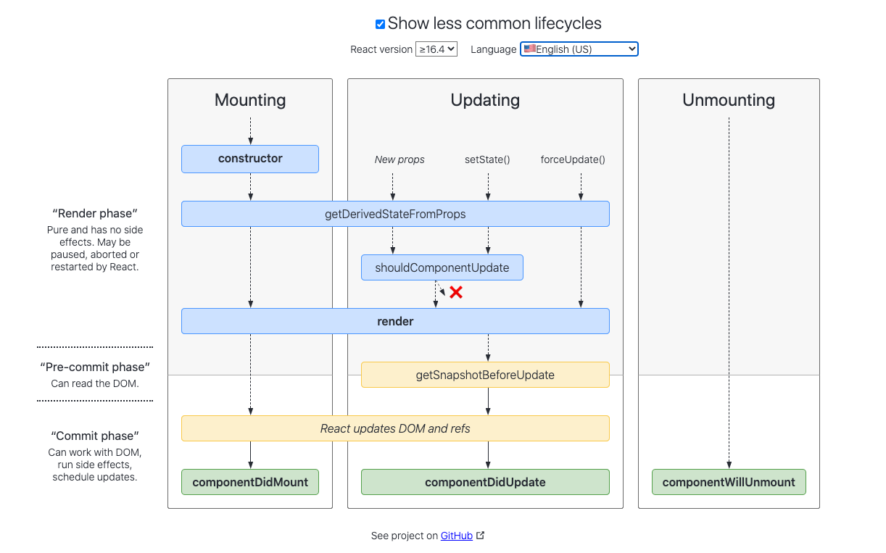

- [ReactJS](#reactjs)
  - [造成组件试图渲染（调用 `render`）的原因](#造成组件试图渲染调用-render的原因)
  - [LifeCycle](#lifecycle)
  - [*Pure Component*: `React.PureComponent`](#pure-component-reactpurecomponent)
  - [*Context*: `React.createContext`](#context-reactcreatecontext)
  - [*Error Boundary*: `React.Component.getDerivedStatefromError`, `React.Component.prototype.componentDidCatch`](#error-boundary-reactcomponentgetderivedstatefromerror-reactcomponentprototypecomponentdidcatch)
  - [*Fragment*: `React.Fragment`, `<>`](#fragment-reactfragment-)
  - [*Refs*: `React.createRef`, `React.forwardRef`](#refs-reactcreateref-reactforwardref)
  - [*Portals*: `ReactDOM.createPortal`](#portals-reactdomcreateportal)
  - [*Strict Mode*: `React.StrictMode`](#strict-mode-reactstrictmode)
  - [*Profiler*](#profiler)

# ReactJS

> A rendering library.

## 造成组件试图渲染（调用 `render`）的原因

- 父组件 `render`
  - 实际上是 *props* 每次传入的都是新对象（`props = Object.assign({}, props ...)`）
- 调用 `setState`
  - 实际上是 *state* 每次都生成了新对象（`state = Object.assign({}, state ...)`）

## LifeCycle

- `componentWillMount`
- `componentWillReceiveProps`
  - 父组件 *render*
- `getDerivedStateFromProps`
- `shouldComponentUpdate`
  - 父组件 *render*
  - 调用 `setState`
- `componentWillUpdate`
- `render`
- `getSnapshotBeforeUpdate`
- *update real dom*
- `componentDidUpdate`

```mermaid

```


[ReactJS lifecycle v16.4](https://hackernoon.com/reactjs-component-lifecycle-methods-a-deep-dive-38275d9d13c0)

[ReactJS lifecycle](https://projects.wojtekmaj.pl/react-lifecycle-methods-diagram/)

## *Pure Component*: `React.PureComponent`

> 相对于 `React.Component`，对 `shouldComponentUpdate` 进行了部分优化：对传入 `props` 的属性进行*浅比较*，相同时会返回 `true`。

## *Context*: `React.createContext`

- `Context.prototype.Provider`
- `Context.prototype.Consumer`
- `React.Component.contextType`
- `Context.prototype.displayName`

```js
// Theme context，默认的 theme 是 “light” 值
const ThemeContext = React.createContext('light');
// 用户登录 context
const UserContext = React.createContext({
  name: 'Guest',
});
class App extends React.Component {
  render() {
    const {signedInUser, theme} = this.props;
    // 提供初始 context 值的 App 组件
    return (
      <ThemeContext.Provider value={theme}>
        <UserContext.Provider value={signedInUser}>
          <Layout />
        </UserContext.Provider>
      </ThemeContext.Provider>
    );
  }
}
function Layout() {
  return (
    <div>
      <Sidebar />
      <Content />
    </div>
  );
}
// 一个组件可能会消费多个 context
function Content() {
  return (
    <ThemeContext.Consumer>
      {theme => (
        <UserContext.Consumer>
          {user => (
            <ProfilePage user={user} theme={theme} />
          )}
        </UserContext.Consumer>
      )}
    </ThemeContext.Consumer>
  );
}
```

## *Error Boundary*: `React.Component.getDerivedStatefromError`, `React.Component.prototype.componentDidCatch`

> 捕获发生在其*子组件树*任何位置的 JavaScript 错误。

- `getDerivedStatefromError(error)` 在渲染阶段调用，因此不允许出现副作用，用于降级UI。

- `componentDidCatch(error, info)` 在提交阶段调用，因此允许执行副作用，用于报送错误。

*Error Boundary* 无法捕获的错误：

- 事件处理
- 异步代码
- 服务端渲染
- 该组件自身抛错（非其子组件）

## *Fragment*: `React.Fragment`, `<>`

> 不支持 `key` 或 `props`.

## *Refs*: `React.createRef`, `React.forwardRef`

- 方法一：回调

```js
class MyComponent extends React.Component {
  constructor(props) {
    super(props)
    this.refComps = {}
    this.createRef = name => el => this.refComps[name] = el
    // this.refComps.div
  }
  render() {
    return <div ref={this.createRef('div')} />
  }
}
```

- 方法二：`React.createRef`

```js
class MyComponent extends React.Component {
  constructor(props) {
    super(props)
    this.refDiv = React.createRef()
    // this.refDiv.current
  }
  render() {
    return <div ref={this.refDiv} />
  }
}
```

- 方法三（函数组件）：`React.forwardRef`

> 函数组件没有实例，所以无法直接*ref*，只能*ref*其子元素。

```js
const FancyButton = React.forwardRef((props, ref) => (
  <button ref={ref} className="FancyButton">
    {props.children}
  </button>
))
// 你可以直接获取 DOM button 的 ref：
const ref = React.createRef()
<FancyButton ref={ref}>Click me!</FancyButton>
```

## *Portals*: `ReactDOM.createPortal`

> *将组件渲染到其他（父节点以外）DOM节点。*
> （仍属于当前React组件树，故除了real dom渲染位置以外，表现与常规子节点无异，比如，React事件依然会直接冒泡到React父组件。）

```js
const app = document.createElement('div')
const modal = document.createElement('div')
document.body.appendChild(app)
document.body.appendChild(modal)

class Modal extends React.PureComponent {
  render() {
    return ReactDOM.createPortal(this.props.children, modal)
  }
}

class App extends React.PureComponent {
  render() {
    return <div onClick={e => alert('Listen on app, dispatched from ' + e.target.innerHTML)}>
      <button>Click App!</button>
      <Modal>
        <button>Click Modal!</button>
      </Modal>
    </div>
  }
}

ReactDOM.render(<App/>, app)
```

## *Strict Mode*: `React.StrictMode`

## *Profiler*

[lifecycle-diagram]: https://projects.wojtekmaj.pl/react-lifecycle-methods-diagram/
[vue-vs-react-2021]: https://fulcrum.rocks/blog/vue-vs-react-comparison/
