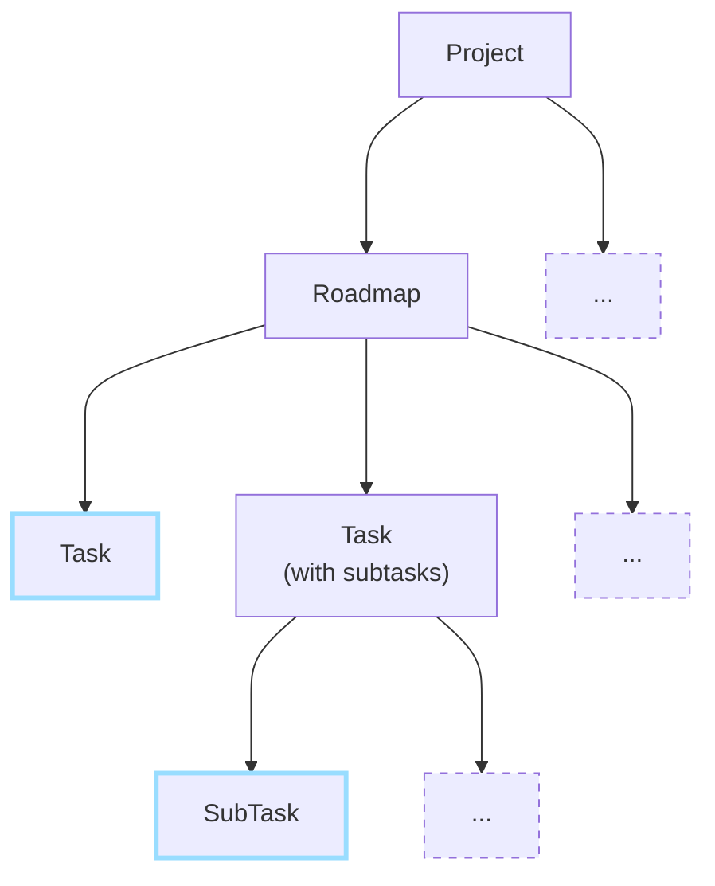

```mermaid
graph TD
	classDef edge stroke:#9df,stroke-width:3;
	classDef more stroke-dasharray:5 5;
	project[Project]
		project ---> roadmap[Roadmap] 
		project ---> roadmaps[...]:::more
	roadmap ---> task[Task]:::edge 
	roadmap ---> task2["Task<br/>(with subtasks)"] 
	roadmap ---> tasks[...]:::more
	task2 ---> subtask[SubTask]:::edge
	task2 ---> subtasks[...]:::more
```
