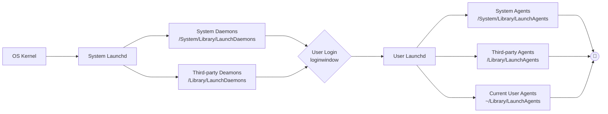

# MAC OS

## 一些目录

| 目录             | 描述                     | `/System/Library/` | `/Library/` | `~/Library/` |
| ---------------- | ------------------------ | ------------------ | ----------- | ------------ |
| `Preferences/`   | 存放应用的配置文件       | Y                  | Y           | Y            |
| `LaunchDaemons/` | 存放系统级进程的配置文件 | Y                  | Y           |              |
| `LaunchAgents/`  | 存放用户级进程的配置文件 | Y                  | Y           | Y            |
| `StartupItems/`  | 存放启动项的配置文件     | Y                  | Y           |              |

## 命令

### 调用系统脚本：osascript

> [`osascript`](https://ss64.com/osx/osascript.html): execute OSA scripts (AppleScript, JavaScript, etc.)

```bash
osascript -e <script> [-l <language>]
```

OSX10.4以下使用的是MacRoman编码，unicode需要额外备注:

```bash
script='display notification ("您好" as unicode text)'
osascript -e $script
```

[AppleScript快速入门](https://juejin.cn/post/7055599089081122829)

#### 常见命令

```bash
# 右上角通知
# https://developer.apple.com/library/archive/documentation/LanguagesUtilities/Conceptual/MacAutomationScriptingGuide/DisplayNotifications.html
display notification "hello world!"
  with title "Greet"
  subtitle "Everyone"
  sound name "Frog"
# 弹窗
display alert "Alert"
  message "Hello, ..."
  as critical
  buttons {"Don't Continue", "Continue"}
  default button "Continue"
  cancel button "Don't Continue"
display dialog "Dialog"
  buttons {"Don't Continue", "Continue"}
  default button "Continue"
  cancel button "Don't Continue"
  with icon caution
  giving up after 5 # 5秒后自动关闭
# 打开Safari
tell app "Safari" to activate
# 关闭Safari
quit app "safari.app"
# 调整音量
set volume input volume 40
set volume output volume 50
set volume output muted TRUE
set volume output muted not (output muted of (get volume settings))
# 直接关机、重启
tell app "System Events" to shut down
tell app "System Events" to restart
# 延时
delay 0.5 # 秒
```

#### 获取软件的ID

`osascript -e 'id of app "Visual Studio Code"'`

### 管理进程：launchctl

> `launchd`: System wide and per-user daemon/agent manager.

> `launchctl`: interfaces with launchd to manage and inspect daemons, agents and XPC services.

`launchd`是苹果系统（>10.4）管理进程的服务。通过*任务管理器*的*显示*菜单中选择*所有进程，分层显示*可以看到所有进程都是由`launchd`来管理的。

开机过程：



```bash
# 列出用户进程状态
launchctl list
# 列出系统进程状态
sudo launchctl list
```

#### daemon和agent

- `daemon`: 系统级进程，在系统启动时载入，在活动监视器中可以看到用户为*root*。
- `agent`: 用户级进程，在用户登录时载入，在活动监视器中可以看到用户为当前用户（`whoami`）。

[LaunchAgents与LaunchDaemon](https://www.wuliaole.com/2017/02/19/launchagents_and_launchdaemon_on_mac_osx/)

#### 进程配置文件

```bash
# 系统自带的系统级进程配置文件
/System/Library/LaunchDaemons
# 系统自带的用户级进程配置文件
/System/Library/LaunchAgents
# 系统自带的进程间通信进程配置文件
/System/Library/xpc
# 管理员提供的（如安装软件）系统级进程配置文件
/Library/LaunchDaemons
# 管理员提供的用户级进程配置文件
/Library/LaunchAgents
# 当前登录用户自己的进程配置文件
~/Library/LaunchAgents
```

### 软件配置文件：plist

> *launchd.plist*是*daemon*和*agent*任务的服务配置文件。

关于*plist*，可以查看`man plist`, `man launchd.plist`。

### 管理内核状态：sysctl

> `sysctl`: get or set kernel state.

```bash
```

查看交换内存（*swap usage*）：

```bash
sysctl vm.swapusage
# vm.swapusage: total = 0.00M used = 0.00M free = 0.00M (encrypted)
```

### 管理Spotlight索引：mdutil

管理建立*Spotlight*索引的服务（进程名称：`mds_stores`）

>  `mdutil`: Utility to manage Spotlight indexes.

```bash
# 关闭所有卷（volumes）的索引服务
mdutil -a -i off
# 开启
mdutil -a -i on
```

### 管理磁盘和卷：diskutil

> `diskutil`: Utility to manage local disks and volumes.

```bash
# 列出磁盘的分区（Partitions）
diskutil list
# 获取磁盘或分区信息
diskutil info <disk>
```

### 控制系统睡眠：caffeinate

> `caffeinate`: prevent the system from sleeping on behalf of a utility.

### 电源管理

> `pmset`: manipulate power management settings.

设置（不同电源条件下）不同事件的

```bash
pmset
  [
    -a # all
    | -b # battery
    | -c # charger
    | -u # UPS
  ]
  [displaysleep|disksleep|sleep|...]
```

获取当前配置：

```bash
pmset -g [
  everything
  | stats # sleeps and wakes system has gone thru since boot.
  | ac,adapter
  | ps # ups
  | batt # battery
  | sched # scheduled events
  ...
]
```

#### 定时开关机休眠唤醒

- `type`: *sleep*, *wake*, *poweron*, *shutdown*, *wakeorpoweron*

- `weekdays`: Subset of *MTWRFSU*

- `date+time`: *"MM/dd/yy HH:mm:ss"* (in 24 hour format; must be in quotes)

- `time`: *HH:mm:ss*

一次性：

```bash
pmset schedule [cancel|cancelall] <type> <date+time> [owner]
```

重复：

```bash
pmset repeat <type> <weekdays> <time>
pmset repeat cancel
```

相对上次休眠/关机进行唤醒/开机：

```bash
pmset relative [wake | poweron] <seconds>
```

### 管理plist文件：plutil

> `plutil`: can be used to check the syntax of property list files, or convert a plist file from one format to another. Specifying - as an input file reads from stdin.

使用`plutil`可以轻松地修改*.plist*的属性和值，包括二进制格式的*.plist*文件。

例如，关闭Microsoft AutoUpdate软件的自动启动：

```bash
plutil -remove SuccessfulExit /Library/LaunchAgents/com.microsoft.update.agent.plist
plutil -replace RunAtLoad -bool NO /Library/LaunchAgents/com.microsoft.update.agent.plist
```

[launchd plist](#launchd%20plist)是*daemon*和*agent*任务的服务配置文件。

#### plist属性

1. `RunAtLoad`：表示当前任务是否在配置载入（开机/登录）后自动启动。
2. `KeepAlive`：表示当前任务是否一直运行。当设置为`true`时，在退出后会自动重启（俗称关不掉的流氓程序）。
3. `SuccessfulExit`：表示是否在当前任务成功退出后自动重启。当该属性出现时，载入后一定会自动启动。
4. `Label`：该`.plist`文件代表的任务名称。
5. `Program`, `ProgramArguments`：任务的程序路径。
6. `WatchPaths`：监控路径，当路径变化时执行当前任务。

核心属性（详细可见`man launchd.plist`）：

```xml
<?xml version="1.0" encoding="UTF-8"?>
<!DOCTYPE plist PUBLIC "-//Apple//DTD PLIST 1.0//EN" "http://www.apple.com/DTDs/PropertyList-1.0.dtd">
<plist version="1.0">
<dict>
	<!-- 任务名称 -->
	<key>Label</key>
	<string>MyProgram</string>
	<!-- 工作目录 -->
	<key>WorkingDirectory</key>
	<string>/tmp</string>
	<!-- 程序路径，写法一 -->
	<key>Program</key>
	<string>/path/to/program</string>
	<!-- 程序路径，写法二 -->
	<key>ProgramArguments</key>
	<array>
		<string>/usr/bin/rsync</string>
		<string>--archive</string>
		<string>--compress-level=9</string>
		<string>/Volumes/Macintosh HD</string>
		<string>/Volumes/Backup</string>
	</array>
	<!-- 环境变量 -->
	<key>EnvironmentVariables</key>
	<dict>
		<key>PATH</key>
		<string>/bin:/usr/bin:/usr/local/bin</string>
	</dict>
	<!-- 标准输入输出 -->
	<key>StandardInPath</key>
	<string>/tmp/test.stdin</string>
	<key>StandardOutPath</key>
	<string>/tmp/test.stdout</string>
	<key>StandardErrorPath</key>
	<string>/tmp/test.stderr</string>
	<key>Debug</key>
	<true/>
  <!-- 权限：用户 -->
  <key>UserName</key>
  <string>nobody</string>
  <!-- 权限：用户组 -->
  <key>GroupName</key>
  <string>nobody</string>
  <!-- 权限：Umask -->
  <key>Umask</key>
  <!--
    0	read, write and execute/search
    1	read and write
    2	read and execute/search
    3	read only
    4	write and execute
    5	write only
    6	execute/search only
    7	none
  -->
  <string>0</string>
  <!-- 限流 -->
  <key>ThrottleInterval</key>
  <integer>60</integer>
  <!-- IO优先级 -->
  <key>LowPriorityIO</key>
  <true/>
	<!-- 限制可用资源 -->
	<key>HardResourceLimits</key>
  <!-- 包括：CPU, FileSize, NumberOfFiles, Core, Data, MemoryLock, NumberOfProcesses, ResidentSetSize, Stack -->
	<dict>
		<key>NumberOfFiles</key>
		<integer>2048</integer>
	</dict>
	<key>SoftResourceLimits</key>
	<dict>
		<key>NumberOfFiles</key>
		<integer>2048</integer>
	</dict>
	<!-- 运行条件：常驻运行（自动重启） -->
	<key>LaunchOnlyOnce</key>
	<true/>
	<key>KeepAlive</key>
	<true/>
	<!-- 运行条件：常驻运行（自动重启），有条件地 -->
	<key>KeepAlive</key>
  <dict>
    <key>SuccessfulExit</key>
    <true/>
    <key>Crashed</key>
    <true/>
    <key>NetworkState</key>
    <true/>
    <key>PathState</key>
    <dict>
      <key>/tmp/runJob</key>
      <true/>
    </dict>
    <key>OtherJobEnabled</key>
    <dict>
      <key>local.otherJob</key>
      <false/>
    </dict>
    <key>AfterInitialDemand</key>
    <dict>
      <key>local.otherJob</key>
      <true/>
    </dict>
  </dict>
	<!-- 运行条件：在开机后自动启动 -->
	<key>RunAtLoad</key>
	<true/>
  <!-- 运行条件：周期性启动，按时间间隔 -->
  <key>StartInterval</key>
  <integer>3600</integer>
  <!-- 运行条件：周期性启动，按日历 -->
  <key>StartCalendarInterval</key>
  <array>
  	<dict>
  		<key>Hour</key>
  		<integer>3</integer>
  		<key>Minute</key>
  		<integer>0</integer>
  	</dict>
  	<dict>
  		<key>Minute</key>
  		<integer>0</integer>
  		<key>Weekday</key>
  		<integer>0</integer>
  	</dict>
  </array>
  <!-- 运行条件：监控路径，当路径变动（创建、删除、写入）时启动 -->
  <key>WatchPaths</key>
  <array>
    <string>/path/to/directory_or_file</string>
  </array>
  <!-- 运行条件：监控目录，当目录不为空时启动 -->
  <key>QueueDirectories</key>
  <array>
    <string>/path/to/directory_or_file</string>
  </array>
</dict>
</plist>
```

- [Launchd，如何在Mac上运行服务](https://yishanhe.net/dive-into-launchd/)
- [launchd.info](https://www.launchd.info/)

### Xcode Command Line Tools

> [Xcode Command Line Tools](https://mac.install.guide/commandlinetools/index.html)：将Xcode的底层功能提供到命令行中，以便脚本脚用和喜欢命令行操作的开发者。

工具目录：

```bash
ls /Library/Developer/CommandLineTools/usr/bin/
```

安装：

```bash
xcode-select --install
```

## 技巧

### 关闭流氓进程

1. 活动监视器查看进程的父进程，如果是`launchd`，执行后续操作

2. 找到开机启动配置文件

3. 使用[`plutil`](#管理plist文件：plutil)将配置文件中的`KeepAlive`改为`false`；删除`StartInterval`和`StartCalendarInterval`属性，删除`SuccessfulExit`属性；如果不需要开启启动，将`RunAtLoad`也改为`false`；

4. 如果父进程不是`launchd`，则继续执行第一步，找到最终进程即可

```bash
# 直接搜索配置文件（自动启动的服务），注意，对于二进制格式的.plist无法直接搜索，可以先找到文件。
grep -iw -e 'RunAtLoad' \
         -e 'KeepAlive' \
         -e 'StartInterval' \
         -e 'StartCalendarInterval' \
         -e 'SuccessfulExit' \
         /System/Library/Launch*/*.plist \
         /Library/Launch*/*.plist \
         ~/Library/LaunchAgents/*.plist
```

例如禁止*Microsoft AutoUpdate*（包括*Edge*）弹窗：

```bash
# 查找microsoft产品相关的配置文件，比如使用关键词 microsoft：
ls /System/Library/Launch*/*.plist \
   /Library/Launch*/*.plist \
   ~/Library/LaunchAgents/*.plist | grep -i microsoft

# 找到文件：
# /Library/LaunchAgents/com.microsoft.update.agent.plist
# /Library/LaunchDaemons/com.microsoft.autoupdate.helper.plist

# 删除定期开启（StartInterval）：
plutil -remove StartInterval /Library/LaunchAgents/com.microsoft.update.agent.plist
# 取消开机启动（RunAtLoad）：
plutil -replace RunAtLoad -bool NO /Library/LaunchAgents/com.microsoft.update.agent.plist
# 让系统加载最新的配置
launchctl load /Library/LaunchAgents/com.microsoft.update.agent.plist
```

### 通过命令设置文件的默认打开软件

参考：[Set vscode as the default editor for text files on mac](https://www.darraghoriordan.com/2021/09/15/vscode-default-text-files-mac/)

1. 先安装`duti`：

```bash
brew install duti
```

2. 设置vscode为默认打开软件

2.1 获取vscode的软件ID（*bundle ID*）

```bash
osascript -e 'id of app "Code"'
# 打印: com.microsoft.VSCode
```

```bash
while read -d ' ' line; do
  # program=$(duti -x $line 2>/dev/null | head -1)
  [[ $line ]] && duti -s com.microsoft.VSCode $line all
done <<< '.c .cpp .cs .css .go .java .js .sass .scss .less .vue .cfg .json .jsx .log .lua .md .php .pl .py .rb .rs .ts .tsx .txt .conf .yaml .yml .toml'
```
