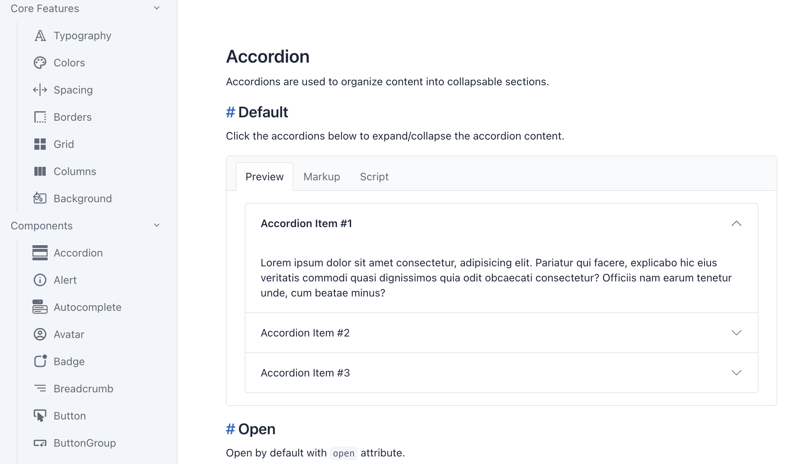
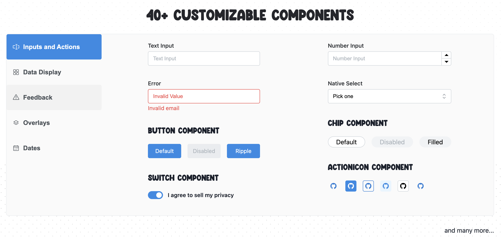
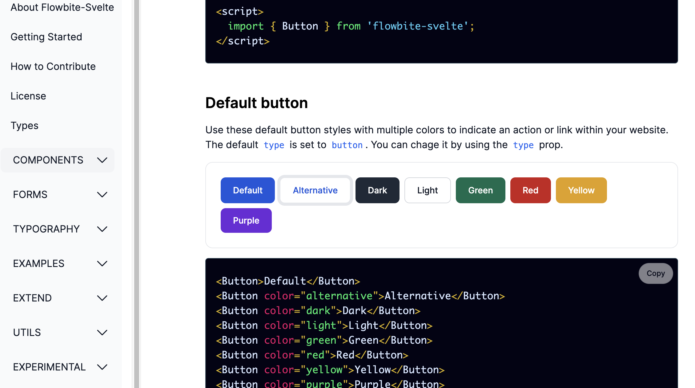

# 渲染框架

## Vue

### NaiveUI

### ElementUI

### AntDesign

### Ionic

## React

### AntDesign

## Svelte

### YeSvelte

> [YeSvelte](https://www.yesvelte.com/docs)，灵感来自于基于Bootstrap的[tabler](#tabler)

### SvelteUI

> [SvelteUI](https://www.svelteui.org/introduction)，

### SvelteStrap

> [SvelteStrap](https://sveltestrap.js.org/), Bootstrap 5 components for Svelte 3.

### Flowbite-Svelte

> [Flowbite-Svelte](https://flowbite-svelte.com/)，基于[Tailwind](#tailwindcss)开发的Svelte组件库。

## Angular

## Riot

# 组件库

## daisyui

> [daisyui](https://daisyui.com/components/)，基于Tailwind的纯CSS组件库。

## tabler

> [tabler](https://preview.tabler.io/)，基于Bootstrap5的框架无关组件库。

- 完全响应式
- 适配移动端
- 自带一套矢量图标
- 暗黑模式

## UIkit

# CSS框架

## TailwindCSS

# 离线存储

- [localForge](https://github.com/localForage/localForage): 复杂数据结构存储，支持使用`IndexedDB`和`Web SQL`，或（降级）`LocalStorage`存储数据，支持*存储序列化数据*，以及`Blobs`和`TypedArrays`等，API类似*localStorage*。
- [ImmortalDB](https://github.com/gruns/ImmortalDB): 简单的`key-value`存储，通过同时使用`Cookies`, `IndexedDB`和`LocalStorage`进行冗余存储，最大程度保存数据和保证数据正确性。
- [PouchDB](https://github.com/pouchdb/pouchdb): 轻量级数据库（*46kb*），在浏览器默认使用`IndexedDB`，或（降级）`Web SQL`，在*NodeJS*则使用本地文件存储。
- [WebStorageCache](https://github.com/wuchangming/web-storage-cache): `LocalStorage`和`SessionStorage`增强，支持超时和序列化。
