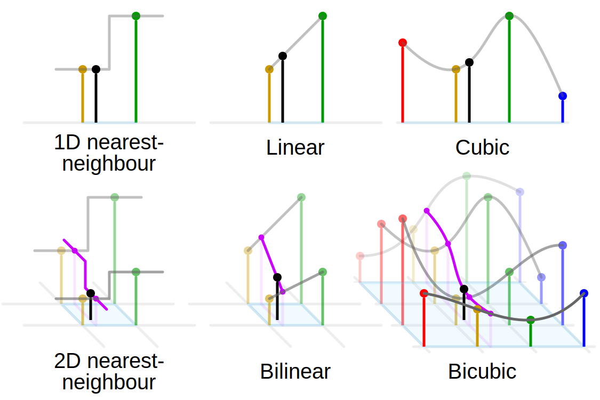
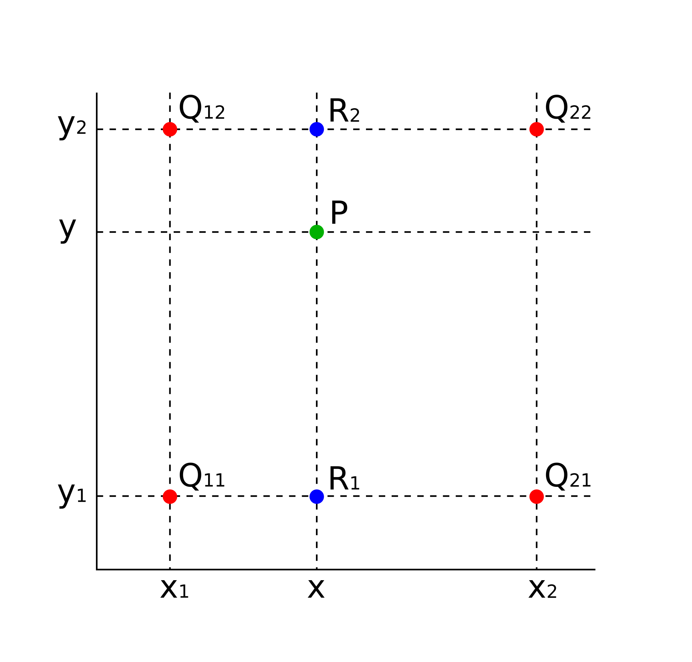

# Raster

[Comparison gallery of image scaling algorithms](https://en.wikipedia.org/wiki/Comparison_gallery_of_image_scaling_algorithms)

## Scaling

[Comparison gallery of image scaling algorithms](https://en.wikipedia.org/wiki/Comparison_gallery_of_image_scaling_algorithms)

### 最近邻差值（Nearest-neighbor interpolation）

> *最近邻插值（Nearest-Neighbor Interpolation）*也叫*近邻插值（Proximal Interpolation）*、*点采样（Point Sampling）*，是一种简单的一维或多维*多元插值（multivariant interpolation）*方法，通常用在实时3D渲染中选取纹理表面颜色值。

$$S=\left(w,h\right), S'=\left(w',h'\right)$$
$$P_{(x,y)}=\left(x'\times\dfrac{w}{w'},y'\times\dfrac{h}{h'}\right)$$
$$P_{(x,y)}=P_{\left(round\left(x\right), round\left(y\right)\right)}$$
$$f_{(x',y')}=f_{(x,y)}$$

||
|-|
||
|[Comparison_of_1D_and_2D_interpolation](https://commons.wikimedia.org/wiki/File:Comparison_of_1D_and_2D_interpolation.svg#/media/File:Comparison_of_1D_and_2D_interpolation.svg)|

### 双线性插值（Bilinear interpolation）

> *双线性插值、二维线性插值（Bilinear Interpolation）*也叫*双线性滤波（Bilinear filtering）*、*双线性纹理映射（Bilinear Texture Mapping）*，即在两个方向上（*2x2*像素）进行*线性插值（Linear Interpolation）*实现。

|                                                                                                                                  |
| -------------------------------------------------------------------------------------------------------------------------------- |
|                                                                               |
| [BilinearInterpolation](https://commons.wikimedia.org/wiki/File:BilinearInterpolation.svg#/media/File:BilinearInterpolation.svg) |

$$S=\left(w,h\right), S'=\left(w',h'\right)$$
$$P_{(x,y)}=\left(x'\times\dfrac{w}{w'},y'\times\dfrac{h}{h'}\right)$$
$$
\begin{cases}
P_{(x_1,y_1)}=P_{\left(floor\left(x\right), floor\left(y\right)\right)}\\
P_{(x_2,y_1)}=P_{\left(ceil\left(x\right), floor\left(y\right)\right)}\\
P_{(x_2,y_2)}=P_{\left(ceil\left(x\right), ceil\left(y\right)\right)}\\
P_{(x_1,y_2)}=P_{\left(floor\left(x\right), ceil\left(y\right)\right)}\\
\end{cases}
$$
$$f_{(x,y_1)}=\dfrac{x-x_1}{x_2-x_1}\times{f_{(x_1,y_1)}}+\dfrac{x_2-x}{x_2-x_1}\times{f_{(x_2,y_1)}}$$
$$f_{(x,y_2)}=\dfrac{x-x_1}{x_2-x_1}\times{f_{(x_1,y_2)}}+\dfrac{x_2-x}{x_2-x_1}\times{f_{(x_2,y_2)}}$$
$$f_{(x,y)}=\dfrac{y-y_1}{y_2-y_1}\times{f_{(x,y_1)}}+\dfrac{y_2-y}{y_2-y_1}\times{f_{(x,y_2)}}$$
$$f_{(x',y')}=f_{(x,y)}$$

### 双三次插值（Bicubic interpolation）

### 傅立叶插值（Fourier-based interpolation）

### 边缘定向插值（Edge-directed interpolation）

### 图像跟踪（Image tracing）

### 深度卷积神经网络（Deep convolution neural networks）

### 感知损失的深度卷积神经网络（Deep concolution neural networks using perceptual loss）

# Vector
